

<small>Plotting code for the essay is in a [Jupyter notebook](./figure/analytical_mechanics_plotting.ipynb).</small>

## Introduction

### What this essay contains

This essay works through what is typically contained in a university course on analytical mechanics. The prerequisites are multivariate calculus and mathematical maturity.

It covers: calculus of variations, Lagrangian, Legendre transform, Hamiltonian, Hamilton's principal function, Hamilton--Jacobi equation, the particle-wave duality, contact geometry, symplectic geometry, Poisson bracket, canonical transformations, infinitesimal generator, Schrödinger's equation, Hamilton's geometric optics, action-angle variables, general relativity, Noether's theorem, adiabaticity, old quantum theory, Bohr--Sommerfeld quantization, Einstein--Brillouin--Keller quantization.

It does not cover: virtual work, d'Alembert's principle, canonical perturbation theory, continuum mechanics, rigid bodies, field theory.

Philosophically, this essay has two undercurrents:

One, that [thinking on the margins](https://en.wikipedia.org/wiki/Marginalism) is vital not just in economics, but also in classical mechanics. In my other essay, [*Classical thermodynamics and economics*](https://yuxi.ml/essays/posts/equilibrium-thermoeconomics), I show that classical thermodynamics is also nothing more than thinking on the margins.

Two, classical mechanics is a leakless leaky abstraction. Though classical mechanics has many equivalent forms, the search for the most elegant form has led us to the Hamilton--Jacobi equation, and the adiabatic theorem, both of which were on the threshold of quantum mechanics. Even though classical mechanics is a self-consistent closed world (thus "leakless"), when viewed in the right light, all its lines and planes seem to angle towards a truer world (thus "leaky"), of which this world is merely a shadow (thus "abstraction").

### Conventions

We always assume all functions are analytic (that is, they have Taylor expansions).

We would often say "minimize cost" or "maximize revenue" or such, but we always mean "stationarize". For example, when we say "Let's maximize $f(x)$", what we mean is "Let's solve $f'(x) = 0$". If we were to actually maximize $f(x)$, we would have to check $f''(x) < 0$ as well, but we don't. This is not a problem for physics, where the principle of *stationary* action rules. However, in optimal control and economics, we should check if the solution is actually a minimum/maximum.[^stationarize]

[^stationarize]: Thus, the analogy between classical mechanics and economics is not precise. However, the analogy is precise between classical thermodynamics and economics, since the entropy is actually maximized, and not merely stationarized.

Instead of laboriously typing $\vec q$ or $\mathbf{q}$, I just write $q = (q_1, \dots, q_n)$, unless there is a serious risk of confusion.

| Symbol | Mechanics      | Economics       | Control Theory |
|---|---|---|---|
| $L$                           | Lagrangian    | time-rate of cost  | time-rate of cost |
| $t$                           | time          | time                   | time |
| $q$                           | location/coordinate | commodity      | state variable |
| $\dot q$                      | velocity      | production rate/consumption rate | control variable |
| $S = \int L(t, q, \dot q)dt$  | action        | total cost | total cost |
| $p$                           | momentum      | price        | co-state variable |
| $H = \sum_i p_i\dot q_i - L$  | Hamiltonian   | market equivalent cash flow[^cash-flow] | Hamiltonian |

: Reference table for the economics-mechanics analogy.

[^cash-flow]: also known as "[mark to market](https://en.wikipedia.org/wiki/Mark-to-market_accounting) cash flow"

### Why I wrote this

I wrote this as "Analytical Mechanics done right", or "What every graduate student in physics should know about analytical mechanics, but didn't learn well, because the textbooks are filled with too many symbols and not enough pictures.", or "what I wish the textbooks to have said when I first learned the subject".

In my physics Olympiad years, I saw the Lagrangian a few times, but we had no use for that. During my undergraduate years, I studied analytical mechanics. The construction of the Lagrangian was reasonable enough, and I understood how the Euler--Lagrange equation was derived by $\delta \int L = 0$. However, as soon as they proceeded to the Hamiltonian, I was entirely lost.

What is $H(p, q) = p \dot q - L(q, \dot q)$? Why does the right side depend on $\dot q$ but not the left side? How does anyone just *make up* the Legendre transform out of thin air? It's named "Legendre transform" -- well, if it has such a fancy name, surely this has many more applications than $H = p \dot q - L$, else, why not call it "Legendre's one-time trick"? Canonical transform? Point transform? Aren't they all coordinate transforms? Poisson bracket? Infinitesimal generators? It was all a giant mess. Reading Goldstein's classic textbook only made my confusion more well-rounded.

Early 2023, I studied mathematical microeconomics. When I was studying [Ramsey's theory of optimal saving](https://en.wikipedia.org/wiki/Ramsey%E2%80%93Cass%E2%80%93Koopmans_model), I saw, to my great surprise, something they call a "Hamiltonian" [@campanteAdvancedMacroeconomicsEasy2021, chapter 3]. I was shocked, but after studying it carefully, and thinking it over, I realized that it was no mistake -- the "Hamiltonian" in economics and in physics really are the same. Physics has an economic interpretation. Everything fell into place over the course of a few hours. Guided by this vision, I worked through analytical mechanics again, this time with true understanding.

It is my experience that everything in undergraduate physics is taught badly, except perhaps Newtonian mechanics. I have written this essay to make analytical mechanics finally make sense. It has made sense for me, and I hope it will make sense for you.

## Optimization as making money

### The shortest line problem

::: {.callout-warning}

In this problem, the so-called "time" $t$ has units of length as well. So, please don't panic when we see something like $\sqrt{1 + \dot x^2}$. If it worries us, we can replace $t$ by $v\tau$, where $v$ is a constant speed of one, and $\tau$ is time.

:::

Start with the easiest problem: shortest path problem. What is the shortest path from $(0, 0)$ to $(A, B)$? We parametrize the path by a function $t \mapsto (x(t), y(t))$, with $t\in [0, 1]$. The problem is then

$$\begin{cases} \min \int_0^1 \sqrt{\dot x^2 + \dot y^2}dt \\ \int_0^1 \dot x dt = A \\ \int_0^1 \dot y dt = B \\ \end{cases}$$

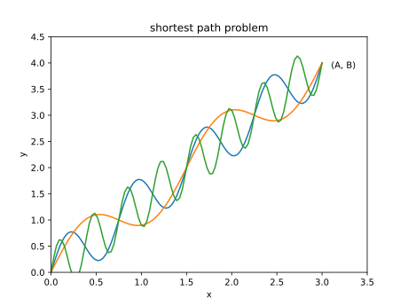

This is a standard constraint-optimization problem, and could be solved by the Lagrangian multiplier method:

$$\delta \left(\int_0^1 \sqrt{\dot x^2 + \dot y^2}dt + p_x \left( A - \int_0^1 \dot x dt\right) + p_y \left( B - \int_0^1 \dot y dt\right) \right) = 0$$

where $p_x, p_y$ are the Lagrangian multipliers, each responsible for enforcing one constraint.

Varying the path functions $x, y$ gives us

$$\delta \int_0^1 (\sqrt{\dot x^2 + \dot y^2} - p_x \dot x - p_y \dot y)dt = 0$$

Each of $\dot x, \dot y$ could be independently perturbed with a tiny concentrated "pulse", so for the integral to be stationary, the integrand must be zero with respect to derivatives of $\dot x, \dot y$. That is, we have

$$\begin{cases} \partial_{\dot x}(\sqrt{\dot x^2 + \dot y^2} - p_x \dot x - p_y \dot y )= 0\\ \partial_{\dot y}(\sqrt{\dot x^2 + \dot y^2} - p_x \dot x - p_y \dot y ) = 0 \end{cases}$$

and we are faced with the solution

$$(p_x, p_y) = \frac{1}{\sqrt{\dot x^2 + \dot y^2}}(\dot x, \dot y)$$

Since $p_x, p_y$ are independent of time, they are constants, and since we have from the above equation $p_x^2 + p_y^2 = 1$, we find that $p_x = \cos\theta, p_y = \sin\theta$ for some $\theta$. Thus, the curve is a straight line making an angle $\theta$ to the x-axis.

### Economic interpretation

Interpret $x, y$ as two goods that we can produce (let's say, tons of steel and tons of copper).

We are a factory manager, and  we are given a task: produce $A$ of $x$ (tons of steel), and $B$ of $y$ (tons of copper), in $[0, 1]$ (one year). If we don't do it, we will be sacked. Our problem is to accomplish the task at minimal cost.

$\dot x, \dot y$ are the speed at which we produce the goods, which we can freely control. In control theory, we say $x, y$ are state variables, and $\dot x, \dot y$ are control variables.

The cost function is $L(t, x, y, \dot x, \dot y) = \sqrt{\dot x^2 + \dot y^2}$. Its integral $S = \int_0^1 L dt$ is the total cost of production, which we must minimize.

We are also given a free market on which we are allowed to buy and sell the goods. If we cannot achieve the production target, we buy from the market. If we achieve more than the production target, we sell them off.

Then, the total cost is

$$\left(\int_0^1 \sqrt{\dot x^2 + \dot y^2}dt + p_x \left( A - \int_0^1 \dot x dt\right) + p_y \left( B - \int_0^1 \dot y dt\right) \right)$$

where $p_x, p_y$ are the market prices which do not change with time.

If our production plan is optimal, then the plan must have stationary cost. That is, if we make a change in our production plan $(\dot x, \dot y)$ by $O(\delta)$, our production cost must not change by $O(\delta)$, or else we could achieve lower cost. For example, if the plan $(\dot x + \delta \dot x, \dot y + \delta \dot y)$ achieves higher cost, then $(\dot x - \delta \dot x, \dot y - \delta \dot y)$ achieves lower cost.

Mathematically, it means the optimal production plan must satisfy

$$\delta \left(\int_0^1 \sqrt{\dot x^2 + \dot y^2}dt + p_x \left( A - \int_0^1 \dot x dt\right) + p_y \left( B - \int_0^1 \dot y dt\right) \right) = 0$$

Now, the great thing about the market is that it is always there and we can trade with it, So, we have completely transformed the question into a problem of profit maximization -- we'll always sell to the market, and then buy back from the market right at the end.

Now we can perform profit maximization moment-by-moment: raise production until marginal profit reaches cost:

$$\begin{cases} \partial_{\dot x}(\sqrt{\dot x^2 + \dot y^2} - p_x \dot x - p_y \dot y )= 0\\ \partial_{\dot y}(\sqrt{\dot x^2 + \dot y^2} - p_x \dot x - p_y \dot y ) = 0 \end{cases}$$

which may be solved as before.

Now we can interpret $p_x, p_y$. What are they? Suppose we perturb $\dot x$ by $\delta \dot x$, then since the production plan is already optimal, we have

$$\delta \left(\int_0^1 \sqrt{\dot x^2 + \dot y^2}dt + p_x \left( A - \int_0^1 \dot x dt\right) + p_y \left( B - \int_0^1 \dot y dt\right) \right) = 0$$

that is,

$$p_x \delta \int_0^1 \dot xd t = \delta\int_0^1 \sqrt{\dot x^2 + \dot y^2}dt$$

We have our interpretation $p_x$: the marginal cost of producing one unit of steel, That is, if we want an extra $\delta A$, we have to incur an extra cost $p_x \delta A$. It can thus be called the *neutral price* of steel. If the price were lower, we would rather buy steel from the market than produce steel ourselves, and vice versa. At the neutral price, we could use the market, but we have no reason to, since we can't profit from doing so.

We actually have $p_x = \cos \theta, p_y = \sin\theta$, which means that when $x, y$ are perturbed by $\delta x, \delta y$, the shortest length between them is perturbed by

$$p_x \delta x + p_y \delta y = \cos\theta \delta x + \sin\theta \delta y$$

which is clearly true by geometry.

::: {.callout-tip title="The market inside our head"}

We actually don't need an external market. We could have put up such a fictional market inside the factory, and simply read out its price $p_x, p_y$ without ever trading with it. Why? Because in this problem, a solution exists, and under some niceness assumptions, there exists a "fair" market price at which we are indifferent to trading with the market -- we can sell $\delta x$ and buy $\delta y$, but there is "no point to it" because it doesn't change our eventual cost. Thus, although the market exists, we never actually trade with it, so the market might as well be a card-board cutout with a number display of the latest prices. As long as we don't *actually* try to trade with it, we would be behaving exactly as if we are facing a real market with the same prices.

It is perhaps best to think of the markets as things inside the head, a system of mental accounting to assign the proper price of everything. If the market prices are truly efficient, then we don't need a real market to trade with.

> When the producer is ready, the market appears.
> 
> When the producer is truly ready, the market disappears.

:::

### Lagrange's devil at Disneyland

This is a parable about maximizing entropy under conservation of energy.

You are going to an amusement park, with many amusements $i = 1, 2, \dots, n$. You have exactly 1 day to spend there, so you need to spend $p_i$ of a day on amusement $i$. Now, your total utility at the end of the day is 

$$S(p) := \sum_i p_i \ln \frac{1}{p_i}$$

a sum of logarithms, the idea being that you gain utility on any amusement at a decreasing rate: The first minute on the rollercoaster is great, but the second is less, and the third even less.

If that's all there is to the amusement park, then the solution is clear: you should spend an equal amount of time at each amusement. This can be proved by the Lagrange multiplier mechanically, but underneath the algorithm of the Lagrange multiplier is the idea of partial equilibrium, so it's worth spelling it out in full.

::: {.callout-note title="Proof by partial equilibrium" collapse="false"}

Suppose your parents give you a schedule for your amusement. You look at the schedule and notice that $p_i < p_j$. You can reject the plan and say, "I can always do better just by spending equal time at $i, j$, even holding the other times fixed.". That is, if we are only allowed to trade between time at $i$ and $j$ (a "partial market"), then at partial market equilibrium, the marginal utility of amusements $i, j$ must be equal.

The marginal utility of amusement $i$ is $\ln(1/p_i) - 1$, and the same for $j$. So, at partial equilibrium, $p_i = p_j$, and at general equilibrium, all partial markets are in partial equilibrium.

:::

Unfortunately, the amusement park is actually infinite. You can take this news in two ways: optimistically "I can earn arbitrarily high utility by spending $1/N$ of a day on $N$ amusements each, and let $N$ be as large as I want!" and pessimistically "No matter how much I try, I can never achieve the perfect day.". Fortunately, the amusement park has a token system: when you enter the park, you would buy a certain number of tokens. Then you spend some tokens at the rides, proportional to the time you spend there.

There are some rules to the game:

1. You will be given a certain number of tokens $E$ at the start of the day.
2. The prices of amusements are $0 = E_0 \leq E_1 \leq E_2 \leq \cdots$. Here $E_0$ is the "zero-point energy", or in other words, "just relax".
3. You must spend exactly all your tokens. Your parents hate wastefulness and would beat you up if you don't use all the tokens.
4. Your parents are kind enough to supply you with the right number of tokens $E$, such that you can avoid getting beat up: $E_0 \leq E \leq \max_i E_i$.

Thus we have reduced the problem to
$$
\begin{cases}
    \max S(p) \\
    \sum_i p_i \cdot 1 = 1 \\
    \sum_i p_i \cdot E_i = E
\end{cases}
$$

Under these assumptions, there exists a unique schedule that maximizes your fun, or entropy.

Now there is a slight difficulty with your previous approach. Doing partial equilibrium between 2 amusements is not possible now, because you have two constraints of not just time, but also tokens. Suppose you spend less time at $i$ to spend more time at $j$, this might cause you to under- or over-spend your tokens. So, to make a partial equilibrium calculation, you must use at least 3 amusements, not 2. And you are not allowed to "just relax", since relaxing is actually "the 0th amusement", and thus it also costs you tokens and time. That is, you must open partial markets with $i, j, k$ at once, and then you can run the system to partial equilibrium. This is pretty annoying. There's got to be a better way. 

Suddenly, in a puff of smoke, Lagrange's devil makes an appearance!

* "You can't solve the general equilibrium problem, you say? Why not try the Lagrange multipliers?"
* "Too annoying."
* "Alright, how about I make you a deal --"
* "Sorry, but I don't sell my soul."
* "Don't be stupid -- only something as stupid as God could still believe in souls these days! I am proposing that you trade happiness for time and for tokens. I will make a set price for time and another set price for tokens. Both prices are in units of your happiness. You can buy happiness with time, or time with happiness, also for tokens."
* "Uhmm..."
* "That's all that I offer. You should read up on microeconomics so you can make the right choice. See you when the day comes!" 

So the day comes and the devil shows up with the two prices:

* 1 unit of time = $\alpha$ unit of utility.
* 1 unit of token = $\beta$ unit of utility.

So you solve the following problem

$$\max_p \lrb{S(p) - \alpha \sum_i p_i - \beta \sum_i p_i E_i}$$

What a great luck that the devil is there -- it has split a giant, intercorrelated general equilibrium into so many little, uncorrelated partial equilibria:
$$\forall i,\quad \max_{p_i} \lrb{p_i \ln \frac{1}{p_i} - \alpha p_i - \beta p_i E_i}$$

with solution $p_i = e^{-1-\alpha} e^{-\beta E_i}$.

You are about to go to the devil, but then the devil waves at you to halt, "Don't make individual trades, but make a bulk one-time trade.". So you calculate $\sum_i p_i$ and $\sum_i p_i E_i$, and to your surprise, you find that they equal exactly $1$ and $E$. That is, you actually would spend all your time and tokens without needing to trade with the devil.

And so you sits there, looking at your two equations in strange amusement:

$$p_i = \frac{e^{-\beta E_i}}{e^{1+\alpha}}, \quad \alpha+1 = \ln\sum_i e^{-\beta E_i} , \quad E = \sum_i E_i \frac{e^{-\beta E_i}}{e^{1+\alpha}}$$

A physicist comes and points out that they are better known as

$$p_i =  \frac{e^{-\beta E_i}}{Z}, \quad Z = e^{-\beta F} = \sum_i e^{-\beta E_i}, \quad E = \sum_i p_i E_i$$

where $Z$ is called "partition function", $F$ "Helmholtz free energy", and $\beta$ "inverse temperature". 

As the devil prepares to leave, you call after it:

* "I'm grateful for all your help, but, please why did you price your wares this way?"
* "Because I don't want you to actually be happier!"
* "What do you mean?"
* "If I were to lower the price of tokens, then what would you do? You would realize that you can profit by spending a little less time at every amusement, then sell both the time and the tokens you saved, increasing your happiness! Similarly for any other form of price change. If I priced it in any other way than the equilibrium prices, you would be able to exploit my bad pricing and arbitrage out some happiness."
* "So why did you come to visit me in the first place?"
* "It was easy to mess with mortals back before you discovered calculus. Now all I do is help you people discover general equilibrium, because you people have no fun anymore -- every arbitrage opportunity is exploited to death. Still, I have to come, because I am the CEO of Hell, and I need to make maximally profitable deals with mortals, no matter how pointless it is."

> When the mortal is ready to make a deal, the devil appears.
> 
> When the mortal is truly ready to make a deal, the devil disappears.

### Isoperimetric problem

If we have a rope of length $S$, and wish to span it from $(0, 0)$ to $(T, h)$, what shape should the rope have, in order to maximize the area under the rope? In formulas, we model the rope as a differentiable function $x(t): [0, T] \to \mathbb R$, such that

$$\begin{cases} 
\max \int_0^T xdt\\ 
\int_0^T \sqrt{1 + \dot x^2}dt = S \\ 
\int_0^T \dot x dt = h 
\end{cases}$$

Here we have two constraints, but the solution is essentially the same. First, to take care of the two constraints, we open two markets $p_h, p_S$ -- one for the price of height, and another for the price of rope. Then, solve for

$$\delta \int_0^T \left(x + p_h \left(\frac hT - \dot x\right) +  p_S\left(\frac ST - \sqrt{1+\dot x^2}\right)\right) dt = 0$$

The state variable is $x$, and the control variable is $\dot x$. Unlike the previous problem, here we need to maximize the integral of the state variable. Consequently, we consider it as a problem of "profit flows".

To make things more clear, let's explicitly write $v$ as a control variable, and say that the control system satisfies:

$$\begin{cases} 
v \text{ is a control variable}\\ 
x \text{ is a state variable}\\ 
\dot x = v 
\end{cases}$$

Given that, how do we control the system? Again, it comes down to putting a price on everything, and greedily maximizing profit at every instant. So, let's open one more market, this time on commodity $x$, such that the "fair" price is $p(t)$ at time $t$. We can interpret this as follows: $x$ is the number of area-producing machines, and $v$ is the rate at which we are producing the area-producing machines. We are tasked with producing exactly $h$ number of area-producing machines during the time period of $[0, T]$. The supervisor does not care what we are going to do with the area-producing machines. So, our plan is to first over-produce the machines and use these machines to produce area, which we can sell to the market and pocket the profit, then destroy some of the machines that we wouldn't need anymore.

With that interpretation, we can write down the moment-by-moment profit flow:

$$H = x + p_h \left(\frac hT - v\right) +  p_S\left(\frac ST - \sqrt{1+v^2}\right) + p v$$

Then, maximizing profit over all time implies maximizing profit flow at every instant:

$$\partial_v H= 0$$

This gives us one equation, but we need one more equation. Namely, we need to know how $p(t)$, the "fair" price of the machinery $x$, changes with time. Unlike the price of area and height, which are constants that we work with, the price of machinery quite reasonably could change over time. At the beginning of time, machines are valuable, because there is still much time to produce area with. Near the end of time, machines become worthless to us, because we don't have the time to produce more area. Thus, intuitively, the value of a machine should decrease with time linearly. Can we justify this more rigorously?

The fundamental problem in pricing theory is this: how do we put a price on something? The fundamental reply from pricing theory is: no-arbitrage (no free money).

Here is how the no-arbitrage argument works. Suppose that we have been following our optimal production plan. Then at time $t$, we suddenly decide to buy an extra $\delta x$ from the market, save it, then sell $\delta x$ at time $t+ \delta t$.

Now, since $\dot x = v$, this buying-and-selling plan does not change how much $x$ grows, so after time $\delta t$, we have $\delta x(t + \delta t) = \delta x(t)$. Thus, the no-arbitrage equation states:

$$p(t)\delta x(t) = p(t + \delta t)\delta x(t + \delta t)  + \delta x(t) \delta t \implies p(t+ \delta t) = p(t) - \delta t$$

and consequently, $\dot p = -1$. This is the price dynamics, matching our intuition. Intuitively, we see that the value of a machine decreases linearly as we run out of time to use it for producing area.

To solve

$$\partial_v  H= 0$$

first expand it to

$$-p_h + p - p_S \frac{\dot x}{\sqrt{1 + \dot x^2}} =  0$$

then take derivative with respect to $t$, to obtain

$$-\frac{\ddot x}{(1+\dot x^2)^{3/2}} = \frac{1}{p_S}$$

From elementary calculus, we know the item on the left is the curvature, so we find that the line $x(t)$ is a constant-curvature curve -- circular arc. The radius of the circle is the inverse of curvature, which is exactly $p_S$. Thus we find that, if we are given $\delta S$ more rope, we can encircle $R\delta S$ more area under the rope, where $R$ is the radius of curvature for the circular arc.

Notice that there we are not given the sign of $p_S$. There are in general two solutions, one being a circular arc curving downwards, and the other curving upwards. If we use $p_S < 0$, then we get the one curving upwards, and so we get the solution that achieves *minimal* area under the rope. If we use $p_S > 0$, then we get the *maximal* solution. This is a general fact about such problems.

## Lagrangian and Hamiltonian mechanics

Generalizing from our experience above, we consider a generic function $L(t, q, v)$, with finitely many state variables $q_1, ..., q_N$. For each state variable $q_i$, we regard its time-derivative as a control variable $v_i$, which we are free to vary. Our goal is to design a production plan $t \mapsto v(t)$, such that

$$\delta \int L(t, q(t), v(t)) dt = 0, \quad \dot q = v$$

To comply with general sign conventions, we interpret $L$ as cost-per-time, so we *say* we want to minimize it (even though we only want to stationarize it).

We can understand $i\in\{1, 2,..., N\}$ to denote a commodity, say timber and sugar (let's say there is such a thing as "negative 1 ton timber" -- that is, we can short-sell commodities). Let $p_i$ be the market price of commodity $i$. Again, there is no need for real market to trade with if the prices are right, since at the right price (no-arbitrage price), we are indifferent between buying and selling, or producing and consuming. It is purely a "mental accounting" device.

With access to a market, our profit flow is:

$$H(t, q, p, v) := \ub{\sum_i p_i v_i}{revenue flow} - \ub{L(t, q, v)}{cost flow}$$

In words, $H(t, q, p, v)$ is the rate of profit at time $t$ if we hold a stock of commodity $q$, is producing at rate $v$, and the market price of commodities is $p$. This is close to the Hamiltonian, but not yet. We still need to remove the dependence on $v$.

Moment-by-moment profit-flow maximization is myopic, and could lead us into deadends. That is, it is not a sufficient condition for global profit-maximization. However, it is a necessary condition. That is, suppose we are given a profit-maximizing trajectory, then it must maximize profit flow at every moment, since otherwise we could improve it. In formula:

$$v = \mathop{\mathrm{arg\,max}}_v \left(\sum_i p_i v_i - L(t, q, v)\right)$$

So, define the "optimal controller" as

$$v^\ast (t, q, p) = \mathop{\mathrm{arg\,max}}_v \left(\sum_i p_i v_i - L(t, q, v)\right)$$

and define $H$ as the "maximal profit flow" function:

$$H(t, q, p) = \max_{v} \left(\sum_i p_i v_i - L(t, q, v)\right) = \sum_i p_i v_i^\ast(t, q, p) - L(t, q, v^\ast(t, q, p))$$

By basic convex analysis, if $L$ is strictly convex with respect to $v$, then $v^*$ is determined uniquely by $(t, q, p)$, and furthermore, it is a continuous function of $(t, q, p)$. Consequently, "profit maximization" allows us to model the system in $(t, q, p)$ instead of $(t, q, v)$ coordinates, and the dynamics of the system is equivalently specified by either $H$ or $L$.

This is the mysterious "Legendre transform" that they whisper of. It is better called "convex dual". I also like to joke that the *real* reason that momentum is written as $p$ is because it secretly means "price"!

### Derivatives of $H$

::: {#thm-hotelling-lemma}

## Hotelling's lemma

$H(t, q, p)$ is differentiable with respect to $p$, and
$$
\begin{cases}
    \partial_t H(t, q, p) &= -(\partial_t L)(t, q, v^\ast(t, q, p)) \\
    \nabla_p H(t, q, p) &= v^\ast(t, q, p) \\
    \nabla_q H(t, q, p) &= -(\nabla_q L)(t, q, v^\ast(t, q, p)) \\
\end{cases}
$$

:::

::: {.callout-note title="Proof" collapse="false"}

We prove the first formula. The other two are proved in the same way.

The argument is by no-arbitrage. We can imagine what happens if we were to suffer a little price-shock $\delta p$, adjust our production plan accordingly to $v + \delta v$, then *hold* that production plan and suffer another little price-shock $-\delta p$. Since we are back to the original price $p$ again, we should have no more than the maximal profit rate. That is, we should have

$$\ub{H(t, q, p)}{maximal rate before shock} \geq \ub{H(t, q, p+\delta p)}{maximal rate after shock} + \ub{\langle -\delta p, v^\ast(t, q, p+\delta p) \rangle}{undoing the shock, holding price steady}$$

Since $\delta p$ is infinitesimal, this implies $\lra{-\delta p , \nabla_v H} \geq \lra{-\delta p , v^*(t, q, p)} + O(\delta^2)$ for all $\delta p$, implying $\nabla_v H = v^\ast(v^*(t, q, p))$.

:::

::: {.callout-tip title="Notation for $\partial_t L$"}

Here, we explicitly put a bracket around $\partial_t L$ to emphasize that

$$
\begin{aligned}
(\partial_t L)(t, q, v^\ast(t, q, p)) 
&= \lim_{\epsilon \to 0} \frac{L(t + \epsilon, q, v^\ast(t, q, p)) - L(t, q, v^\ast(t, q, p))}{\epsilon} \\
&\neq \lim_{\epsilon \to 0} \frac{L(t + \epsilon, q, v^\ast(t + \epsilon, q, p)) - L(t, q, v^\ast(t, q, p))}{\epsilon}
\end{aligned}$$

and similarly for $\nabla_q L$.

:::

### Hamiltonian equations of motion

We are given free control over $\dot q$, and we saw that the cost-minimizing trajectory must maximize the profit flow moment-by-moment. That is,

$$\dot q(t) = v^\ast(t, q(t), p(t)) = (\nabla_p H)(t, q(t), p(t))$$

or more succinctly (you can see why we tend to be rather sloppy with notations!)

$$\dot q \ub{=}{optimality} v^\ast \ub{=}{Hotelling's lemma} \nabla_p H$$

More evocatively speaking, we have two opposing forces of greed and no-arbitrage, clashing together to give something interesting:

$$\dot q \ub{=}{we are greedy} v^\ast \ub{=}{but the market gives us no free money} \nabla_p H$$

It remains to derive $\dot p$ by the no-arbitrage condition: If we shock the system with some $\delta q_i$, it does not matter if we sell it now, or carry it $\delta t$, incurring additional cost, and sell it later. That is,

$$p_i(t) \delta q_i = p_i(t+\delta t) \delta q_i - \partial_{q_i} L(t, q, v) \delta q_i \delta t \implies \dot p_i = \partial_{q_i} L(t, q, v)$$

::: {#tip-higher-order-infinitesimal .callout-tip title="Higher-order infinitesimal"}

The equality should be more precisely read as "up to a higher-order infinitesimal than $\delta q_i\delta t$". That is, we should be writing:

$$
p_i(t) \delta q_i = p_i(t+\delta t) \delta q_i - \partial_{q_i} L(t, q, v) \delta q_i \delta t  + o(\delta q_i\delta t)
$$

This detail would come up later in our proof of the [Hamilton--Jacobi equation](#thm-hje).

:::

Since we are only concerned with what happens on the optimal trajectory, we always choose $v = v^\ast$, so

$$\dot p_i = (\partial_{q_i} L)(t, q, v^\ast(t, q, p)) \ub{=}{Hotelling's lemma} -\partial_{q_i} H(t, q, p)$$

Thus, we obtain the two fundamental equations of Hamiltonian mechanics: 

::: {#thm-hem}

## Hamilton equations of motion

$$\begin{cases}  
\partial_t H &= -\partial_t L \\
\dot p &= -\nabla_q H \\     
\dot q &= \nabla_p H 
\end{cases}$$

:::

### Euler--Lagrange equations of motion

By definition,

$$H(t, q, p) =  \max_{v} \left(\sum_i p_i v_i - L(t, q, v)\right) =  \sum_i p_i v_i^\ast(t, q, p) - L(t, q, v^\ast(t, q, p))$$

and since $L$ is strictly convex in $v$, this can be inverted (this is called "**convex duality**") to give

$$L(t, q, v) =  \max_{p} \left(\sum_i p_i v_i - H(t, q, p)\right) =  \sum_i p^\ast_i v_i - H(t, q, p^\ast(t, q, p))$$

where $p^\ast = \mathop{\mathrm{arg\,max}}_p \sum_i p_i v_i - H(t, q, p)$. It is a basic theorem in convex geometry that, if $L$ is strictly convex in $v$, then $H$ is strictly convex in $p$, so the inversion works.

By the same argument as in Hotelling's lemma, we have

$$\nabla_v L(t, q, v) = p^\ast(t, q, v)$$

By definition of the convex dual, for any $t, q, p, v$, we have

$$H(t, q, p) + L(t, q, v) \leq \sum_i p_i v_i$$

with equality reached iff both $p = p^\ast(t, q, v)$ and $v = v^\ast(t, q, p)$. Thus, on any optimal trajectory, since $v = v^\ast(t, q, p)$, we must also have $p = p^\ast(t, q, v)$, and consequently,

$$\frac{d}{dt} \nabla_v L \ub{=}{Hotelling's lemma} \dot p^\ast \ub{=}{optimality} \dot p \ub{=}{no-arbitrage} \nabla_q L$$

This is the famous

::: {#thm-elem}

## Euler--Lagrange equations of motion

$$
\frac{d}{dt} (\partial_{v_i} L) = (\partial_{q_i} L) \quad \forall i \in \{1, 2, \dots, N\}
$$

or more succinctly, 

$$
\frac{d}{dt} (\nabla_v L) = \nabla_q L
$$

:::

::: {.callout-tip title="Explaining the notation" collapse="true"}

Physicists are often sloppy with notations, but the Euler--Lagrange equation is particularly egregious in this regard, so I will describe it carefully.[^sloppy-notation]

[^sloppy-notation]: I am okay with sloppy notation sometimes, but in this case, the sloppy notation often leads to calculational mistakes and conceptual confusions, as teachers of undergrad courses can testify.

The function $L$ is a function of type $\ub{\R}{time} \times \ub{\R^N}{state} \times \ub{\R^N}{control} \to \R$.

The function $\partial_{v_i} L$ is also a function of type $\R \times \R^N \times \R^N \to \R$. It is obtained by taking derivative of $L$ over its $(1 + i)$-th input. Let's write that as $f_i$ to make sure we are not confused by it. It is absolutely important to be clear about this! $f_i$ is *not* a function defined only along a trajectory, but over the entire space of $\R \times \R^N \times \R^N$. We can similarly define $f_{i + N}$ to be $\partial_{q_i} L$.

Now, suppose we are given a *purportedly optimal* trajectory $q: \R \to \R^N$, then for any coordinate $i \in \{1, 2, \dots, N\}$, we can define a function $g_i$, of type $\R \to \R$ by 

$$
g_i(t) = f_i(t, q(t), \dot q(t))
$$

and similarly, we can define $g_{i + N} = f_{i + N}(t, q(t), \dot q(t))$.

The Euler--Lagrange equations say that we need only check 

$$
g_i'(t) = g_{i+N}(t) \quad \forall t \in [0, T], i \in 1:N
$$

to certify that the *purportedly* stationary trajectory $q$ is truly stationary.

:::

::: {.callout-tip title="Bonus: Herglotz mechanics" collapse="true"}

In 1930, Herglotz proposed a generalization of Lagrangian mechanics, by making the Lagrangian $L$ depend on the path-action-so-far $S$:

$$
\begin{cases}
\delta S(t_1) = 0\\
\dot S (t) = L(t, \gamma (t), \dot \gamma (t), S(t)), & t \in [t_0, t_1] \\
S(t_0) = S_0 \\
\gamma \text{ has end points } t_0, q_0, t_1,  q_1
\end{cases}
$$

This can be interpreted economically as saying that money itself has effect on our profit. For example, suppose that $L = \frac 12 v^2 - S$, then it says that the more cost we have incurred during the production, the less further production would cost. Perhaps this can be interpreted as saying that there is now a transaction subsidy/cost that depends on how much money we currently have. This interpretation suggests that we can model friction this way, and indeed Herglotz mechanics is often used to model systems with friction.

Most derivations in this essay still work as long as you account for the transaction subsidy/cost. So, as you read, you are welcome to rederive all the equations for Herglotz mechanics:

$$
\begin{aligned}
    &\begin{cases}
        H(t, q, p, S) &= \max_v (\braket{p, v} - L(t, q, v, S)) \\
        v^*(t, q, p, S) &= \argmax_v (\braket{p, v} - L(t, q, v, S)) \\
        L(t, q, v, S) &= \min_p (\braket{p, v} - H(t, q, p, S)) \\
        p^*(t, q, v, S) &= \argmin_p (\braket{p, v} - H(t, q, p, S))
    \end{cases} \quad \text{(convex duality)}
    \\
    &\begin{cases}
        (\partial_t, \nabla_q, \partial_S) H &= -(\partial_t, \nabla_q, \partial_S) L \\
        \nabla_p H &= v^*\\
        \nabla_v L &= p^*
    \end{cases} \quad \text{(Hotelling's lemma)}
    \\
    &\begin{cases}
        \dot S &= \braket{p, \nabla_p H} - H \\
        \dot p &= \nabla_p H \\
        \dot q &= -(\nabla_p H + p \partial_S H)
    \end{cases} \quad \text{(Hamiltonian equations of motion)}
    \\
    &\begin{cases}
        \dot S &= L \\
        \frac{d}{dt} (\nabla_v L) &= \nabla_q L + (\partial_S L) (\nabla_v L)
    \end{cases} \quad \text{(Euler–Lagrange equations of motion)}
    \\
    &\begin{cases}
        dS = \braket{p, dq} - H dt
    \end{cases} \quad \text{(Hamilton–Jacobi equations)}
    \\
\end{aligned}
$$

:::

### Variational Hamiltonian mechanics

To recap, we have derived two sets of equations: the Euler--Lagrange equations in configuration spacetime, parameterized by $(t, q, v)$, and the Hamiltonian equations in phase spacetime, parameterized by $(t, q, p)$. Both of them came from the same constraint moneymaking scheme:

$$
\begin{cases}
\delta \int_{t_0}^{t_1} L(t, q(t), \dot q(t)) dt &= 0 \\
q(t_0) &= q_0, \; q(t_1) = q_1
\end{cases}
$$

This is usually called **Hamilton's principle**. However, Hamiltonian's principle is a statement about trajectories in configuration spacetime, where the variables are just $t$ and $q$. That is, we are considering only how we, as a factory manager, produce the commodities over time. The market and its prices $p$ do not feature originally in our problem set-up, and the market and its prices are purely a matter of mental accounting.

But what if we do a market reform? Suppose the market really exists, and the prices are as real as steel and concrete? In that case, we enter the realm of phase space-time, where the factory and the market both exist with equal reality, optimizing against each other over time. In this perspective, the variational principle of $\delta \int_{t_0}^{t_1} L(t, q(t), \dot q(t)) dt = 0$ is unsatisfactory, because only the factory appears explicitly in it, not the market. There is such a statement, called **modified Hamilton's principle**:

$$
\begin{cases}
\delta \int_{t_0}^{t_1} \braket{p, dq} - H(t, q, p) dt = 0 \\
q(t_0) = q_0, \; q(t_1) = q_1
\end{cases}
$$ {#eq-modified-hamilton}

Ostensibly, this is "derived" from the Hamilton's principle by writing $\braket{p, dq} = H + L$, but this is wrong in two senses. One, the Hamiltonian $H$ is a function of $(t, q, p)$, but the Lagrangian $L$ is a function of $(t, q, v)$. Two, the market is free to vary its price schedule, *independently* of however the factory might vary its production schedule. In particular, the market can be rampantly mispriced. This is in contrast to the case of $\delta \int Ldt$, where the market pricing, being a mental accounting technique, is imagined by the factory manager to be ruthlessly efficient.

So let us interpret it anew. It is a new economy, not a planned economy anymore. Let us assume that this is the new economic system:

* There are 3 agents: The government, the market, and the factory.
* The factory sells everything it produces to the market. Thus, the total revenue earned by the factory is $\int_{t_0}^{t_1} \braket{p, dq}$.
* Meanwhile, the factory is required by the government to pay a form of "rent" to the market. The rent rate is $H(t, q, p)$. In words, the rate of rent depends on time, the total amount of commodity ever produced, and the current market price.

The economy is a kind of zero-sum economy. The factory wants to maximize $\int_{t_0}^{t_1} \braket{p, dq} - H dt$, while the market wants to minimize it. When neither side can profit from the other side's mistake by making an infinitesimal variation of its own strategy, we have achieved a (local) Nash equilibrium. This is how we interpret the variational equation $\delta\int (\braket{p, dq} - H dt) = 0$.

As for the constraints, $q(t_0) = q_0$ is an initial condition: "The total amount of commodity that has been produced at time $t_0$ is $q_0$". $q(t_0) = $q(t_1) = q_1$ is a government mandate: The factory must produce exactly $q_1 - q_0$ during the interval $[t_0, t_1]$. The market is truly free to vary its commodity pricing, although the government can indirectly control for it by changing the production target for the factory.

Given this, it remains to show that a (local) Nash equilibrium occurs iff the factory and the market follows the Hamiltonian equations.

::: {.callout-tip title="Proof" collapse="false"}

Wolog, set $N = 1$. That is, there is only one commodity and one price. Suppose at some moment $t \in (t_0, t_1)$, Hamilton's equations are violated, then there are 4 possibilities.

If $\dot p(t) + \partial_q H > 0$, then it means the market is raising the prices too fast right now. The factory can profit by producing less now and pay less rent, and produce more later to exploit the higher price. Specifically, the factory can create a supply shock of $-\epsilon q$ now, wait $\delta t$, then produce a compensating supply shock of $+\epsilon q$. The factory's profit from this double shock is 

$$p(t)(-\epsilon q) + p(t + \delta t)(\epsilon q) - \partial_q H (-\epsilon q)\delta t = (\dot p(t) + \partial_q H)\epsilon q\delta t > 0$$

If $\dot q - \partial_p H > 0$, then the factory is producing too fast right now. The market can profit by lowering prices now by $\epsilon p$ and raise it later. The market's profit from this double shock is

$$
(\partial_p H)(-\epsilon p) \delta t - (-\epsilon p) (\dot q \delta t) = (\dot q - \partial_p H)\epsilon p \delta t > 0
$$

Similarly if $\dot p(t) + \partial_q H < 0$ or $\dot q - \partial_p H < 0$.

Thus, if Hamilton's equations are violated, then we are not at a Nash equilibrium. Conversely, if Hamilton's equations are satisfied, then no local variation at any point in $t \in (t_0, t_1)$ can be profitable for either side. It remains to handle the case of $t = t_0$ or $t = t_1$. In the expression $H(t, q, p)dt - pdq$, $dt = 0$ because we are at the end times, and $dq = 0$ because the factory has quotas to fill, so there is no way to make a profit for either the market or the factory in this case.

:::

The standard proof appearing in [@goldsteinClassicalMechanics2008, Chapter 8] goes like:

* Start with the original system with configuration space $(t, q_{1:N}, \dot q_{1:N})$.
* Move to the Hamiltonian equations on phase space $(t, q_{1:N}, p_{1:N})$.
* Regard *that* as part of a larger system with configuration space $(t, q_{1:N}, p_{1:N}, \dot q_{1:N}, \dot q_{1:N})$
* Write down the Euler--Lagrange equations for that larger system.

However, this argument only shows that the Hamiltonian equations are *necessary* for a Nash equilibrium. This is because, to use the Euler--Lagrange equations, we need to fix the end points of $q_{1:N}, p_{1:N}$. However, this is tantamont to the government simultaneously imposing a production quota on the factory, *and* fixing the market price at the start and end:

$$
\begin{cases}
\delta \int_{t_0}^{t_1} \braket{p, dq} - H(t, q, p) dt = 0 \\
q(t_0) = q_0, \; q(t_1) = q_1\\
p(t_0) = p_0, \; p(t_1) = p_1
\end{cases}
$$

In this economic model, if the government-mandated prices $p_0, p_1$ are different from what a free market would have picked, then a Nash equilibrium does not exist. For any joint production--pricing schedule, either the factory can exploit the market by infinitesimally modifying the production schedule, or the market can exploit the factory by infinitesimally modifying the pricing schedule. If the government mandates the market to be mispriced at either $t_0$ or $t_1$, then at some $t \in [t_0, t_1]$, we must have either $\dot p_i + \partial_{q_i} H \neq 0$ or $\dot q_i - \partial_{p_i} H \neq 0$ for some $i$, creating free money for either the factory or the market.

::: {#exr-0}

Consider the **Hamilton--Pontryagin principle**, a variational principle in the combined $(3n+1)$-dimensional configuration-velocity-momentum space-time:

$$
\begin{cases}
\delta \int_{t_0}^{t_1} (L(t, q, v) + \braket{p, \dot q - v}) dt = 0 \\
q(t_0) = q_0, \; q(t_1) = q_1
\end{cases}
$$

where $\delta v, \delta p$ are freely variable, and $\delta q$ is freely variable except at the specified end points. Prove that the solution satisfies

$$\dot{q}=v, \quad p=\frac{\partial L}{\partial v}, \quad \dot{p}=\frac{\partial L}{\partial q}$$

:::

### What does it all mean?

In the Lagrangian formalism, we are given a system with $q$ coordinates, and allowed to manipulate $\dot q$ however we want, in order to minimize a "cost" function $\int_0^T L(t, q, \dot q)dt$.

In the Hamiltonian formalism, we are also given a market to trade with. We attempt to maximize profit by varying production, buying, and selling. However, the market simultaneously adjusts its prices $p$ in just the right way so that we are always indifferent about the market (if we are ever not indifferent, the market is in serious trouble -- it doesn't actually carry any real commodity!), so we never actually make any trade. The market has been in our heads all along, but its effects are real.

Assuming this kind of double optimization (we against the market, and the market against us), the trajectory is uniquely determined by several possible specifications. We may fix it by $(t_0, q_0, p_0)$, or by $(t_0, q_0), (t, q)$, or by $(t_0, q_0, v_0)$, or perhaps more exotic constraints that mix up $t, q, p, v$.

Ironically, the Hamiltonian equations of motion flow out naturally in this economic interpretation, with no fuss whatsoever. The Euler--Lagrange equations are derived only as an afterthought. This is exactly backwards compared to the usual way of teaching, where the EL equations are derived first, and the Hamiltonian equations are derived by an unmotivated "Let us define $H = \sum_i p_i \dot q_i - L$ ...", followed by some clumsy and unjustified derivations.

In classical control theory, the price vector $p$ is called "costate" since it is multiplied with the state $q$, and $\dot p= -\nabla_q H$ is called the "costate equation". The above methods can be generalized to account for constraints, yielding Pontryagin's maximum principle, among other results.

The market reform did not change the dynamics of the economy. The market is no longer in the head, but the same Hamiltonian equations of motion reappear. So what is the point of the market reform? The answer is that even though classically, nothing has changed, quantum-mechanically, much has changed. In classical mechanics, momentum is a less real concept than position and velocity, but in quantum mechanics, position and momentum are equally real, while velocity has been demoted to an almost useless concept. So in this sense, the market reform has succeeded, even though we cannot see it from within the classical world.

### Cyclic coordinates

Given a system defined by a Lagrangian function $L(t, q, v)$, we say that it is **cyclic** in the coordinate $q_i$ if $L$ does not depend on $q_i$. By definition of

$$H(t, q, p) = \max_v \left(\sum_i p_i v_i - L(t, q, v)\right)
$$

we see that if $L$ does not depend on $q_i$, then $H$ also does not depend on $q_i$. Consequently, any optimal trajectory satisfies $\dot p_i = -\partial_{q_i} H = 0$. That is, $p_i$ is conserved -- **conservation of generalized momentum**.

#### Routhian mechanics

Suppose that the market does not contain all commodities, but only the last $n$ commodities. That is, let $q_{1:N} = (q_{1:s}, q_{s+1:s+n})$, and only open markets on $q_{s+1:s+n}$. The optimal cash flow equation then gives us the "Routhian":

$$
R(t, q, v_{1:s}, p_{s+1:N}) = \max_{v_{s+1:N}} \left(\sum_{i=s+1}^n p_i v_i - L(t, q, v)\right)
$$

As before, the optimal control variables are $v_{s+1:N}^\ast = \mathop{\mathrm{arg\,max}}_{v_{s+1:N}} \left(\sum_{i=s+1}^n p_i v_i - L(t, q, v)\right)$.

::: {#thm-routhian}

## Routhian equations of motion

$$
\begin{cases} 
    \partial_t R &= -\partial_t L \\
    \frac{d}{dt} \partial_{v_i} R = \partial_{q_i}R \quad & i \in 1:s\\ 
    \begin{cases} 
    \dot q_i = \partial_{p_i} R \\ \dot p_i = -\partial_{q_i} R 
    \end{cases}\quad & i\in s+1:N 
\end{cases}
$$

:::

::: {.callout-note title="Proof" collapse="false"}

By the same argument as in Hotelling's lemma, we have

$$
\begin{cases}
    \partial_t R = -\partial_t L \\
    \nabla_q R = -\nabla_q L \\
    \nabla_{v_{1:s}} R = -\nabla_{v_{1:s}} L \\
    \nabla_{p_{s+1 : N}} R = v^*_{s+1 : N}
\end{cases}
$$

Plugging the 2-th and 3-th equations into the original Euler--Lagrange equations, we obtain 

$$\frac{d}{dt} \partial_{v_i} R = \partial_{q_i}R \quad i \in 1:s$$

The 4-th equation gives

$$\dot q_i =v_i^\ast = \partial_{p_i} R, \quad \forall i\in s+1:N$$

For $i\in s+1:N$, we can obtain the price dynamic of the partial market by the no-arbitrage condition, giving

$$\dot p_i = \partial_{q_i} L = -\partial_{q_i} R$$

:::

We see that the first $s$ equations look just like the EL equations, but the next $2n$ equations look just like the Hamiltonian equations. The Routhian equations make an awkward hybrid.

> ... as a fundamental entity, the Routhian is a sterile hybrid, combining some of the features of both the Lagrangian and the Hamiltonian pictures. For the development of various formalisms of classical mechanics, the complete Hamiltonian formulation is more fruitful. 
> 
> [@goldsteinClassicalMechanics2008, section 8.3]

#### Application to cyclic coordinates

Though the Routhian equations are theoretically useless, they are useful for solving specific problems. For some worked examples of using the Routhian, see the [Wikipedia page](https://en.wikipedia.org/wiki/Routhian_mechanics#Examples).

While the Euler--Lagrangian equations are $N$ second-degree differential equations, the Hamiltonian equations are $2N$ first-degree differential equations. We are essentially trading derivatives for equation numbers.

Though the EL equations and the Hamiltonian equations are philosophically different, for solving particular problems, they often end up giving the same equations anyway. Specifically, if we are solving the Hamiltonian equations for a concrete example, by eliminating the variables $p$, we often end up right back to the Euler--Lagrange equations. This would be quite the detour, and if there are cyclic coordinates, the Routhian could save us some trouble.

If we have a system that is cyclic in the last $n$ coordinates, then since $\nabla_q R = -\nabla_q L$, its Routhian satisfies $\partial_{q_i} R = 0$ for the last $n$ coordinates too. Then we find that the Routhian equations become:

$$
\begin{cases} 
\frac{d}{dt} \partial_{v_i} R = \partial_{q_i}R \quad & i \in 1:s\\ 
\begin{cases} 
\dot q_i = \partial_{p_i} R \\  p_i = p_i(0)
\end{cases}\quad & i\in s+1:N 
\end{cases}
$$

giving us $n$ first-degree equations and $N-n$ second-degree equations. If we were to start with the Hamiltonian equations of motion, we would get

$$
\begin{cases} 
\dot q_i = \partial_{p_i} H \\  p_i = p_i(0)
\end{cases}\quad i\in s+1:N 
$$

by the same reasoning, and then laboriously eliminate the variables $p_i$ for $i \in 1:s$, and end up with $s$ second-degree differential equations, often exactly the same as the first $s$ Routhian equations:

$$\frac{d}{dt} \partial_{v_i} R = \partial_{q_i}R \quad i \in 1:s$$

This is how the Routhian saves us some effort in practical calculations. It is useful in this way, and in this way only.

## Bonus: Higher-order Lagrangians and Hamiltonians

What happens if we use a Lagrangian with higher-order derivatives? It turns out that even in this case, we can still use economic reasoning to derive its Hamiltonian and Euler--Lagrangian equations

::: {#exr-higher-order-hamiltonian}

Read the following sections, then generalize the derivation to $n$-th-order derivatives.

:::

This construction of Hamiltonians from higher-order Lagrangians is often called **Ostrogradsky theorem** or **Ostrogradsky instability**, because Ostrogradsky published it in 1850 [@ostrogradskyMemoiresEquationsDifferentielles1850] after seeing Hamilton's paper of 1833 [@hamiltonGeneralMethodExpressing1833]. He did not note its implications for instability, which was first noted by Pais and Uhlenbeck in 1950 [@paisFieldTheoriesNonLocalized1950]. For this reason, it's also called the **Pais--Uhlenbeck model**.

### When Lagrangian also depends on acceleration

When the Lagrangian depends not just on position and velocity, but also acceleration, the total cost to be optimized is:

$$S(q) := \int L(t, q^{(0)}, q^{(1)}, q^{(2)})dt$$

where $q^{(n)}$ is a symbol that *suggests* itself to be the $n$-th time-derivative of the optimal trajectory $q$, although it is actually defined for any tuple of real numbers, even when we don't have $q^{(1)}(t) = \frac{d}{dt}q^{(0)}(t)$.

Our previous method, which is to open a market on position $q$, fails for two reasons:

1.  The producer cannot optimize its velocity, because now velocity is no longer a control variable. Now, both position and velocity are state variables, and only acceleration is a control variable.
2.  The producer cannot buy and sell velocity, so it has no price signal to optimize its acceleration (how fast it produces velocity).

If the market fails, make it bigger: allow the market to buy and sell not just position, but also velocity.

We open a market of both positions and velocities. The price vector of positions is $p^{(0)}$ and the price vector of velocities is $p^{(1)}$. Then, the maximal profit flow is

$$H(t,  q^{(0)}, q^{(1)}, p^{(0)}, p^{(1)}) = \max_{ q^{(2)}} (\langle p^{(0)} , q^{(1)}\rangle + \langle p^{(1)} , q^{(2)}\rangle - L(t, q^{(0)}, q^{(1)}, q^{(2)}))$$

and the optimal production plan is

$$q^{(2)\ast} = \mathop{\mathrm{arg\,max}}_{ q^{(2)}}(\langle p^{(0)} , q^{(1)}\rangle + \langle p^{(1)} , q^{(2)}\rangle - L)$$

### Hamiltonian equations

We can prove the Hotelling's lemma for this Hamiltonian, using the same no-arbitrage argument as before:

$$\begin{cases}     
    \partial_t H = -\partial_t L \\  
    \nabla_{q^{(0)}} H = -\nabla_{q^{(0)}} L \\     
    \nabla_{q^{(1)}} H = p^{(0)}-\nabla_{q^{(1)}} L \\     
    \nabla_{p^{(0)}} H = q^{(1)} \\     
    \nabla_{p^{(1)}} H = q^{(2)\ast} 
\end{cases}$$

Along an optimal trajectory, the producer always chooses $\dot q^{(1)} = q^{(2)\ast}$, and has no choice in $\dot q^{(0)} = q^{(1)}$, so we have two equations of motion:

$$\begin{cases}     
\dot q^{(1)} = q^{(2)\ast} = \nabla_{p^{(1)}} H\\    
\dot q^{(0)} = q^{(1)} = \nabla_{p^{(0)}} H 
\end{cases}$$

The market must adjust its prices by the no-arbitrage condition, as before. If we inflict a position shock of $\delta q^{(0)}$, then by no-arbitrage, selling it now or later is equally (up to order $\delta^2$) profitable:

$$\langle p^{(0)} , \delta q^{(0)}\rangle = \langle p^{(0)} + \dot p^{(0)} \delta t , \delta q^{(0)}\rangle - \langle \nabla_{q^{(0)}} L , \delta q^{(0)}\rangle \delta t$$

yielding $\dot p^{(0)} = \nabla_{q^{(0)}} L = -\nabla_{q^{(0)}} H$.

For the last equation of motion, inflict a velocity shock of $\delta q^{(1)}$. The effect of the shock include both its effect on $q^{(0)}$ and $L$, thus the no-arbitrage equation states:

$$\underbrace{\langle p^{(1)} , \delta q^{(1)}\rangle}_{\text{selling now}} =  \underbrace{\langle p^{(1)} + \dot p^{(1)} \delta t , \delta q^{(1)}\rangle}_{\text{selling later}} + \underbrace{\langle p^{(0)} + \dot p^{(0)} \delta t , \delta q^{(1)}\delta t\rangle}_{\text{profit from extra }p^{(0)}} - \underbrace{\langle \nabla_{q^{(1)}} L , \delta q^{(1)}\rangle \delta t}_{\text{cost from holding extra }p^{(1)}}$$

which yields the last equation $\dot p^{(1)} = \nabla_{q^{(1)}} L - p^{(0)} = -\nabla_{q^{(1)}} H$.

In summary, we have 

::: {#thm-higher-hem}

## higher-order Hamiltonian equations of motion:

$$
\begin{cases}     
    \dot q^{(1)} = \nabla_{p^{(1)}} H\\     
    \dot q^{(0)} = \nabla_{p^{(0)}} H \\     
    \dot p^{(0)} = -\nabla_{q^{(0)}} H \\     
    \dot p^{(1)} = -\nabla_{q^{(1)}} H  
\end{cases}
$$

:::

### Euler--Lagrange equations

In order to obtain the Euler--Lagrange equations of motion, we need to work backwards from the Hamiltonian equations of motion as before.

From the Hamiltonian, we can go back to the Lagrangian by inverting the convex transform:

$$L(t, q^{(0)}, q^{(1)}, q^{(2)})  = \max_{p^{(0)} ,p^{(1)}} (\langle p^{(0)} , q^{(1)}\rangle + \langle p^{(1)} , q^{(2)}\rangle - H(t,  q^{(0)}, q^{(1)}, p^{(0)}, p^{(1)}))$$

Here we are given a hint of the troubles ahead. Since $H$ is linear in $p^{(1)}$:

$$H(t,  q^{(0)}, q^{(1)}, p^{(0)}, p^{(1)}) = \langle p^{(0)} , q^{(1)}\rangle + \max_{ q^{(2)}} (\langle p^{(1)} , q^{(2)}\rangle - L(t, q^{(0)}, q^{(1)}, q^{(2)}))$$

there is no way to fix $p^{(1)}$ in the inverse transform! In detail, we plug the equation for $H$ into the equation for $L$, to get

$$L(t, q^{(0)}, q^{(1)}, q^{(2)}) = \max_{p^{(0)} ,p^{(1)}} (\langle p^{(1)} , q^{(2)}\rangle - \max_{ q^{(2)}} (\langle p^{(1)} , q^{(2)}\rangle - L(t, q^{(0)}, q^{(1)}, q^{(2)}))$$

and we see that there is *no* optimality constraint on $p^{(0)}$. This is a hint of instabilities ahead.

Differentiating $L$, we get

$$\begin{cases} 
\partial_t L = -\partial_t H\\ 
\nabla_{q^{(0)}}L = -\nabla_{q^{(0)}}H \\ 
\nabla_{q^{(1)}}L = p^{(0)} - \nabla_{q^{(1)}}H \\ 
\nabla_{q^{(2)}}L = p^{(1)\ast}  
\end{cases}$$

Now, along the optimal trajectory, we must have $\nabla_{q^{(2)}}L = p^{(1)\ast}$, so taking its time-derivative, we get

$$\frac{d}{dt}\nabla_{q^{(2)}}L = \dot p^{(1)} = -\nabla_{q^{(1)}}H = \nabla_{q^{(1)}}L - p^{(0)}$$

Take another time-derivative, to obtain the Euler--Lagrange equations of motion:

$$\sum_{i=0}^2\left(-\frac{d}{d t}\right)^i (\nabla_{q^{(i)}} L ) =0$$

The generalization to $L(t, q^{(0)}, ..., q^{(N-1)})$ is immediate. It can be derived by a similar argument through the market economy.

### Ostrogradsky instability and the anthropic principle

Thus, we see that the entire machinery of Lagrangian and Hamiltonian mechanics still apply. In particular, we have a Hamiltonian:

$$H(t,  q^{(0)}, q^{(1)}, p^{(0)}, p^{(1)}) = \langle p^{(0)} , q^{(1)}\rangle + \max_{ q^{(2)}} (\langle p^{(1)} , q^{(2)}\rangle - L(t, q^{(0)}, q^{(1)}, q^{(2)}))$$

But now we have a catastrophe. Consider an oscillator with higher-order derivatives. Since its Hamiltonian contains a term $\langle p^{(0)} , q^{(1)}\rangle$, it is linear with respect to $p^{(0)}$ and $q^{(1)}$. In other words, it can have arbitrarily *low* energy states.

Now, this could be alright if we live in a classical world, but we live in a world described by [quantum field theory](https://en.wikipedia.org/wiki/Quantum_field_theory). In QFT, the world is a giant network of oscillators. If a quantum oscillator has higher-order derivatives, then its energy levels can go both infinitely high and low. If there is any coupling at all between its energy levels, it would instantly evaporate into infinitely many positive and negative energy particles, in a blaze of vacuum decay.

This is an anthropic explanation for "Why Newton's laws?" Newton's laws, because the Lagrangian depends on only up to velocity. Why? Because if it also depends on acceleration, the vacuum would decay [@swansonOstrogradskiInstabilityWhy2022]. We can similarly explain anthropically why space has 3 dimensions, and time has 1 dimension.

> With more or less than one time dimension, the partial differential equations of nature would lack the hyperbolicity property that enables observers to make predictions. In a space with more than three dimensions, there can be no traditional atoms and perhaps no stable structures. A space with less than three dimensions allows no gravitational force and may be too simple and barren to contain observers.
> 
> [@tegmarkDimensionalitySpacetime1997].

### An unstable higher-order oscillator

It is beyond our scope to quantitatively discuss Ostrogradsky instability in quantum field theory, however, we can have a taste of it here. Consider the oscillator perturbed by $\epsilon$:

$$L = \frac 12 m\dot x^2 - \frac 12 kx^2 - \frac 12 \epsilon \ddot x^2$$

Its EL equation is

$$\epsilon x^{(4)} + m\ddot x + kx = 0$$

a linear order-4 equation, so its solutions are of the form $x = \sum_{i=1}^4 a_i e^{z_i t}$, where $z_1, z_2, z_3, z_4$ are its fundamental (complex) frequencies. Plug them in the equation and solve it simply:

$$z = \pm \sqrt{-\frac{1}{2\epsilon} (m \pm \sqrt{m^2 - 4\epsilon k})}$$

At small $|\epsilon|$ limit, we have

$$z \approx \pm i\sqrt{\frac km}, \pm\sqrt{-\frac m\epsilon}$$

and so if $\epsilon < 0$, one of the modes is exponentially growing at rate $\sqrt{m/|\epsilon|}$.

If $\epsilon > 0$, then the oscillator survives, with two modes of oscillation of frequency $\sqrt{\frac km}$ and $\sqrt{\frac{m}{\epsilon}}$. When there is viscous force, however, this delicate stability is destroyed. [@nesterenkoInstabilityClassicalDynamics2007]

The equation of motion in this case is 

$$\epsilon x^{(4)} + m\ddot x + \gamma \dot x + kx = 0$$

Let the ansatz be $e^{i\omega t}$, the algebraic equation to solve is now $\epsilon \omega^4 - m\omega^2 + i\gamma \omega + k = 0$. At the small $\gamma$ limit, the perturbative solution $\omega = \pm\sqrt{\frac{m}{\epsilon}} + \delta$ yields $\delta = \mp i \frac{\gamma}{2m}$. Thus, we see that the $\sqrt{\frac{m}{\epsilon}}$ mode of oscillation splits into two sub-modes: an exponentially decaying mode and an exponentially growing mode, both at the rate of $\frac{\gamma}{2m}$. 

Similarly, the perturbative solution $\omega = \pm\sqrt{\frac{k}{m}} + \delta$ shows that the $\sqrt{\frac{k}{m}}$ mode of oscillation also splits in the exact same way: an exponentially decaying mode and an exponentially growing mode, both at the rate of $\frac{\gamma}{2m}$. 

Interpreted in quantum field theory, this means that the oscillator, with even the slightest mutual interaction between its $+\sqrt{\frac{k}{m}}$ and $-\sqrt{\frac{k}{m}}$ modes, will cause an exponential growth of one of the modes. A [catastrophic](https://en.wikipedia.org/wiki/Ultraviolet_catastrophe) explosion of particles!

The quantum field theorists call these "bad Ostrogradsky [ghosts](https://en.wikipedia.org/wiki/Ghost_(physics))", and spend some effort in removing them. Bad ghosts cannot be allowed, because bad ghosts will destroy the universe. Mutual interaction must be preserved between oscillation modes, because nothing is completely independent in this universe -- [even photons can interact](https://en.wikipedia.org/wiki/Two-photon_physics). Some theorists thus simply declare higher-than-2 derivatives forbidden, while others do some renormalization-exorcism, and so on.

## Hamilton--Jacobi equation

### Hamilton's principal function

Consider a problem in traveling: Given a starting spacetime $(t_0, q_0)$ and an ending spacetime $(t, q)$, what is the lowest cost of traveling between them? We want to define it as:

$$
S(t, q; t_0, q_0) = \int_{t_0}^t L(\tau, \gamma(\tau), \dot\gamma(\tau))d\tau
$$ 

where $\gamma$ is the path from $(t_0, q_0)$ to $(t, q)$. However, we have a problem. Do you see it?

Each trajectory $\gamma$, physically real or physicall unreal, has a cost $\int_\gamma Ldt$. The cost is well-defined. Now I ask you: if we fix the starting point $(t_0, q_0)$ and the ending point $(t, q)$, what is *the* cost of going from $(t_0, q_0)$ to $(t, q)$? Hold on. Don't get excited. There is a serious issue here! Can you see it?

Let's assume the earth is a perfect sphere. You need to go from London to Paris in 1 day, and you must travel at constant velocity. Alright, you will travel at a constant speed of 14 km/h in that direction -- but hold on! You could also travel at 1681 km/h in the same direction, pass Paris, around the earth, pass London, and stop at Paris. That may sound silly, but remember that classical mechanics specifically does *not* care about finding the *globally best* path, only the *locally stationary* path. You can go around the earth an arbitrary number of times. All these paths are stationary!

In general, given any two points $(t_0, q_0), (t, q)$, there can be infinitely many paths that connect both points. Therefore, we cannot say "*the* path" $(t_0, q_0)$ to $(t, q)$. We can only say "*a* path". So how do we define $S(t, q; t_0, q_0)$ now?

Looking at the earth-traveling problem again, we notice something: Even though there are infinitely many ways to stationarily go from London to Paris, they are well separated from each other. You cannot slightly change your travel plan, and suddenly find yourself going around the earth one more round. This saves our definition of $S$. As follows:

First, we select a prototypical path $\tilde\gamma$ Next, we smoothly vary $\tilde\gamma$ until it becomes some path $\gamma$ that goes from $(t_0, q_0)$ to $(t, q)$. Finally, define the Hamilton's principal function using this particular $\gamma$. The construction is a bit awkward, but it would allow us to avoid the non-uniqueness problem.

Thus, we define the **Hamilton's principal function**:

$$
S(t, q; t_0, q_0) = \int_{t_0}^t L(\tau, \gamma(\tau), \dot\gamma(\tau))d\tau
$$ {#eq-hpf}

### Billiards in a circular board

To be more concrete, consider a billiard ball in a circular table.

When both $q_0, q$ are the center of the billiard table, then there are $S^1 \times \N$ ways to go from $q_0$ to $q$ over the interval $[t_0,t]$. Here, $S^1$ denotes the circle of possible directions, and $\N$ denotes the discrete number of starting speeds: $\frac{2R}{t-t_0}, \frac{4R}{t-t_0}, \dots$.

When not both of them are in the center, then there are only in general $\N$ ways to go from $q_0$ to $q$ over the interval $[t_0,t]$.

Consider a billiard ball in a circular (not elliptical) table. Let $q, q_0$ be any two points inside the table, not both on the center, and $t_0 < t$ be two moments in time, then there are a countable infinity of possible trajectories that reach $(t, q)$ from $(t_0, q_0)$.

There are two ways to see this visually, a particle way and a wave way.

For the particle way, define:

* the billiard's starting angle is $\theta$, with $\theta$ chosen such that when $\theta = 0$, the billiard would move on a diameter of the table.
* $l(\theta, n)$ is the oriented line segment that starts at the point where the billiard's hits the table for the $n$-th time, and ends at the point where it hits for the $(n+1)$-th time.

For any $n = 1, 2, ...$, as $\theta$ moves from $\theta = 0$ to $\theta = \pi$, the line $l(\theta, n)$ smoothly varies from the diameter in one direction to the diameter in the opposite direction. Now, if you take a diameter in the circle, and smoothly turn it around by $180^\circ$, then no matter how much you shift the line around in the mean time, you are forced to sweep it over every point at least once.[^billiard-intuition-nail] Consequently, every point can be reached after $n$ reflections, for any positive integer $n$

[^billiard-intuition-nail]: If you want a hands-on approach, imagine hammering in a nail at some point $q$ in the circle, and putting a long stick on the diameter. Now grab the stick and start turning it around. There is no way for you to turn it by $180^\circ$ without hitting the nail at some time.

For the wave way, imagine simultaneously shooting out a billiard in every direction with constant speed, and watch the "wavefront" of billiards evolve. The wavefront is reflected by the table edges and assumes increasingly complicated shapes, but it remains a closed curve (with possible self-intersections). As the closed curve reverberates across the table again and again, it sweeps across every point in the table again and again at discrete intervals.

However, there is no way to smoothly reach one trajectory from any other -- you either have to make a discrete jump in how hard you strike the billiard ball, or in which direction you strike. This contrasts with the case with both $q, q_0$ at the center, where you can smoothly vary your striking angle while keeping the same striking force.

Similarly, for a table with smooth boundary, for almost all point-pairs in the table, there are also a countable infinity of trajectories between them. We must say "almost all" to exclude singular cases such as the two focal points of an ellipse, where there is a whole continuum of trajectories between them.[^dynamical-billiards]

[^dynamical-billiards]: Exactly counting the singular cases, and studying polygonal, or even non-convex tables, is an ongoing research program, with the name of "dynamical billiard flow".

{width=50% fig-align="center"}

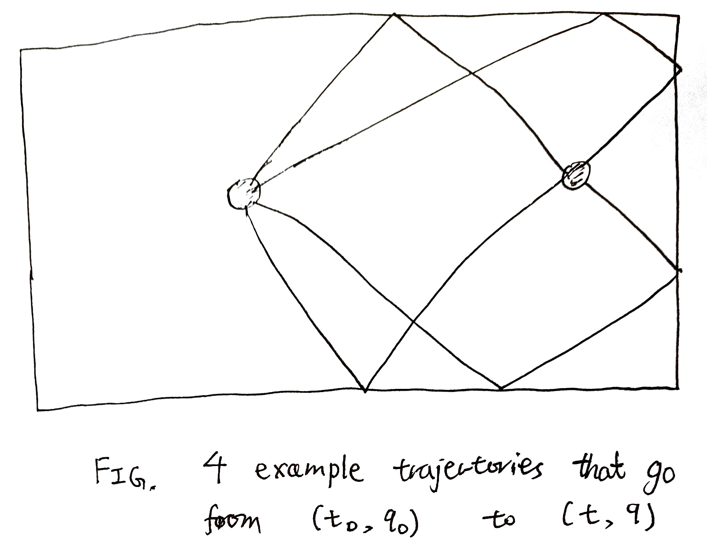{width=80% fig-align="center"}

What is the general lesson for defining $S$? In general, we need to do two things:

* Fix a particular optimal path $\tilde\gamma$, and only consider optimal paths that can be reached by continuously deforming that path. This is the same idea as selecting a branch cut when dealing with multi-valued functions like the complex logarithm.
* Avioid hitting the special points. To study the cost of traveling on a sphere, we must avoid our antipodal point. In general, we must avoid the points that can be reached by trajectories that are "too stationary", because as soon as we hit those points, we break single-valuedness.[^too-stationary]

[^too-stationary]: How stationary is "too stationary"? We want trajectories that are as stationary as $x=0$ in $y = x^2$, but not too stationary like $x=0$ in $y=x^3$, or even $y=x^4$. This has deep connections to [catastrophe theory](https://en.wikipedia.org/wiki/Catastrophe_theory) and the theory of [caustics](https://en.wikipedia.org/wiki/Caustic_(mathematics)), but it will take us too far afield to write it out.

Why are we so concerned with reflections? Why does this feel like [geometric optics](https://en.wikipedia.org/wiki/Geometrical_optics)? Read on!

### Hamilton--Jacobi equation

For all nice enough Lagrangian $L$, Hamilton's principal function $S$ is differentiable with respect to $(t, q)$, so we will study its differential equation.

Let's first consider the easy case: we simply let the trajectory "run a little longer". That is, we let the trajectory run from $(t_0, q_0)$ to $(t, q)$, then let it keep running for $\delta t$, reaching $(t+\delta t, q + \delta q)$. It's clear that we have $\delta q = \dot q(t) \delta t$, and

$$
S(t+\delta t, q + \delta q; t_0, q_0) - S(t, q; t_0, q_0) = \left(\sum_i p_i \dot q_i - H\right)\delta t
$$

so we have:

$$
\partial_t S + \sum_i \partial_{q_i}S \dot q_i = - H + \sum_i p_i \dot q_i
$$ {#eq-HJ0}

which strongly suggests 

::: {#thm-hj}

$$
(-\partial_t, \nabla_q)S(t, q; t_0, q_0) = (H, p), \quad (-\partial_{t_0}, \nabla_{q_0})S(t, q; t_0, q_0) = (-H_0, -p_0)
$$ {#eq-HJ}

If we consider only the $t, q$ part of $S$, we have a more elegant differential form:

$$
dS = \braket{p, dq} - Hdt
$$ {#eq-HJ-df}

:::

If @eq-HJ is indeed true, then we have

::: {#thm-hje}

## Hamilton--Jacobi equation

$$\partial_t S + H(t, q, \nabla_q S) = 0$$

:::

It suffices to prove $\nabla_q S = p$, since then $\partial_t S = -H$ follows from @eq-HJ0.

It suffices to prove $(-\partial_t, \nabla_q)S(t, q; t_0, q_0) = (H, p)$, since the other one is proved by the same argument, time-reversed.

Recall the economic construction of $p$. It is a price vector designed specifically to destroy all arbitrage opportunities. Consequently, we can consider an entire family of paths shown in Figure (a, b).

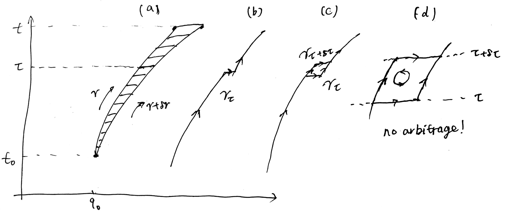

Here, $\gamma$ is the path from $(t_0, q_0)$ to $(t, q)$, and $\gamma + \delta \gamma$ is the path to $(t, q+\delta q)$. We interpolate between them by a family of paths $\{\gamma_\tau\}_{\tau}$, where $\gamma_\tau$ is the path obtained by first moving on $\gamma$ for time $t\in [t_0, \tau]$, then making a "jump" by "purchasing from the market"[^purchasing-from-the-market] an infinitesimal bundle of commodities so that we fall onto the $\gamma + \delta \gamma$ path, then continue along that path.

[^purchasing-from-the-market]: We are using the market *for real* now, so the marketeer had better had stocked up on those commodities!

Now consider two such jumped-paths, $\gamma_{\tau}$ and $\gamma_{\tau + \delta \tau}$, where $\delta \tau$ is an infinitesimal, shown in Figure (c). The cost difference between them is that between two sides of the parallelogram. By the no-arbitrage construction, the difference is zero.[^higher-order-infinitesimal]

Thus, we can smoothly "glide"[^path-homotopy] the path $\gamma$ to $\gamma + \delta\gamma$ by the family of jumped-paths $\gamma_\tau$, with $\tau$ going from $t$ to $t_0$, with no change in cost.[^higher-order-infinitesimal-cost] Thus, the only cost difference between $\gamma$ and $\gamma + \delta \gamma$ is the cost it takes to buy the bundle of commodities $\delta q$ at the very last instance:

$$S(t, q+\delta q; t_0, q_0) - S(t, q; t_0, q_0) = \sum_i p_i \delta q_i$$

finishing the proof.

[^path-homotopy]: In the jargon of topology, this is a homotopy of paths.

[^higher-order-infinitesimal]: More precisely, a higher-order infinitesimal than the area of the parallelogram. See @tip-higher-order-infinitesimal.

[^higher-order-infinitesimal-cost]: More precisely, their difference in cost is a higher-order infinitesimal than the area of the curvy triangle between them. Since the curvy triangle is an infinitesimal of order $\delta q$, the difference in cost is a higher-order infinitesimal than $\delta q$.

::: {#thm-poincare-cartan}

## Poincaré--Cartan integral invariant [@arnoldMathematicalMethodsClassical2001, pages 237--238]

Draw an arbitrary closed cycle $\alpha$ in phase space-time. Let every point $A \in \alpha$ evolve for some time (not necessarily the *same* amount of time) to reach some other point $A'$. Let $\alpha'$ be the cycle consisting of those points $A'$. Then we have the **Poincaré--Cartan integral invariant**

$$
\oint_\alpha \lra{p, dq} - Hdt = \oint_{\alpha'} \lra{p, dq} - Hdt
$$

As a special case, if both $\alpha$ and $\alpha'$ consists of simultaneous points, then it reduces to the **Poincaré relative integral invariant**

$$
\oint_\alpha \lra{p, dq} = \oint_{\alpha'} \lra{p, dq}
$$

:::

::: {.callout-note title="Proof" collapse="true"}

By the HJE, this is equivalent to $\oint_{\alpha - \alpha'} dS = 0$, which is just Stokes's theorem.

But this is too slick, so we prove it again by drawing pictures. Divide the tube into ribbons, like a barrel, then note that the integral around each barrel-plank is zero, as argued before.

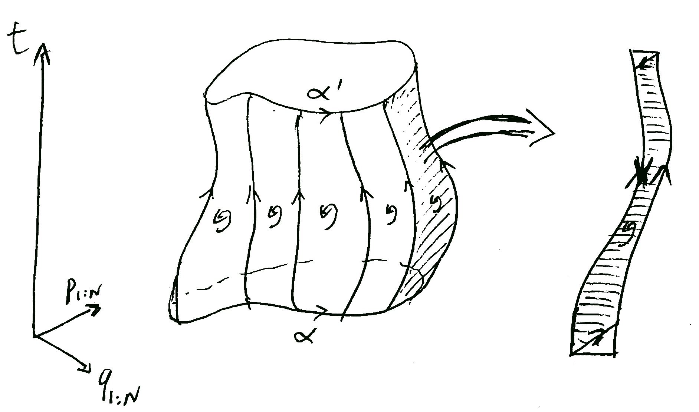

In more detail, we can consider the four ends of a barrel-plank parallelogram. Label those points as $A, B, A', B'$ as shown. Though the points $A, B, A', B'$ exist in phase space-point, we can forget their momenta, thus projecting them to configuration space-time. Each phase space-time trajectory projects to a trajectory in configuration space-time, and we obtain $S_{A \to B} = S(t_A, q_A; t_B, q_B)$, etc.

Now, by @eq-HJ, we can shift $S_{A \to B}$ to $S_{A \to B'}$, then to $S_{A' \to B'}$:

$$
S_{A \to B} = S_{A \to B'}  -H_B \delta t_B + \lra{p_B , \delta q_B} = S_{A' \to B'} + H_A \delta t_A - \lra{p_A , \delta q_A} -H_B \delta t_B + \lra{p_B , \delta q_B}
$$

Now, if we shift around one entire cycle, we would get back the same $S_{A \to B}$. Thus the two integrals are equal.

We will prove [Noether's theorem](#thm-noether) similarly.

:::

::: {#exr-zero-poincare-cartan}

A one-dimensional family of trajectories in phase space sweep out a curved surface. As shown in the illustration, prove that for any cycle $\gamma$ on the curved surface, $\oint_\gamma \lra{p, dq} = 0$.

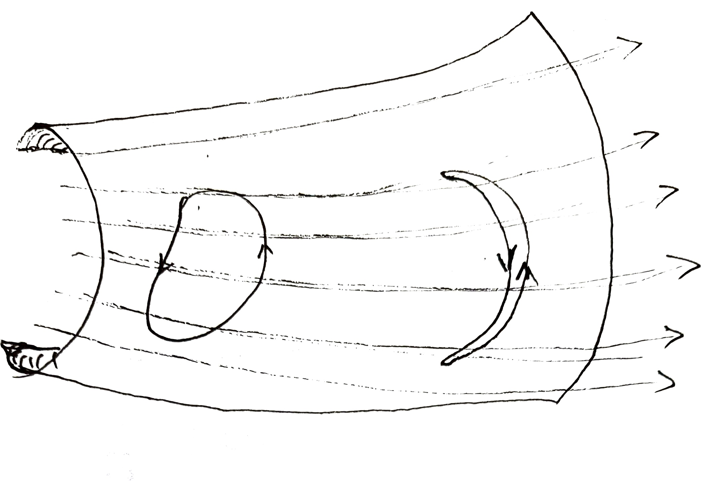{width=60% fig-align="center"}

:::

### Two more proofs of HJE

::: {.callout-note title="Proof by positional arbitrage" collapse="false"}

We only need to prove $p = \nabla S$, which is sufficient to prove @eq-HJ, and thus the HJE. This we show by positional arbitrage.

Suppose that a physically real trajectory goes from $(t_0, q_0)$ to $(t, q)$. Now we consider a nearby trajectory: First, we go from $(t_0, q_0)$ to $(t, q + \delta q)$ by a physically real trajectory, then we sell off $\delta q$ on the market. This would cost us 

$$S(t, q+\delta q; t_0, q_0) - \lra{p, \delta q} = S(t, q; t_0, q_0) + \lra{\nabla S - p, \delta q}$$

If $\nabla S \neq p$, then we can take $\delta q = -(\nabla S - p)\epsilon$, and thus magically make the journey cost less by a first-order infinitesimal. This means the market is inefficient, a contradiction.

:::

Here is a proof in the spirit of wave mechanics and dynamical programming. Though I did not study his proof,[^bellman-proof] I believe this is how the inventor of dynamical programming, [Richard Bellman](https://en.wikipedia.org/wiki/Richard_E._Bellman), proved his extension, the [Hamilton--Jacobi--Bellman equation](https://en.wikipedia.org/wiki/Hamilton%E2%80%93Jacobi%E2%80%93Bellman_equation). The HJBE reduces to the HJE under certain conditions -- they do not talk about the same thing, because while HJ is about stationary action, HJB is about maximal action.

[^bellman-proof]:
    In his autobiography, he said, 
    
    > Problems of this type had been worked on before by many mathematicians, Euler, Hamilton, and Steiner, but the systematic study of problems of this type was done at RAND starting in 1948 under the inspiration of von Neumann. [@bellmanEyeHurricaneRichard1984, page 208]
    > 
    > ... one can use dynamic programming for the minimum principles of mathematical physics. For example, with dynamic programming one has a very simple derivation of the eikonal equation. In addition, the Hamilton--Jacobi equation of mechanics can easily be derived. [@bellmanEyeHurricaneRichard1984, page 289]

Suppose that we have found all points at which the action is equal to $S$. Now we would like to expand that surface a little further, to the surface of action $S + \delta S$. We do that in the spirit of economics (of course!) and traveling.

Interpret the action of a path as the cost of traveling along that path. The surfaces of constant action, then, become the [isochrone maps](https://en.wikipedia.org/wiki/Isochrone_map). The problem we face is then a matter of travel planning: Given that we can reach up to surface $X_S$ if we are willing to pay cost $S$, how much further can we travel if we are willing to pay an additional $\delta S$?

![Isochrone maps of travel time in America, 1800 -- 1930. [@paullinAtlasHistoricalGeography1932, plate 138, page 366]](figure/isochrone_map_america.jpg)

Let us stand at a point $(t, q)$ on the surface of action $S$, and consider all the points we can reach by an additional action $\delta S$. Suppose we go from $(t, q)$ to $(t + \epsilon t, q + \epsilon q)$, then the cost of that is $L\lrb{t, q, \frac{\epsilon q}{\epsilon q}}\epsilon t$. (We write $\epsilon t$ instead of $\delta t$, because we have to use that symbol later.)

Therefore, the "little waves" ("wavelets") of action $\delta S$ radiating out of the point $(t, q)$ are those points $(t + \epsilon t, q + \epsilon q)$ satisfying the equation

$$
L\lrb{t, q, \frac{\epsilon q}{\epsilon t}}\epsilon t = \delta S
$$

And the surface of action $S + \delta S$ is the envelope of all those wavelets. This is the wave perspective, but we still need to return to the particle perspective.

Suppose you are already at $(t, q)$, and you just want to reach the surface of $S + \delta S$. It doesn't matter where you end up on that surface -- you just have to get to that surface *somewhere*. You also have exactly $\delta S$ to spend, so you have to plan optimally. So, you draw out the surface of all points you can reach after spending another $\delta S$. This is the $\delta S$-wavelet out of $(t, q)$. Now, looking at that picture, you see that the only place you can possibly reach is a certain point $(t + \delta t, q + \delta q)$.

Because the wavelet cannot reach beyond $S + \delta S$, it's clear that the wavelet is tangent to the surface of $S+\delta S$ precisely at $(t + \delta t, q + \delta q)$. But we can go further. We claim that the tangent surface of $S$ at $(t, q)$ is exactly parallel to the tangent surface of $S+\delta S$ at $(t + \delta t, q + \delta q)$.

To see it, imagine nudging $(t, q)$ around the surface of $S$. As you nudge around, the wavelet also slides around. If the tangent surfaces are not exactly parallel, then you can find a good direction to nudge the point $(t, q)$, such that as you give it a good shove, the wavelet bursts through the surface of $S + \delta S$, creating a contradiction.

That is, we have shown that there are 3 tangent planes, all parallel to each other:

1. The tangent plane of $S$ at $(t, q)$.
2. The tangent plane of $S + \delta S$ at $(t + \delta t, q + \delta q)$.
3. The tangent plane at $(t + \delta t, q + \delta q)$, of the $\delta S$-wavelet radiating out of $(t, q)$.

We write out symbolically the fact that Plane 1 is parallel to Plane 3:

$$
\begin{aligned}
& \quad \ub{dS}{Plane 1} \\
&= \partial_t S + \lra{\nabla_q S, dq} \\
&\propto \ub{d\Bigg|_{\epsilon t = \delta t, \epsilon q = \delta q}\left(L\left(t, q,\frac{\epsilon q}{\epsilon t}\right) \epsilon t\right)} {Plane 3} \\ 
&= \left(L-\frac{\delta q}{\delta t} \nabla_v L\right) dt + \lra{\nabla_v L, dq}\\
\end{aligned}
$$

Thus, there exists some constant $c > 0$ such that

$$
(\partial_t S, \nabla_q S) = c \lrb{L - \lra{\nabla_v L, \frac{\delta q}{\delta t}} , \nabla_v L} = (-cH, cp)
$$

This is the HJE, once we prove that $c=1$. To prove it, note that, by construction, the straight path from $(t, q)$ to $(t + \delta t, q + \delta q)$ is an optimal way to reach $S + \delta S$ from $S$, therefore it costs exactly $\delta S$, so

$$
\delta S = L \delta t
$$

which means

$$
\partial_t S \delta t + \lra{\nabla_q S, \delta q} = L\delta t = \lrb{L - \lra{\nabla_v L, \frac{\delta q}{\delta t}}}\delta t + \lra{\nabla_v L, \delta q}
$$

Thus, $c=1$.

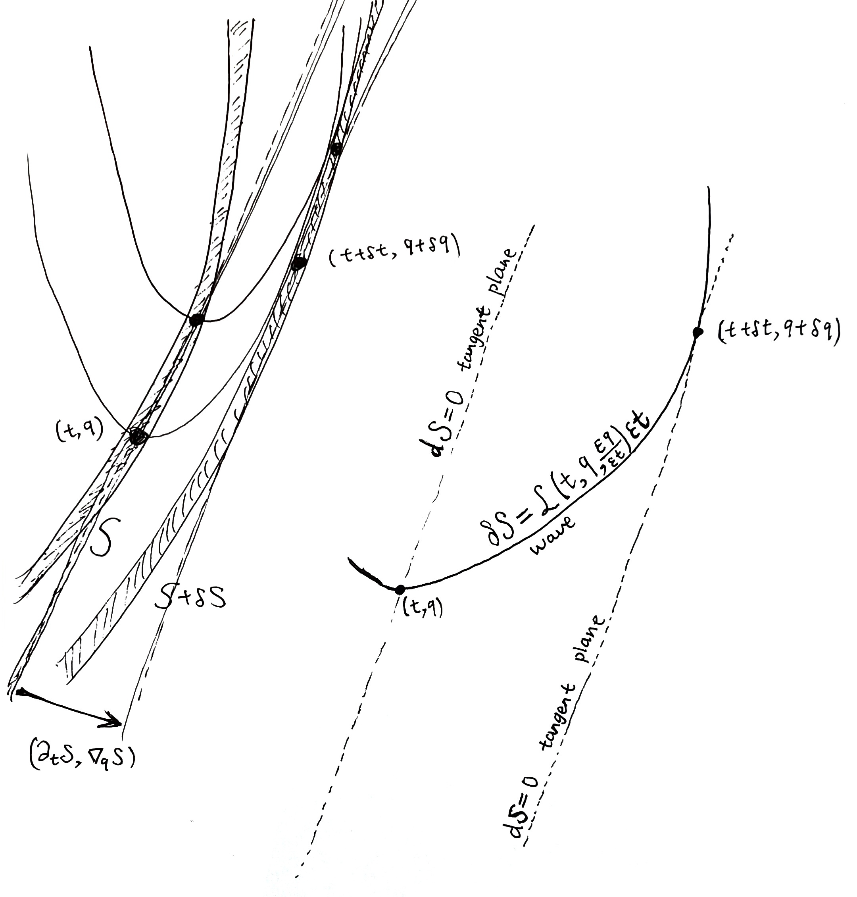{width=70% fig-align="center"}

::: {.callout-tip title="Convexity of the wavelet"}

If the wavelet is convex, then the tangent point is unique, and there is only one way to proceed from $(t, q)$. However, if the wavelet is not, then there could exist *two* or more particle paths shooting out from $(t, q)$. It is similar to [birefringence](https://en.wikipedia.org/wiki/Birefringence) and conical refraction [@lunneyInsOutsConical2006].

:::

::: {#exr-0}

If you have studied, or intend to study, control theory, then prove the Hamilton--Jacobi--Bellman equation using the exact same picture. You can also prove the stochastic HJB equation in the same way, though you would need to insert the expectation $\E$ somewhere.

:::

### Hamilton characteristic function

In many situations, the dynamics of the system is time-independent. That is, $H$ does not depend on time. This simplifies the HJE to

$$\partial_t S = -H(q, \nabla_q S)$$

Since the left side depends on $t$, but the right side does not explicitly, we can solve this by separating configuration and time:

$$
S(t, q) = W(q) - Et, \quad H(q, \nabla_q W(q)) = E
$$ {#eq-THJE}

for some $E\in \R$, and a function $W(q)$ depending only on configuration. $W$ is the **Hamilton characteristic function**.

Now we interpret it. Let $\gamma$ be a physically real trajectory from $(t_0, q_0)$ to $(t_1, q_1)$. By @eq-HJ, we see that along $\gamma$, 

$$H = E,\quad \partial_{q_i} S = \partial_{q_i} W = p_i$$

and the action satisfies

$$
S[\gamma] = \int_\gamma (\braket{p, dq} - H dt) = \int_\gamma \braket{p, dq} - E(t_1 - t_0)
$$

This provides us with another variational principle, **Maupertuis's principle**, or **principle of stationary abbreviated action**:[^maupertuis]

$$
\begin{cases}
\delta \int_\gamma \braket{p, dq} = 0 \\
q(t_0) = q_0, q(t_1) = q_1 \\
H(q, p) = E
\end{cases}
$$

Here, the trajectory is taken within phase space-time, with constraints on position, and an "on-shell energy" constraint. The name "abbreviated action" denotes $\int \braket{p, dq}$ to distinguish it with the "full" action $\int \braket{p, dq} - Hdt$. Notice that in this formulation, time has been eliminated. This may save effort when we only wish to know the shape of the trajectory.

::: {#exr-0}

Prove that for time-independent Hamiltonian $H(q, p)$, the principle of stationary abbreviated action and modified Hamilton's principle are equivalent. That is, a trajectory $\gamma$ is a solution for one iff it is a solution for the other.

:::

[^maupertuis]:
    [Maupertuis](https://en.wikipedia.org/wiki/Pierre_Louis_Maupertuis) was a curious character. His achievement in physics was mainly from proposing a principle of *least* action. In our language, it states that the trajectory of the entire universe, $\gamma$, is the unique **minimizer** of $\int_\gamma \sum_i m_i (v_{x,i}dx_i + v_{y,i}dy_i + v_{z,i}dz_i)$, where $i$ sums over all matter in the universe. There was a strong dose of Christianity in this, as he justified this by God's infinite elegance. He cannot but perform everything in the most efficient way. Fine. The context of discovery is not the context of justification. But in his [1744 paper](https://en.wikisource.org/wiki/Translation:Derivation_of_the_laws_of_motion_and_equilibrium_from_a_metaphysical_principle#II._Need_to_Identify_Proofs_of_God's_Existence_in_the_General_Laws_of_Nature;_In_particular,_the_Laws_Governing_Motion's_Conservation,_Distribution_and_Destruction_are_Based_on_the_Attributes_of_a_Supreme_Intelligence), he illustrated it with ... 3 examples: perfectly elastic collision between two points, perfectly inelastic, and the lever law. The paper also made a probabilistic argument for the existence of God: The 5 inner planets all move on circles nearly in the same plane "within a solid angle that is the 17th part of a sphere". This happens only by chance at probability $1/17^5$, proving that it was designed.

    Although to his credit, what he lacked in theory, he made up in experiments. He led an expedition to the far north to measure the length of one degree of latitude, finding that the latitudes are longer there. This ended a long debate on whether the diameter of earth from pole to pole is longer or shorter than the diameter on the equator.

    Years later, in a priority dispute, Maupertuis was helped by Euler who took his side. Then Voltaire got involved somehow, and wrote a satire of Maupertuis. He might have overdone it, since Maupertuis was President of the Royal Academy of Sciences at Berlin. The king of Prussia at the time (Frederick the Great) was so angered by it that he commanded all copies to be burnt.

If the system is a generalized particle in a potential field, there is a more geometric principle. Suppose

$$
H(q, p) = \frac 12 \sum_{ij} g^{ij}(q) p_i p_j + V(q), \quad L (t, q, v) = \frac 12 \sum_{ij} g_{ij}(q) v_iv_j - V(q)
$$

where $g_{ij}, g^{ij}$ are positive-definite matrices, and are inverse matrices of each other. Then, on any physically real trajectory $\gamma$, the abbreviated action becomes

$$
\int_\gamma \braket{p, dq} = \int_\gamma \ub{\braket{p, \dot q}}{$2$(kinetic energy)} dt = \int_\gamma \sqrt{2(E-V)} \sqrt{\sum_{ij} g_{ij} d q_i d q_j}
$$

The integrand looks a bit ugly, but after a clever redefinition,

$$
\int_\gamma \braket{p, dq} = \int_\gamma ds_E, \quad ds_E^2 := \sum_{ij} g_{E, ij} d q_i d q_j, \quad g_{E, ij} := 2(E-V(q)) g_{ij}(q)
$$ {#eq-jacobi-metric}

it shows itself as a [Riemannian metric](https://en.wikipedia.org/wiki/Riemannian_manifold). That is, each energy $E \in \R$ corresponds to a Riemannian-geometric structure on the configuration space $\mathcal C$, defined by $2(E-V(q)) \sum_{ij} g_{ij}(q)$. Then, we have the elegant formula

$$\delta \int_\gamma ds_E = 0$$

That is, if we impose the metric structure $g_E$ on the configuration space (not space-time), then physically real trajectories of energy $E$ are the geodesics of $g_E$. Once a geodesic is found, time can be restored via

$$
ds_E^2 = 2(E-V)\sum_{ij} g_{ij} dq_i dq_j = 4(E-V)^2 dt^2 \implies dt = \frac{ds_E}{2(E-V(q))}
$$

This is **Jacobi's principle of stationary action**. Note that each energy corresponds to a *different* metric, even though the underlying configuration manifold-in-itself stays the same. Indeed, energy has to enter the equation somewhere, because changing the energy changes what trajectories are physically real.

## Hamiltonian optics {#sec-geometric-optics}

### Isotropic case

We are going back to the roots, as geometric optics was what inspired Hamilton to develop his theory of Hamiltonian mechanics.

When Hamilton developed his Hamiltonian approach, it was to study geometric optics, which can be derived from Fermat's principle: *light paths have stationary travel time*. In other words, the action of a path is

$$S(\text{path}) = \int_{\text{path}} dt$$

Thus, $L = 1$\...? Well, here we see the problem: in geometric optics, if you fix the starting and ending point as $(t_0, q_0), (t, q)$, then *any* path between them takes exactly $t-t_0$ time, and there is nothing to vary. Consequently, we need to remove time from consideration, so that there is something to vary.

Fermat's principle, reformulated, states *light paths have stationary optical length*. Let the medium be isotropic (light speed does not depend on direction), then we have

$$S(\text{path}) = \int_{\text{path}} n(q) \|dq\|$$

where $n$ is the refractive index, with $L(q) = n(q)$. Here we encounter a brief difficulty: time flows in one direction only, but space flows in infinitely many possible directions!

The solution might seem like a joke, but it would work out well: select one direction[^principal-optical-axis], say $q_0$, and pretend that it is time. With this trick, all previous mathematical formalism immediately applies, and we have

[^principal-optical-axis]: This direction is usually selected to be the direction of the **principal optic axis**. For example, the long-axis of a camera is a principal optic axis, and so is the barrel-axis of a telescope.

$$S(\text{path}) = \int_{\text{path}} n(q_0, q_1, q_2) \sqrt{1 + \left(\frac{dq_1}{dq_0}\right)^2 + \left(\frac{dq_2}{dq_0}\right)^2}dq_0$$

#### Derivation

Let's make the notation cleaner, by rewriting $q_0$ as $t$, $(q_1, q_2)$ as $q$, and using $v$ to mean $\left(\frac{dq_1}{dq_0}, \frac{dq_2}{dq_0}\right)$. Then we have

$$L(t, q, v) = n(t, q) \sqrt{1 + \|v\|^2}$$

Routine calculation yields

$$\begin{cases}     
L(t, q, v) = n(t, q) \sqrt{1 + \|v\|^2}\\     
H(t, q, p) = -\sqrt{n^2 - \|p\|^2} 
\end{cases} \quad 
\begin{cases}     
p^\ast = \frac{nv}{\sqrt{1 + \|v\|^2}} \\     
v^\ast = \frac{p}{\sqrt{n^2 - \|p\|^2}} 
\end{cases}$$

we continue with the HJE, which simplifies to:

$$(\partial_t S)^2 + \|\nabla_q S\|^2 = n^2$$

Reverting notation back to $(q_0, q_1, q_2)$, we find the **eikonal equation**[^eikonal-etymology]:

[^eikonal-etymology]: From Greek εἰκών (*eikon*, "image"), from which the word "icon" derived.

$$\|\nabla_q S\| = n(q)$$

Why did the trick work? Well, if we look back to how we derived the Hamiltonian, we could see that what we called "time" is really just a special copy of $\R$, along which we organized all other state and control variables. We don't really need time to be anything more than the domain of functions, as in $q_i: \R \to \R$ and $v_i : \R\to \R$. It most definitely does not need to "flow", or flow only from the past to the future, or have any psychological significance.

#### Interpretation

Starting with Fermat's principle for light rays, we ended up with the eikonal equation for light waves. In general, we find the following duality between wave-field optics and particle-path optics.

| perspective |   particle-path |                   wave-field |
|--------------|--------------------------------|------------------------------------------|
| action $S$ |    a function of particle path   |   a field on configuration-spacetime |
| equation    |   $\|\nabla_q S\| = n(q)$      |  $\partial_t S + H(t, q, \nabla_q S) = 0$ |
| in optics    |  light rays, Fermat's principle |  light waves, Huygens principle |
| in mechanics  | point particles                 | matter waves |

: The particle-wave duality.

### Anisotropic case

When the travel cost of light can depend on the direction of travel, we say that the medium is anisotropic. Now, you might expect 

$$
S = \int n(\hat{\delta q}) \delta q
$$

but this is incorrect, not because there is anything necessarily wrong with the formalism, but because of how $n$ is defined by convention in anisotropic material. At this point, we must study the full particle-wave duality again.

For a moment, let's pretend light is really a particle, and consider how it might appear to someone who believes light is a wave. We arrange an entire plane of photons, such that the plane is perpendicular to a unit vector $\hat k$. Now, let them move optimally for time $\delta$. Each of them would go in the same optimal direction $v^*(\hat k)$, to push the wavefront as far-out as possible.

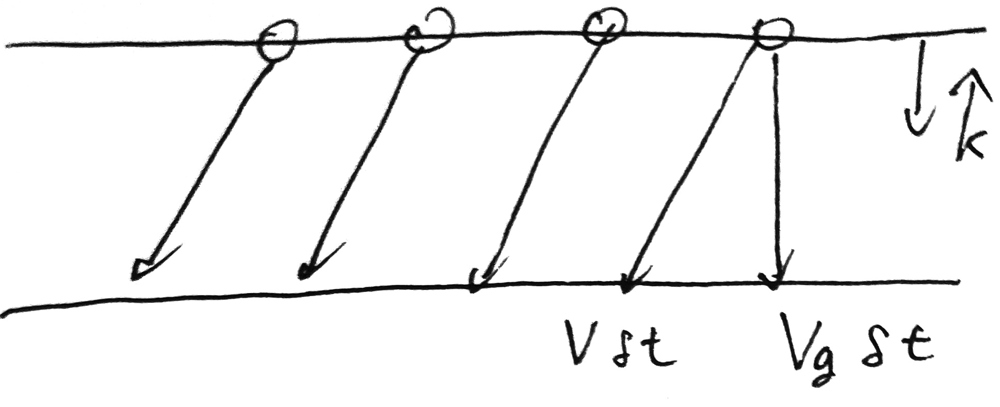{width="50%" fig-align="center"}

Now, the wavefront does not move in the direction $v^*$, but in the direction $\hat k$. Therefore, the wavefront moves at **group velocity** $v_g(\hat k) = \lra{v^*(\hat k), \hat k} \hat k$.

Since the photons are trying to push as far out as possible,

$$v^*(\hat k) = \argmax_{v \in K_{particle}} \lra{\hat k, v}$$

where we write $K_{particle}$ as the surface of all particle velocities in all directions. It is a sphere of radius $c$ in a vacuum, but in an anisotropic medium, we allow it to be any crazy shape.

Instead of studying the group velocity, we actually need to use its inverse -- the wavevector $k = \frac{\hat k}{v_g}$.[^wavevector] We thus have

$$k = \frac{\hat k}{\max_{v \in K_{particle} \lra{v, \hat k}}}$$

[^wavevector]: The typical definition is $k_{usual} = \frac{2\pi}{\lambda}\hat k = \nabla \phi$, where $\phi$ is the phase of the light, and $f$ is its temporal frequency. Our definition, which makes it cleaner, but somewhat different from typical definition, is $k_{ours} = \frac{\nabla \phi}{2\pi f} = \frac{\nabla \phi}{\omega}$.

The reason we use this instead of the group velocity is that, a little simplification later, we have the beautifully simple relation

$$
\forall k \in K_{wave}, \quad \max_{v \in K_{particle}}\lra{v, k} = 1
$$

This is a suggestive symmetry, which practically demands us to write it as a duality:

$$
\begin{cases}
v^*(k) = \argmax_{v \in K_{particle}}\lra{v, k} \\
k^*(v) = \argmax_{k \in K_{wave}}\lra{v, k}
\end{cases}, \quad
\begin{cases}
\lra{v^*(k), k} = 1\\
\lra{v, k^*(v)} = 1\\
\end{cases}
$$

This is the polar dual construction, often used in convex analysis.[^polar-dual] [@hiriart-urrutyFundamentalsConvexAnalysis2001, Section C.3].

[^polar-dual]: What, just because we have not mentioned Legendre transform for a few pages, you would think that we're done with convex analysis? Too bad! If nature is the great optimizer, then convex analysis is inescapable at every turn.

The best case is if $K_{particle}$ is convex. In this case, each $k \in K_{wave}$ defines a plane perpendicular to it, at a distance $\|k\|^{=1}$ from the origin, and the plane is tangent to $K_{particle}$ at precisely $v^*(k)$, and conversely so. In other words, $K_{particle}$ is the envelope of polar lines to points in $K_{wave}$, and conversely so. 

Conversely, we can pretend that light is really a wave, and consider how it might appear to someone who believes light is a particle. We would then go through the above argument, and obtain the same result.

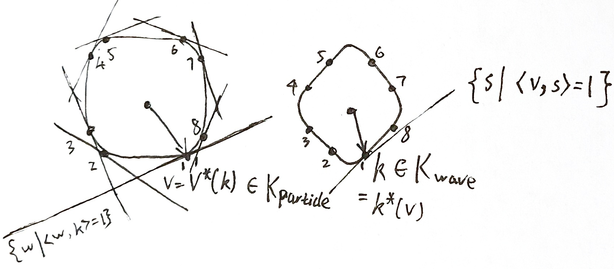{width="80%" fig-align="center"}

However, we want to deal with more general cases than this, so we need to resolve two issues.

First issue: $K_{particle}$ might be non-convex. Second issue: it might be double-sheeted, or even many-sheeted. For example, in crystal, light polarized in two different orientations can move at two different velocities even in the same direction. Thus, its $K_{wave}$ has two sheets, and so its polar dual, $K_{particle}$, also has two sheets.

Both issues are solved by extending the definition of polar duality: replace the maximum with a stationarity. We can still construct $K_{particle}$ from $K_{wave}$ by taking a tangent plane for each $k \in K_{wave}$, but now instead of the intersection of the half-planes, we use their envelope. A picture shows what we mean:

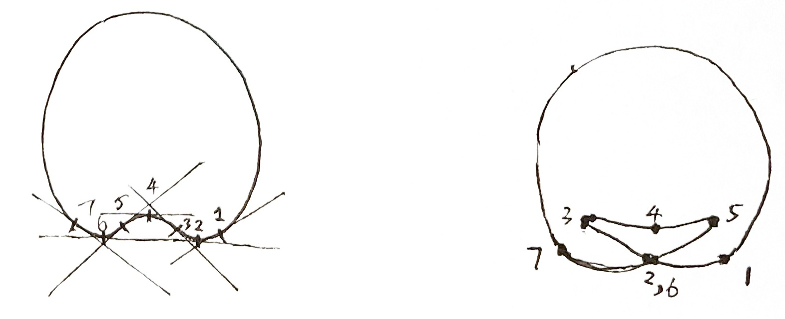{width="60%" fig-align="center"}

We still have a duality between points on the two surfaces, defined by stationarity, not optimality. For example, for any wavevector $k \in K_{wave}$, its corresponding dual point $v^*(k)$ satisfies $\lra{v^*(k) + \delta v, k} = 0$ for any $\delta v$ in the tangent space of $K_{particle}$ at $v^*(k)$.

The first application of Hamiltonian mechanics was done by Hamilton, who in 1832 predicted theoretically that if light enters a biaxial crystal in just the right way, it will not just refract in one direction, but in an entire *cone* of directions -- which he termed [internal conical refraction](https://en.wikipedia.org/wiki/Conical_refraction). The theory of this is fascinating,[^conical-neptune] however, for lack of space, we will only give the barest description. 

[^conical-neptune]: It was historically important as the first phenomenon predicted by mathematical reasoning before experimental observation [@berryChapter2Conical2007], and it was often compared to the mathematical prediction of Neptune by Le Verrier (1845) [@smithCambridgeNetworkAction1989].

Simply put, it turns out that in a biaxial crystal, both $K_{particle}$ and $K_{wave}$ have the same shape of a large blob containing a smaller blob, touching each other at 4 cone-shaped points, as pictured.

![The shape of the $K_{wave}$ surface. The $K_{particle}$ surface is topologically the same, and can be obtained from $K_{wave}$ by squashing it *just right*. Figure from [@schaeferElektrodynamikUndOptik1949, page 485, figure 128]](figure/schaefer_1949_fig_128.png){width=80%}

Now, let $k_c \in K_{wave}$ be one of the cone-shaped points, then it corresponds to a tangent plane to $K_{particle}$. Each tangent point $v \in K_{particle}$, conversely, corresponds to a tangent plane to $k_c$.

Since $k_c$ is a conical point, however, there are a whole *circle* of tangent planes to $K_{wave}$ at $k_c$. Consequently, the tangent plane to $K_{particle}$ is tangent to it on one entire circle. It is as if we throw a tire on the floor -- it will touch the floor not just at three points, but an entire circle of points. Now, suppose that we have a planar wave moving in the direction of $k_c$ inside the crystal, then each light-particle would have to move in a direction $\argmax_{v \in K_{particle}}\lra{v, k_c}$. But since there is an entire circle of such directions, we would have an entire circle of possible $v$, and thus, we obtain a hollow cone of light.

{width="30%" fig-align="center"}

## The particle-wave duality

### Particle in free space

Consider a particle of mass $m$ in free space $\R^n$. Its Lagrangian is $L(t, q, v) = \frac 12 m\|v\|^2$. By convex duality, we have

$$\begin{cases} L(t, q, v) = \frac 12 m\|v\|^2\\ H(t, q, p) = \frac{\|p\|^2}{2m} \end{cases}\quad  
\begin{cases} p^\ast(t, q, v) = mv\\ v^\ast(t, q, p) = \frac{p}{m} \end{cases}$$

For any $t_0, q_0, t, q$ with $t_0\neq t$, we can directly solve for the trajectory from $(t_0, q_0)$ to $(t, q)$, then find the action:

$$S_{t_0, q_0}(t, q) = \frac 12 m \frac{\|q-q_0\|^2}{t-t_0}$$

Each $S$ defines a paraboloid wavefront in spacetime, with apex $t_0, q_0$. The wavefront is translation-symmetric, so we set both to zero, yielding the equation of the wavefront:

$$
t = \frac{\|q\|^2}{2S/m}
$$

The wavefront of $S = 0$ is just the positive $t$-axis, and as $S$ increases, the wavefront widens out.

Now, we interpret this wave from the HJE point of view. Let's say we have the wavefront at $S=S_0$, and we want to construct the wavefront at $S = S_0 + \delta S$. This we perform by rippling out a little wavelet at each point $(t', q')$ on the wavefront. The little wavelet has shape $(t-t') = \frac{\|q - q'\|^2}{2\delta S/m}$, and as we move $t', q'$ around the parabola of wavefront $S = S_0$, the envelope of these wavelets is the wavefront of $S = S_0 + \delta S$.

This is the wave point of view. We can switch back to the particle point of view. What is the velocity of the particle passing the point $(t', q')$? We know that it must be traveling in the optimal direction, and the optimal direction allows it to go as far as possible. Therefore, we simply draw the wavelet of $\delta S$ at $(t', q')$, then find the intersection of the wavelet with the wavefront of $S = S_0 + \delta S$.

The entire procedure is pictured below.

### Particle-wave in free space

The paraboloid-shaped solution for $S$ is interpretable in Newtonian mechanics, as the motion of a single particle moving from the origin. However, the HJE itself is merely a PDE with its own logic and meaning, and consequently, it may have different solutions that are hard to to interpret in Newtonian mechanics.

From our 21st-century perspective, we can say that the HJE is generally true, and Newtonian mechanics is only a special case. Some solutions to the HJE may not be interpretable in Newtonian mechanics, but they are nevertheless physically real, since Newtonian mechanics is incomplete. Given that, we simply try to solve HJE, then try to interpret it, even if not in Newtonian mechanics.

Because the Lagrangian is time-independent, so any [time-independent solution](#eq-THJE):

$$S(t, q) = W(q) - Et, \quad \| \nabla_q W \| = \sqrt{2mE}$$

for any constant $E > 0$ also gives a solution to the HJE. This is just the eikonal equation for a medium of constant wave speed! More on this in [the section on geometric optics](#sec-geometric-optics). One can of course solve the eikonal equation by putting it into a numerical package and let it grind out the solution. However, we can interpret it by the Huygens principle.

Suppose you know a surface of constant $W = W_0$, and you know that the arrows of $\nabla_q W$ point outwards, then since $\nabla W$ is perpendicular to the surface, and is of constant length $\sqrt{2mE}$, you can step out a small distance $ds$ perpendicularly out of the whole surface $W= W_0$, and arrive at the surface of $W=W_0 + \sqrt{2mE} ds$. Alternatively, you can draw small spheres of radius $ds$, and their outwards envelope is the $W=W_0+ \sqrt{2mE} ds$ surface. These procedures are equivalent, but in one, we constructed "rays" while the other we constructed "wave fronts".

For the free particle, the simplest solution is the plane wave:

$$W(q) = \sqrt{2mE} \langle \hat k, q \rangle$$

where $\hat k$ is any unit-vector, interpreted as the direction of wave propagation. Plugging it back to @eq-HJ, we find that the "planar wave particle" has

$$(\partial_t S, \nabla S) = (-H, p) = (-E, \sqrt{2mE}\hat k)$$

where $\hat k$ is the direction of the group velocity of the wave. The group velocity of the wave is $\frac{\partial_t S}{\nabla S} = \frac{E}{\sqrt{2mE}}\hat k$.

Taking the particle-wave analogy seriously, we say that:

* a planar wave is a particle with energy $E$ and momentum $p \propto k \propto \sqrt{2mE} \hat k$.
* a particle with energy $E$ and momentum $p$ is a planar wave traveling at group velocity $E/p$.

Typically, waves have a wavelength $\lambda$, which is related to the wave vector $k$ by $k \propto \lambda^{-1}$, we find that the particle has wavelength $\lambda \propto \frac 1k \propto \frac 1p$. Thus, we arrived at de Broglie's matter-wave hypothesis, which Schrödinger expanded into his equation. Both de Broglie and Schrödinger were inspired by Hamilton's optics-mechanics analogy, so we are treading the same path as them a century ago.

In fact, we could start with an arbitrary wavefront in configuration-spacetime, and use Huygens' principle to construct the wavefront in the next moment. In general, we can't do Fourier analysis on such wavefronts -- they are not decomposable into planar waves, because the HJE is a nonlinear equation. Fourier analysis only works on linear differential equations.

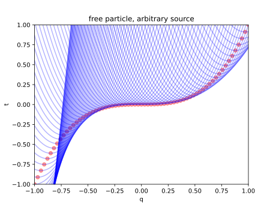

::: {#exr-0}

Solve the time-dependent HJE for a single particle starting at $(0, 0)$. The graph of $S(t, q)$ should look like a cone. This is a particular example of the [Monge cone phenomenon](https://en.wikipedia.org/wiki/Monge_equation).

:::

### Particle in a potential field

A particle in a time-dependent potential field $V$ has Lagrangian $L(t, q, v) = \frac 12 m\|v\|^2 - V(t, q)$. By convex duality

$$\begin{cases}     
L(t, q, v) = \frac 12 m\|v\|^2 - V(t, q)\\     
H(t, q, p) = \frac{\|p\|^2}{2m} + V(t, q) 
\end{cases} \quad 
\begin{cases}     
p^\ast = mv \\     
v^\ast = \frac pm 
\end{cases}$$

The HJE gives

$$\partial_t S + \frac 1{2m} \|\nabla_q S\|^2 = -V(t, q)$$

As before, if we interpret the equation as a wave equation, then the group velocity is $\frac{\partial_t S}{\nabla S} = \frac{-E}{p} \hat k$, with magnitude $v_g = \frac{E}{\sqrt{2m(E-V)}}$.

::: {.callout-note title="Example: particle in free fall" collapse="true"}

We consider the classical problem of a body in free fall, thrown from the origin $(t, q) = (0, 0)$. Basic physics tells us that the position and velocity of the body are given by

$$q(t) = v_0 t - \frac{1}{2}gt^2, \quad v = v_0 - gt = \frac{q}{t} - \frac{1}{2}gt$$

Plugging these expressions into the HJE, we obtain a system of partial differential equations for the action function $S$:

$$
\begin{cases}
\partial_t S &= -H = -\frac{1}{2}m(\frac{q}{t} - \frac{gt}{2})^2 - mgq \\
\partial_q S &= m(\frac{q}{t} - gt)
\end{cases}
$$

Solving this system, we find the unique solution for the action:

$$S = \frac{x^2}{y} - xy - \frac{y^3}{12}$$

where we have introduced convenience variables $x = gq$, $y = gt$, and $s = \frac{2gS}{m}$.

The contour lines of the action function satisfy the equation:

$$
x = \frac{1}{2}y^2 \pm \sqrt{\frac{1}{3}y^4 + sy}
$$

To analyze the wavelet associated with this system, we start by writing down the Lagrangian:

$$L = T - V = \frac{1}{2}m(\frac{\delta q}{\delta t})^2 - mgq$$

The wavelet equation is then given by:

$$\delta S = L \delta t = \left(\frac{1}{2}m(\frac{\delta q}{\delta t})^2 - mgq\right)\delta t$$

Simplifying this equation using our convenience variables, we get:

$$(\delta x)^2 = 2x(\delta y)^2 + \delta s \delta y$$

Solving for $\delta y$, we obtain:

$$\delta y = \frac{-\delta s \pm \sqrt{(\delta s)^2 + 8x(\delta x)^2}}{4x}$$

This equation reveals the nature of the wavelet. When $x > 0$, the equation describes a hyperbola. For $x < 0$, it describes an ellipse. At the boundary $x = 0$, the equation describes a parabola.

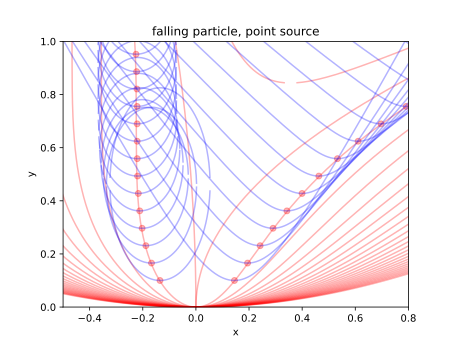

There is no planar wave solution, because a planar wave solution is both constant energy and unbounded, whereas if a particle can move infinitely far away, it must have infinite energy. If we attempt to force a planar wave solution, it would immediately break down:

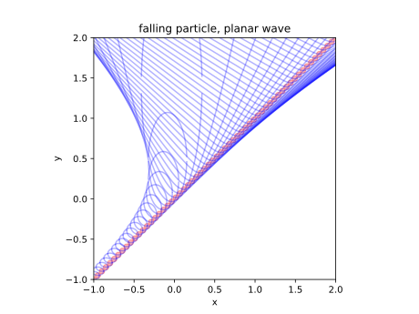

:::

::: {#exr-0}

Solve the time-independent HJE for the particle in free fall. It should be $S = W(q) - Et$, where $E$ is a constant, and $W$ is a [semicubical parabola](https://en.wikipedia.org/wiki/Semicubical_parabola).

:::

::: {#exr-0}

In the same way, analyze the simple harmonic oscillator -- a particle in a potential well $V = \frac 12 kq^2$. Similarly, it cannot have a planar wave solution. Plot the wavelets along each point on a planar wave, and see how it breaks down. Find two families of solutions: The case where we have a point source at $(0, 0)$, and the case of time-independent HJE.

:::

### Guessing the Schrödinger equation

> If, in some cataclysm, all of scientific knowledge were to be destroyed, and only one sentence passed on to the next generations of creatures, what statement would contain the most information in the fewest words? ... that all things are made of atoms—little particles that move around in perpetual motion, attracting each other when they are a little distance apart, but repelling upon being squeezed into one another. In that one sentence, you will see, there is an enormous amount of information about the world, if just a little imagination and thinking are applied.
>
> [The Feynman Lectures on Physics, I.1.2: Matter is made of atoms](https://www.feynmanlectures.caltech.edu/I_01.html)

If, in some space-time cataclysm, the entire knowledge of quantum mechanics were to be destroyed, and only one sentence passed on to the next generation of physicists, what statement would contain the most information in the fewest words? I believe it is the [unitarity principle](https://en.wikipedia.org/wiki/Unitarity_(physics)): All laws of physics must be cast into the form of length-preserving rotations in complex vector space.

So let us derive the time-dependent Schrödinger equation from the HJE using unitarity.

Begin by inspecting the HJE: $\partial_t S + \frac{\|\nabla_q S\|^2}{2m} + V = 0$. It is not fundamental, because it is not a linear differential equation, and all length-preserving rotations must be linear. Either by a good guess, or by watching animated plots of $S(t, q)$ over time, we could be reminded of a water wave, and guess that the wave-like function $\psi(t, q) = e^{iS(t, q)}$ may satisfy a linear differential equation. 

Now, because $S$ has units of energy-time, but $e$ must take a unitless quantity, we invent a new physical constant $\hbar$ with units of energy-time, and insert: $\psi(t, q) = e^{iS(t, q)/\hbar}$.

Now we take its derivatives:

$$
\partial_t \psi = \frac{i}{\hbar}\psi\partial_t S, \quad \partial_{q_i}^2 \psi = -\frac{1}{\hbar^2} \psi (\partial_{q_i} S)^2 + \frac{i}{\hbar}\psi \partial_{q_i}^2 S
$$

and insert them back to the HJE, obtaining

$$
i\hbar \partial_t \psi = \hat H\psi + \frac{i \hbar}{2 m}(\nabla^2 S) \psi
$$

where $\hat H = -\frac{\hbar^2}{2m} \nabla_q^2 + V$. This is promising. We have almost obtained a linear differential equation for a wavefunction, except for the $\frac{i \hbar}{2 m}(\nabla^2 S)$ term. Furthermore, the equation $i\hbar \partial_t \psi = \hat H\psi$ has solution $\psi(t, q) = e^{-i(\hat H/\hbar)t} \psi(0, q)$, and because the differential operator $\hat H$ is self-adjoint, $e^{-i(\hat H/\hbar)t}$ is a [unitary operator](https://en.wikipedia.org/wiki/Unitary_operator).

Apply wishful thinking, ignore the inconvenient term, and just write $i\hbar \partial_t \psi = \hat H\psi$. This is the time-dependent Schrödinger equation.

If you want more of this unitarity, you may be interested in the [Koopman--von Neumann interpretation of classical mechanics](https://en.wikipedia.org/wiki/Koopman%E2%80%93von_Neumann_classical_mechanics).

::: {.callout-note title="More historically accurate derivation" collapse="false"}

One might object to unitarity. The crucial Unitarity Principle emerged only in the 1930s, about 10 years after the founding of quantum mechanics. If Schrödinger didn't need unitarity to guess his equation, why should we? Well, there is a more historically accurate way to guess your way to the equation. [@masoliverClassicalQuantumMechanics2009; @derbesFeynmansDerivationSchrodinger1996; @hamillStudentsGuideLagrangians2013, section 6.4].

Assume that the potential is time-independent: $V(t, q) = V(q)$. Assume that the physical system can be described by a function

$$
\Psi(t, q) = \Psi_0(r) e^{iS(t, q)/\hbar}
$$

where the function $\Psi$ is typically called the "wave function". We assume that the wave is a "standing wave", so that all of space is oscillating in sync. Let $S(t, q) = W(q) - Et$, so that the oscillation frequency is $E/\hbar$.[^standing-wave]

[^standing-wave]: The most important experimental result from quantum mechanics is that energy levels are quantized. Now, a quantized energy level is something like $E = h, 2h, 3h, \dots$. There is really just one kind of thing in classical mechanics that is quantized: standing waves! If you have a string, then its standing waves must have $0, 1, 2, 3, \dots$ nodes, i.e. quantized. Thus, it is natural to try out this "standing wave" assumption.

So, we can separate the variables to

$$
\Psi(t, q) = \ub{e^{-i\frac{E}{\hbar}t}}{oscillation in sync} \ub{\psi(q)}{variation over space}, \quad \psi(q) = \Psi_0(q) e^{i\frac{W(q)}{\hbar}t}
$$

Since $\Psi$ should be a wave, it has better follow the wave equations:

$$
(\partial_t^2 - v_g^2 \nabla^2)\Psi = 0
$$

where $v_g$ is the group velocity of the wave. As we saw previously, $v_g = \frac{E}{\sqrt{2m(E-V)}}$ for a particle in a potential. Then we have

$$
\begin{cases}
\Psi(t, q) &= e^{-i\frac{E}{\hbar} t} \psi(q), \\
0 &= (\partial_t^2 - v_g^2 \nabla^2)\Psi, \\
v_g &= \frac{E}{\sqrt{2m(E-V)}},
\end{cases}\;\; \implies \frac{\hbar^2}{2 m} \nabla^2 \psi+(E-V) \psi = 0,
$$

which is the time-independent Schrödinger equation.

The time-dependent case

$$
i\hbar\frac{\partial}{\partial t} \Psi(t, q) = \left [ - \frac{\hbar^2}{2m}\nabla^2 + V(t, q)\right ] \Psi(t, q).
$$

can be derived similarly. Plug $\Psi(t, q) = \psi_0(t, q) e^{i S(t, q)/\hbar}$ back to the time-dependent Schrödinger equation, and check that at the $\hbar \to 0$ limit, we recover the HJE for $S(t, q)$. This is a simple example of the [WKB approximation](https://en.wikipedia.org/wiki/WKB_approximation).

:::

#### What does it all mean?

If the above derivation looks mildly suspect, and leaves you with a feeling of seeing a magic trick, it is not an accident. The analogy between classical mechanics and quantum mechanics is not exact, so we cannot logically derive quantum mechanics from classical mechanics. The simple problem is that classical mechanics, even when formulated in the form of Hamilton--Jacobi wave equations, cannot reproduce interference or diffractions. Consider the simple case of a straight-edge diffraction. If you aim a light beam at a sharp edge, then on the other side, there would be alternating bright and dark bands fading into the shadow. However, if light is going by the shortest path, then there should be no such banding, and the brightness should just drop off to zero monotonically.

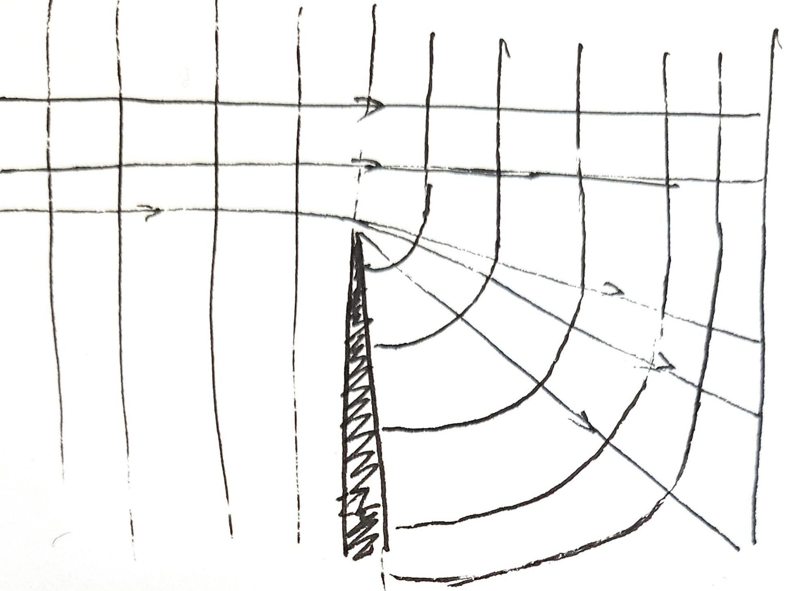{width="60%" fig-align="center"}

The solution is to admit that geometric optics is insufficient, that Huygens' principle is insufficient, and we need a full theory of light wave in order to explain what happens on the smallest scales -- a diffraction theory. Similarly, classical mechanics is insufficient, and the HJE is insufficient, and we need a full theory of matter wave in order to explain what happens in the atomic world -- quantum mechanics.

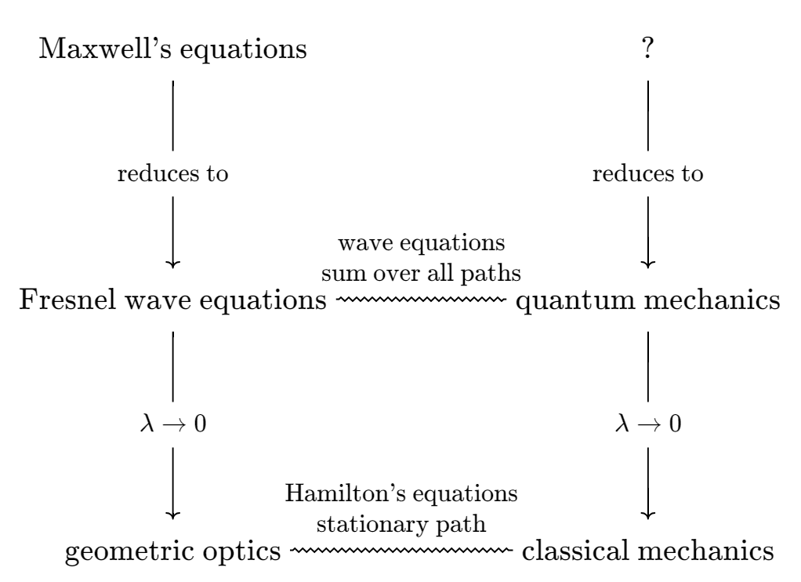

Deriving quantum mechanics from classical mechanics is necessarily fraught with danger and luck, because in going from quantum mechanics to classical mechanics, something is irrevocably lost (and other things are irrevocably earned). It is about as difficult as going from geometric optics to wave optics. Still, several people have tried and succeeded, most famously, Schrödinger.

> ... the conception of rays is thoroughly well defined only in pure abstract geometrical optics. It is wholly incapable of being applied to the fine structure of real optical phenomena, i.e. to the phenomena of diffraction. Even in extending geometrical optics somewhat by adding the notion of Huygens' principle, one is not able to account for the most simple phenomena of diffraction without adding some further very strange rules concerning the circumstances under which Huygens' envelope-surface is or is not physically significant. (I mean the construction of "Fresnel's zones".) These rules would be wholly incomprehensible to one versed in geometrical optics alone. Furthermore it may be observed that the notions which are fundamental to real physical optics, i.e. the wave-function itself ($W$ is merely the phase), the equation of wave-propagation, the wave length and frequency of the waves, do not enter at all into the above stated analogy. 
> 
> [@schrodingerUndulatoryTheoryMechanics1926]

> ... geometrical optics is only an approximation... when interference and diffraction phenomena are involved, it is quite inadequate. This prompted the thought that classical mechanics is also only an approximation relative to a vaster wave mechanics. ... A new mechanics must be developed which is to classical mechanics what wave optics is to geometrical optics. This new mechanics has since been developed, thanks mainly to the fine work done by Schrödinger.
>
> Louis de Broglie's Nobel Prize Lecture [@debroglieWaveNatureElectron1929]

::: {.callout-note title="Jeremiah on particle-wave duality" collapse="true"}

Just after presenting the double slit experiment, pop-science and even textbooks of quantum mechanics often apologize: "So we see that an electron is both a particle and a wave. This may seem like nonsense, but it is true.". It feels like they knelt down, crossed themselves, and prayed for forgiveness, for they were about to tread on the sacred image of Physical Intuition. But the sacred image has nothing behind it.

The entire idea that quantum mechanics is something weirder than classical mechanics is a mistake. Particle-wave duality is not weird. Particle-wave dichotomy is weird. After all, quantum mechanics is *just* finite dimensional complex linear algebra, but classical mechanics involves point-mass particles mysteriously *exactly* hitting each other in space, never missing each other by an infinitesimal amount. And if one were to invoke rigid body mechanics, well, how do rigid bodies stay rigid? If they are made of a cloud of point masses, then how could they stay together and not dispel like mist? If the points are held together by little atomic hooks, then how do the atomic hooks stay rigid?

Everything in physics, when you dig down to it, becomes an abstract mathematical object. A wave in spacetime is merely a function of type $\R^4 \to \R$. A particle is merely its worldline, a function of type $\R \to \R^4$. A quantum particle-wave is merely a length-one element in a complex linear vector space. Is any of these weirder than the others? They are equally mathematical. If one does not apologize for violating quantum intuitions when going classical, neither should one apologize in the other direction.

The point is simply that when one thinks about it, quantum mechanics may need interpretation, but classical mechanics needs interpretation just as much. Newtonian, Lagrangian, Hamiltonian, Hamilton--Jacobian, making money -- they are all interpretations of classical mechanics. There is no book titled "Interpretations of classical mechanics", but there should be. After all, what is Hamilton's principal function? We call it the "minimal cost" for arriving at $(t, q)$, but what really is a cost in physics? Particles do not really pay their paths with natural money. Is it any less mysterious than quantum mechanics? Only by dint of complacency and the mindless clinging to Newtonian interpretation does the classical system of the world appear homely and natural.

:::

### Relativistic quantum mechanics

Since the HJE is fully general for any function $L(t, q, v)$ that is smooth and strictly convex in $v$, we can simply write down the Lagrangian for relativistic particle in a field, and it would *just work*.

Let's first consider particle in free space. In relativity, the one thing that is coordinate-independent is the proper time of a trajectory, so it is reasonable to *guess* that the action is the proper time, then deduce from it the Lagrangian. This is natural if we think of $S$ as the optimal cost of traveling.

Let $t_0 = 0, q_0 = 0$, then by basic relativity, the proper time for the particle to arrive at $(t, q)$ is

$$S(t, q) = \frac{\|q\|}{v\gamma} = \sqrt{t^2- \frac{\|q\|^2}{c^2}}$$

where $\gamma = \frac{1}{\sqrt{1-v^2/c^2}}$ is the well-known factor used everywhere in special relativity.

Taking $\nabla_q$, and simplifying, we find the relativistic momentum to be...

$$p = \nabla_q S = -\frac{\gamma v}{c^2}$$

However, we were expecting $p \to mv$ when $v \to 0$, so we fix this issue by multiplying the action with a constant factor $-mc^2$. Multiplying a constant factor in action has no effect on the calculus of variations, so we are free to do this. Thus we find that the action of a path is the proper time of the path multiplied by $-mc^2$:

$$S(\text{path}) = -mc^2 \int_{\text{path}}d\tau = -mc^2 \int_{\text{path}}\frac 1\gamma dt$$

With this, we can derive the familiar equations by the HJE and convex duality:

$$\begin{cases}
L(q, v) = -\frac{mc^2}{\gamma}\\     
H(q, p) = \sqrt{(\|p\|c)^2 + (mc^2)^2}
\end{cases} \quad 
\begin{cases}     
p^\ast = \gamma mv \\     
v^\ast = \frac{pc}{\sqrt{\|p\|^2 + (mc)^2}} 
\end{cases}$$

In particular, at low $v$, we have $L \approx -mc^2 + \frac 12 m\|v\|^2$. So somehow, by combining the *geometry* of spacetime with analytical mechanics, we have discovered the $E = mc^2$ formula, even though it seems like something we couldn't have discovered from mere geometry.

The HJE then becomes

$$\frac 1{c^2} \left(\partial_t S \right)^2 - \|\nabla S \|^2 = m^2 c^2$$

In particular, the time-independent solutions are of the form

$$S = W(q)-Et, \quad \| \nabla W \| = \frac 1c \sqrt{E^2 - m^2 c^4 }$$

for any $E > mc^2$. In particular, if we plug in the usual relativistic energy $E = \gamma mc^2$, we get

$$\| \nabla W \| = \gamma mv$$

which is similar to what we obtained for the free particle in classical mechanics, with $\|\nabla W \| = \sqrt{2mE}$, just with classical momentum upgraded to relativistic momentum.

::: {#exr-0}

Just as how the HJE of a classical particle can be derived as the $\hbar \to 0$ limit of the Schrödinger equation, one can derive the HJE of the non-quantum relativistic particle as the $\hbar \to 0$ limit of the Klein--Gordon equation. The Klein--Gordon equation is essentially the simplest possible way to combine special relativity with the Schrödinger equation:

$$\left( \frac{1}{c^2} \frac{\partial^2}{\partial t^2} - \nabla^2 + \frac{m^2 c^2}{\hbar^2} \right) \psi(t, \mathbf{x}) = 0$$

Plug in $\psi(t, q) = \psi_0(q, t) e^{i S(t, q) / \hbar}$, and verify that at $\hbar \to 0, c \to \infty$ limit, we recover the HJE.

One can also attempt the opposite route: linearize the relativistic HJE. That is, wishfully assume it is the phase of a wavefunction $\psi(t, q) = \sqrt{\rho(t, q)} e^{iS(t, q)/\hbar}$. Reconstruct each term in the relativistic HJE using a linear differentian equation on $\psi$, with a remainder that goes to $0$ as $\hbar \to 0$.

:::

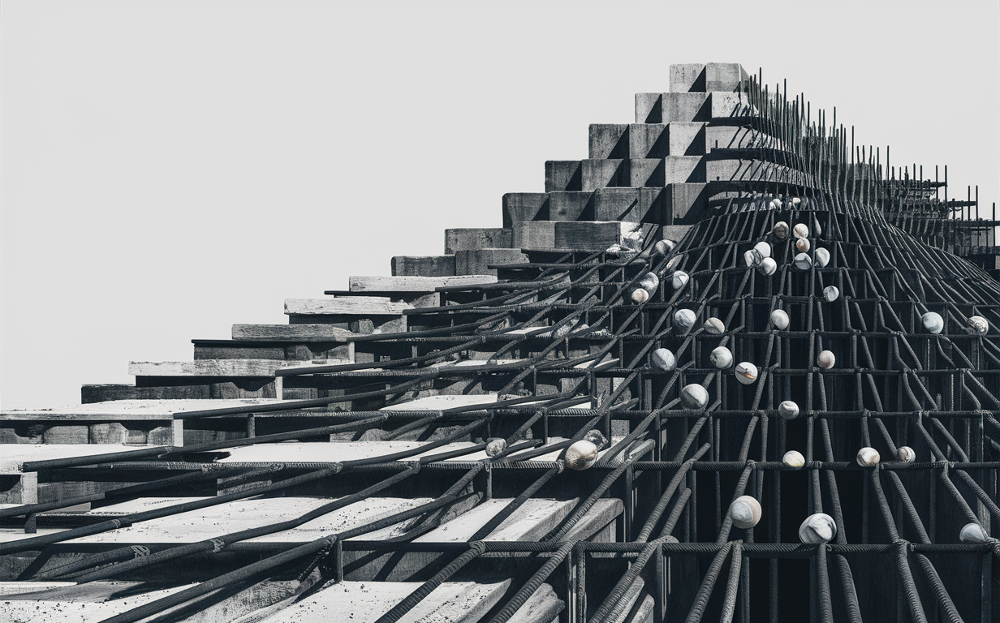

#### Relativistic Hamiltonian?

As it turns out, special relativity plays favorites. It prefers the Lagrangian over the Hamiltonian. Fundamentally, this is because classical Lagrangian mechanics uses the variational constraint $q(t_0) = q_0, \; q(t_1) = q_1$, which already treats space and time equally: We require the particle to start at a specific space-and-time, and end at another specific space-and-time.

Now what happens when we try this for classical Hamiltonian mechanics? Consider the simplest case, of a particle in $\R^3$. The phase space-time has 7 dimensions: $t, q_1, \dots, p_3$. However, Lorentz transformation works on 4 dimensions. Which 4 of the 7 should one pick? Do we pick $t, q_1, q_2, q_3$? But then, what happens if we take a canonical transformation that exchanges $q$ and $p$? Furthermore, the variational principle is hard to make Lorentz-invariant:

$$
\delta \int pdq - Hdt = 0, \quad q(t_0) = q_0, \; q(t_1) = q_1
$$

In the end-point constraint, $q$ is fixed, but $p$ is allowed to vary arbitrarily. This means that the trajectory in phase space-time has two end points sliding along two lines. These two lines are *not* Lorentz invariant, because each one is stuck in a slice of time $t_0, t_1$, and if we do a Lorentz transformation, the two lines no longer live in two slices of times. Finally, canonical transformation theory is not relativistic, because the geometry of Hamiltonian mechanics requires even dimensions, but phase space-time has odd dimensions, so even if phase space-time could be constructed, the transformation theory of Hamiltonian mechanics breaks down.

These difficulties could be bypassed by going one dimension higher. Instead of describing trajectories as a function $\R \to \mathcal C$, describe trajectories as a function $\R \to \R \times \mathcal C$, then insert the speed of light somewhere to convert $\R \times \mathcal C$ to the Minkowski spacetime, solving problems of the form $\delta \int L(t, q, dt/ds, dq/ds) ds = 0$. [@greinerExtendedHamiltonLagrange2010] is an introduction to this approach.

I find this extension rather useless and ugly. Much of the utility and beauty of Lagrangian mechanics is precisely in *not* being imprisoned within the Black Iron Prison of spacetime. Indeed, [@greinerExtendedHamiltonLagrange2010] includes 16 worked examples, but every example either is a generic theory-work, or a single particle in a field. What is the point of constructing a full machinery of Hamiltonian mechanics in $(2n+1)$-dimensional phase space-time, if you are going to only solve problems in $6+1$ anyway?

In fact, Hamiltonian mechanics and relativistic classical mechanics do not mix well. There are several "no-interaction theorems" proving that any Lorentz-invariant generalization of Hamiltonian mechanics necessarily cannot allow particle-particle interaction [@currieRelativisticInvarianceHamiltonian1963; @rohrlichRelativisticHamiltonianDynamics1979]. In other words, you can have classical (not quantum) relativistic Hamiltonian mechanics, but all you will get are particles dancing around in a background field, unaware of each other. You cannot even connect two particles by a spring. There are ways to bypass the obstruction, but so far it remains work for a few theoreticians and a dispensable erudition for the others.

Again and again we see that Lagrangian and Hamiltonian mechanics are different worlds, with their own dreams and phantasies, but always agreeing on the same reality.

If this were the case, then why do we bother creating two mechanics, since there is no physical experiment to distinguish them? It is because in quantum mechanics, virtual trajectories are just as real as the "real" trajectories. A particle can just go around the earth once before it arrives at its destination, taking the long way around. In this case, what is virtually possible matters just as much as what is classically real, and if Lagrangian mechanics and Hamiltonian mechanics can entertain different kinds of dreams, we might be able to tell them apart.

![$S$ is a source of photons, and $P$ is a receiver. A photon can go from $S$ to $P$ by bouncing off the mirror below, along many paths. Each path has a certain amplitude, and the sum of all their amplitudes is the total amplitude. While the amplitude is dominated by the amplitudes near the classical path $SGP$, it is not the only path, and all paths, even the "virtual" paths like $SAP$, contribute to what we observe. [@feynmanQEDStrangeTheory2006, figure 24]](figure/qed_2006_fig_24.png){width=40% fig-align="center"}

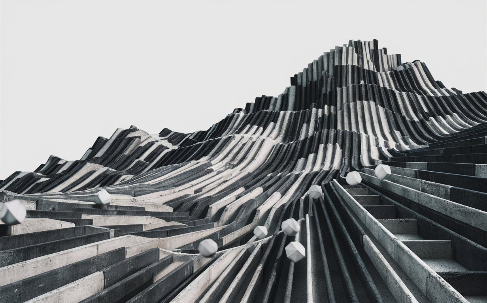

## Transformation theory

<small>This section uses the language of differential forms.</small>

Modern physics is founded upon the idea of symmetry. You shall know a system by the symmetries it has. Classical mechanics, when viewed in this perspective, is concerned not with $x, y, z, \theta, \phi, \mu$, or anything so medieval as up-versus-down. Such asymmetric descriptions of reality have been tossed into the wastebasket of history along with Aristotelian physics. Indeed, with general relativity, we have eliminated the distinction between coordinate systems, between reference frames, and even between the straight and the crooked.

So what does this mean for us? It means that we must investigate what happens to our equations under transformations. If the form of the equations is preserved in one coordinate transformation versus another, then it gives us a new symmetry of the physical system, and reveals a facet of reality. In order to investigate them, we must cast our theory into a more geometric form -- i.e. less coordinate-heavy. If we could avoid writing down $t, q, v$ all the time, and instead speak of manifolds and vector fields on them, it would bring us a [coordinate-free](https://en.wikipedia.org/wiki/Coordinate-free) description of the system, geometric insight, and reveal symmetries otherwise hidden by inelegant coordinates.

### Lagrangian mechanics as contact geometry

Geometrically, it feels dissatisfying to say that a Lagrangian is a function of time, position, and velocity: $L(t, q, v)$. It is dissatisfying, because though we can draw time and space together as spacetime $\R \times \mathcal C$, how do we draw *velocity*? When in doubt, add an extra dimension!

Imagine that, at each point $(t, q)$ on the configuration spacetime $\R \times \mathcal C$, we append the vector space of all possible velocities $v$ passing $q$. That is, we add the tangent space of $\mathcal C$ at $q$. Combining all these tangent spaces, we have expanded the configuration spacetime manifold to $\R \times T\mathcal C$. This is called the **1-jet manifold**, and written as $J^1$.

The first useful property of the 1-jet manifold is that it allows us to **lift** any curve $(t, \gamma(t))$ in the configuration spacetime to a curve $(t, \gamma(t), \dot \gamma(t))$ in the 1-jet manifold.

A Lagrangian $L(t, q, v)$ becomes just a field on the 1-jet manifold $L: J^1 \to \R$. Solving for a physically real trajectory $\gamma$ going from $(t_0, q_0)$ to $(t_1, q_1)$ becomes a constrained variational calculus problem on the 1-jet manifold as well:

$$
\delta \int_\Gamma L dt = 0
$$

where $\Gamma$ is a curve in the 1-jet manifold, under the following constraints:

* $\Gamma$ is obtainable by lifting some curve $\gamma$ in configuration spacetime that passes $(t_0, q_0)$ and $(t_1, q_1)$.
* The variation used in $\delta \int_\Gamma$ is also constrained, so that any variation-trajectory $\Gamma + \delta \Gamma$ must also be obtainable by lifting some curve of the same kind.

We are a bit tired of always saying "obtainable by lifting some curve in configuration spacetime". Is there an easier way to say it? Yes! Around each point $(t, q, v)$ in the 1-jet manifold, we draw a little flat plane centered on that point, so that any lifted curve passing $(t, q, v)$ must be tangent to that little flat plane. The lifted curve can havy any acceleration -- that is, $dv/dt$ can be any value it wants, but we must always have $vdt = dq$. Therefore, the little flat plane should be defined by $vdt - dq = 0$. We can picture the simplest case: a particle moving on a straight line. In this case, the configuration space-time is $\R^2$, and the 1-jet is $\R^3$. Drawing out the little flat planes, we see that it looks like a field of little flat planes, twisting as we move along the $v$ axis.

.](figure/standard_contact_structure.svg)

For general $N$, we still have little flat (hyper)planes, obtained by solving $N$ equations simultaneously: 

$$v_1 dt - dq_1 = 0, \; \dots,\; v_N dt - dq_N = 0$$

These flat planes have dimension $N+1$, within the $2N+1$ dimensions of $J^1$. Each plane is spanned by the $N+1$ vectors $\partial_t + \braket{v, \partial_q}, \partial_{v_1}, \dots, \partial_{v_N}$.

If you have seen it before, you will recognize this: It is a contact structure on the 1-jet manifold. In this sense, Lagrangian mechanics *is* [contact geometry](https://en.wikipedia.org/wiki/Contact_geometry) (or more precisely a [Cartan contact structure](https://en.wikipedia.org/wiki/Jet_bundle#Contact_structure)). Lifting a curve in configuration space-time is simply finding the unique curve in the 1-jet manifold that is tangent to the field of planes, and projects down to that same curve, so you can imagine looking down from the top of the curve in $J^1$ and see just the original curve in configuration spacetime. In equations, a trajectory $(t, \gamma(t))$ is lifted to $(t, \gamma(t), \dot \gamma(t))$, and the lifted trajectory has tangent vector $(1, \dot \gamma(t), \ddot \gamma(t))$.

{width=70%}

If multiple curves crossing the same point $(t, q)$ have different velocities, then their lifts would be separated in $J^1$ at different heights. If they have the same velocity, but different accelerations, then they would be lifted to the same height, but different slopes at that height.

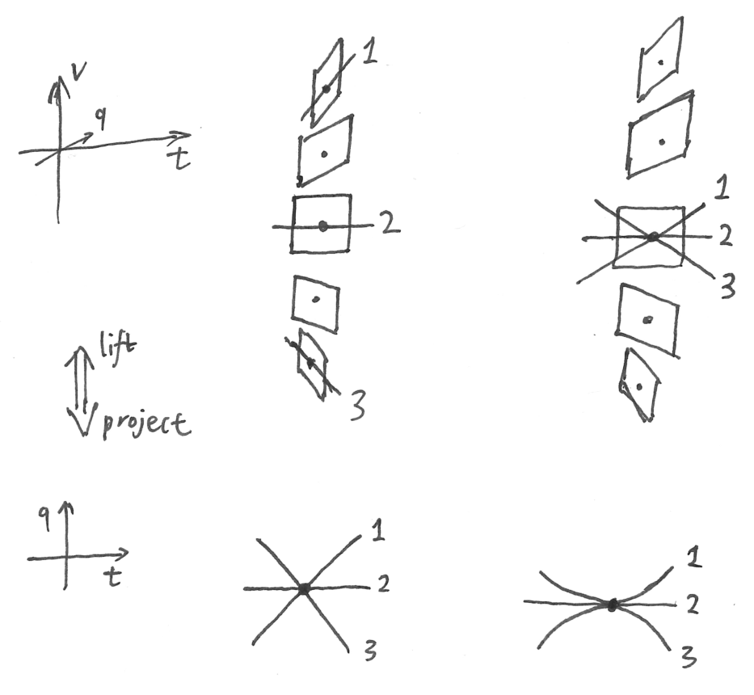{width=60%}

Given the setup, Lagrangian mechanics is simply about solving $\delta \int_\Gamma L dt = 0$ under the constraints:

* $\Gamma$ is tangent to all fields of planes $v_1 dt - dq_1 = 0, \dots, v_N dt - dq_N = 0$.
* The two end points of $\Gamma$ are of the form $(t_0, q_0, v_0), (t_1, q_1, v_1)$, where $v_0, v_1$ are not determined. That is, the end points can "slide vertically".
* The variation path used in $\delta \int_\Gamma$ must follow the same constraints.

What does the solution look like? It looks like a vector field in $J^1$.

Given a Lagrangiang $L: J^1 \to \R$, a system at point $(t, q)$ can go on evolving in any direction. We need to know its velocity $v$ before we can apply the EL equations to solve for its acceleration, and thus calculate its entire past and future. In the 1-jet manifold, given the Lagrangian $L : J^1 \to \R$, we can calculate an acceleration function $a: J^1 \to \R^N$ using the EL equation, then we install that acceleration function into $J^1$ as part of a vector field: at each $(t, q, v) \in J^1$, we install the time-evolution vector field $\Gamma$, which satisfies

$$\Gamma=\partial_t+ \braket{v, \partial_{q}}+ \braket{a, \partial_{v}}, \quad 
\frac{\partial L}{\partial q_i}-\Gamma\left(\frac{\partial L}{\partial v_i}\right)=0 \; \forall i = 1, \dots, N
$$

Once that is installed, predicting where a system would go given $(t, q, v)$ is as mindless as drifting along the vector field in $J^1$.

Here we see the benefit of the lift. Multiple trajectories crossing the same point $(t, q)$ at different velocities would physically intersect in configuration spacetime, but when lifted, they are separated at different heights, so they no longer intersect, and we can picture $J^1$ as filled with infinitely thin noodles exuded out of a noodle-machine,[^angel-hair] filling all of space but never intersecting or looping.

[^angel-hair]: How many [angel hairs](https://en.wikipedia.org/wiki/Capellini) can fit a noodle bowl? Angel hairs are pure curves, not material, but limited, so that they have location in 1-jet manifold, but not extension.

Of course, once we are here, we might as well go all the way, and rewrite the EL equations into an equation that takes place directly within 1-jet space, without having to go through configuration spacetime first. It uses the language of [differential forms](https://en.wikipedia.org/wiki/Differential_form), and we do not need this result subsequently, so you can skip it.

::: {.callout-tip title="EL equations in 1-jet space" collapse="true"}

Define the contact 1-forms

$$
\theta^i:=d q^i-v^i d t, \quad i = 1, \dots, N
$$

Define the Poincaré--Cartan 1-form and 2-form

$$
\begin{aligned}
\theta_L:=p_i \theta^i-H d t, \quad p_i&:=\frac{\partial L}{\partial v^i}, \quad H:=p_i v^i-L \\
\Omega_L&:=-d \theta_L
\end{aligned}
$$

Given those, the EL equation of $\Gamma$ is equivalent to
$$
i_{\Gamma} \Omega_L=0, \quad i_{\Gamma} d t=1,
$$

:::

::: {.callout-tip title="Proof" collapse="true"}

$$
\begin{gathered}
\theta_L=p_i d q^i-H d t, \quad p_i:=\frac{\partial L}{\partial v^i}, \quad H:=p_i v^i-L, \\
\Omega_L:=-d \theta_L=d q^i \wedge d p_i+d H \wedge d t
\end{gathered}
$$

by $-d\left(p_i d q^i-H d t\right)=d q^i \wedge d p_i+d H \wedge d t$

Compute $d H$ on $J^1$ using $p_i=L_{v^i}$:

$$
d H=d\left(p_i v^i-L\right)=v^i d p_i+p_i d v^i-L_t d t-L_{q^i} d q^i-L_{v^i} d v^i=v^i d p_i-L_t d t-L_{q^i} d q^i .
$$
Contract with $\Gamma=\partial_t+v^i \partial_{q^i}+a^i \partial_{v^i}$ (so $i_{\Gamma} d t=1, i_{\Gamma} d q^i=v^i$ ):

$$
i_{\Gamma} \Omega_L=i_{\Gamma}\left(d q^i \wedge d p_i\right)+i_{\Gamma}(d H \wedge d t)=v^i d p_i-d q^i \Gamma\left(p_i\right)+\Gamma(H) d t-d H .
$$

Insert $d H$:

$$
i_{\Gamma} \Omega_L=\eta^i d p_i-d q^i \Gamma\left(p_i\right)+\Gamma(H) d t-\left(\eta^i d p_i-L_t d t-L_{q^i} d q^i\right)=\left(L_{q^i}-\Gamma\left(p_i\right)\right) d q^i+\left(\Gamma(H)+L_t\right) d t .
$$

Therefore $i_{\Gamma} \Omega_L=0$ is equivalent to the two identities

$$
\Gamma\left(\frac{\partial L}{\partial v^i}\right)=\frac{\partial L}{\partial q^i} \quad \text { and } \quad \Gamma(H)+\partial_t L=0
$$

The first is the Euler-Lagrange equation since $\Gamma$ acts as the total time derivative:
$$
\Gamma\left(\frac{\partial L}{\partial v^i}\right)=\frac{d}{d t}\left(\frac{\partial L}{\partial \dot{q}^i}\right) .
$$

The second is more often written as $\frac{dH}{dt} = -\partial_t L$. In particular, if the Lagrangian density does not depend on time, then the Hamiltonian is a constant of motion.

:::

### Gauge transformation

Introductory calculus students are stressed about "Don't miss the $C$ in $\int xdx = \tfrac 12 x^2 + C$.". Introductory physics students are not, but they really should, because the energy $E$ of a system is also only defined up to an additive constant. We can add a constant of 23 joules to the energy of a system, and nothing would go any differently.

Analytical mechanics offers no escape. There is also such "up to additive constants" quantities. In fact, it is more than that: the action $S$ is only defined up to an additive *function*.

Let's say that we have a Lagrangian $L: \R \times T\mathcal C \to \R$. It defines a vector field in the 1-jet manifold, and thus the time-evolution of the physical system. What if we add a "time counter" to the action? That is, suppose we have some Lagrangian $L'$, such that the new action $S'[\Gamma] := \delta \int_\Gamma L' dt = 0$ satisfies $S'[\Gamma] = S[\Gamma] + (t_1 - t_0)$, where $t_0, t_1$ are the starting and ending times of the trajectory $\Gamma$. Then, it is clear that any constrained-stationary trajectory for $S$ is also a constrained-stationary trajectory for $S'$, and therefore they produce exactly the same dynamics.

That's pretty clever, but why does it work? To see it, we stare at what exactly we are doing when we calculate $\int_\Gamma Ldt$. We are integrating a differential 1-form through a curve $\Gamma$. A differential 1-form can be pictured as a field of surface-stacks. If the 1-form is big, then the surface-stacks are closely spaced, and vice versa. Integrating the 1-form through a curve is to follow the curve, and count how many surface-stacks it pierces.

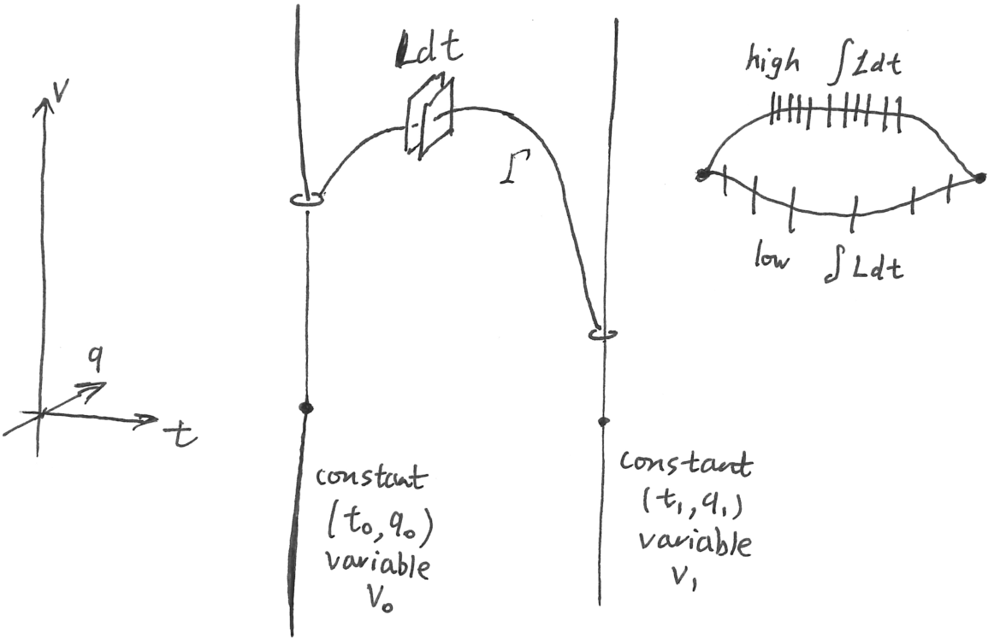{width=70%}

The variational problem: Find a path $\Gamma$ such that it pierces a stationary number of sheets of $Ldt$, under the constraints that its end points are on the rods of $t_0, q_0$ and $t_1, q_0$, is always moving forwards in time, and everywhere tangent to the contact structure. 

In general, the problem is non-trivial. Moving the curve $\Gamma$ up and down may change the number of surfaces pierced dramatically. However, in one particular case, the problem is trivial. Suppose we can quilt together the differential 1-forms into contour surfaces, then every curve pierces the exact same number of surfaces, and so every trajectory is as stationary as any other. Such 1-forms are called [exact forms](https://en.wikipedia.org/wiki/Closed_and_exact_differential_forms).

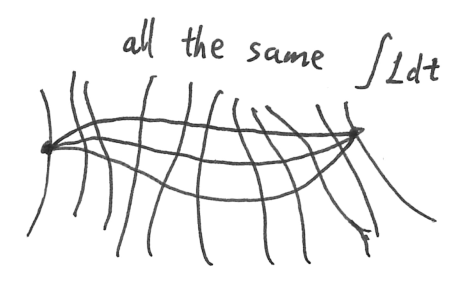{width=30%}

Now, we are rarely going to get such trivial physics, but it does suggest to us how to construct a different but equivalent action $S'$. We write down an arbitrary function $F(t, q)$, which creates an exact 1-form on the configuration spacetime. Now we raise it up to the 1-jet manifold "vertically". Because the constraint on variation of $\Gamma$ states that the two end-points $(t_0, q_0, v_0), (t_1, q_1, v_1)$ can only vary in $v_0, v_1$, the trajectory looks like a string pulled between two rings sliding upon two vertical rods. Each vertical rod is contained in one sheet of $F$, and so we have

$$
\int_\Gamma (Ldt + dF) = \int_\Gamma Ldt + F(t_1, q_1) - F(t_0, q_0)
$$

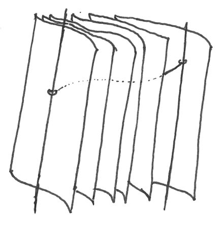{width=30%}

If only we can write $L'dt = Ldt + dF$, then we would obtain our new Lagrangian! Alas, this is in general impossible: the infinitesimal sheets of $(L'-L)dt$ are parallel to $dt$, which is strictly "perpendicular" to the t-axis, but the infinitesimal sheets of $dF = \partial_t F dt + \sum_i \partial_{q_i} F dq_i$ may intersect the t-axis at an "oblique angle".

At this moment, our second constraint rescues us. Because we require $\Gamma$ to be tangent to all fields of planes $v_1 dt - dq_1 = 0, \dots, v_N dt - dq_N = 0$, we can replace $dq_i$ with $v_i dt$ for $\Gamma$:

$$
\int_\Gamma Ldt + dF = \int_\Gamma (L + \partial_t F + \braket{v, \partial_q F})dt
$$

And so we obtain the **gauge transformation of Lagrangian**:

$$
L'(t, q, v) = L(t, q, v) + \partial_t F(t, q) + \braket{v, \partial_q F(t, q)}
$$ {#eq-gauge-lagrangian}

In other words, even though $Ldt + dF = L'dt$ is not literally true, there is no way for a contact-structure-hugging trajectory to tell, so we can just replace $L$ with $L'$, and neither Hamilton nor Nature would notice a thing. Indeed, this is precisely why it is a "gauge transformation", since in the language of modern physics, the "gauge" is the part in our equations that nature doesn't care about, and so we are free to try out every gauge transformation until we get an equation most convenient for us.

### Point transformation

Instead of changing the Lagrangian on the configuration spacetime, we can keep the Lagrangian, but deform the configuration spacetime itself, and all the trajectories in it.

A (continuous) point transformation is a deformation of the configuration spacetime. It is defined by sending each point $(t, q)$ to a nearby point $(t + \epsilon T(t, q), q + \epsilon Q(t, q))$, where $\epsilon$ is an infinitesimal, and $(T, Q)$ is a vector field on the configuration spacetime. The geometric intuition is to slightly manipulate the configuration spacetime like a playdough.

Now, imagine that a strand of hair is stuck inside the playdough. As we manipulate the playdough, the hair also gets manipulated. That is, a trajectory $(t, \gamma(t))$ would be deformed to $(t \epsilon T(t, \gamma(t)), \gamma(t) + \epsilon Q(t, \gamma(t)))$, and the lift of the trajectory to $J^1$ would be deformed as well. We already know how $(t, q)$ parts would be deformed. It remains to deform the $v$ part:

$$
\begin{aligned}
(t, q) &\mapsto(t+\epsilon T(t, q), q+\epsilon Q(t, q)) \\
(t+\delta t, q+\dot{\gamma}(t) \delta t) &\mapsto(t+\delta t+\epsilon T(t+\delta t, q+\dot{\gamma}(t) \delta t), q+\dot{\gamma}(t) \delta t+\epsilon Q(t+\delta t, q+\dot{\gamma}(t) \delta t)) \\
\dot \gamma(t) &\mapsto \frac{\dot{\gamma}(t) \delta t+\epsilon(Q(t+\delta t, q+\dot{\gamma}(t) \delta t)-Q(t, q))}{\delta t+\epsilon(T(t+\delta t, q+\dot{\gamma}(t) \delta t)-T(t, q))}
\end{aligned}
$$

Thus, we have:

$$
\dot{\gamma}(t)+\epsilon\left(\partial_t Q+\braket{\partial_q Q, \dot{\gamma}(t)}-\dot{\gamma}(t)\left(\partial_t T+ \braket{\partial_q T, \dot{\gamma}(t)}\right)\right)
$$

This formula is a bit ugly, so we define the time-derivative operator along the trajectory $D_t := \partial_t + \braket{\dot \gamma, \partial_q}$, which gives us the **prolongation formula**:

$$
\dot\gamma \mapsto \dot \gamma + \epsilon(D_t Q - (D_t T) \dot\gamma)
$$ {#eq-pr-1}

Geometrically speaking, we have lifted a vector field $(T(t, q), Q(t, q))$ on the configuration spacetime to a vector field on the 1-jet manifold

$$
(T(t, q), Q(t, q), V(t, q, v)), \quad D_t Q - (D_t T) v, \quad D_t := \partial_t + \braket{v, \partial_q}
$$ {#eq-pr-1-manifold}

We know how to lift trajectories. What does it mean to lift a vector field? Just like how a vector field can deform a trajectory, so can a vector field deform a field of planes in $J^1$. Consider a point $(t, q, v) \in J^1$, and consider what happens to the plane $v_i dt - q_i = 0$, represented as an infinitesimal square. Draw the vectors 

$$(T(t, q), Q(t, q)), \; (T(t + \delta t, q + v\delta t), Q(t + \delta t, q + v\delta t))$$

at two corners of the square, and drag the corners along the vectors. Because the two vectors differ by $O(\delta t)$, not only would the square be translated by $O(\epsilon \delta t)$, it would also be rotated by $O(\epsilon \delta t)$. Since the square has side length $O(\delta t)$, this means the square would be rotated by $O(\epsilon)$, and so it would measurably rotate, and misfit its local plane. The only solution is to translate the square "vertically" by some $(0, 0, \epsilon R(t, q, v))$, so that it lands in a new position where it would fit the local plane. 

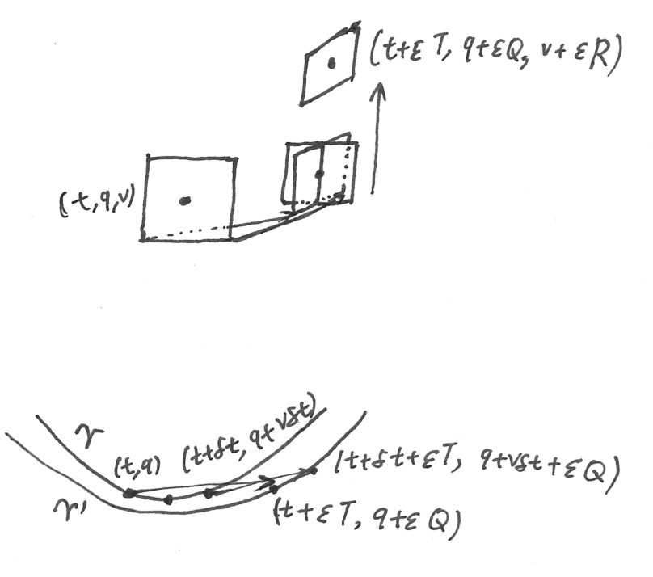{width=50%}

::: {#exr-higher-order-hamiltonian}

Prove that $R(t, q, v) = D_t Q - (D_t T) v$ is necessary and sufficient for fitting the infinitesimal square to its local plane.

:::

### Noether's theorem

The famed Noether's theorem states that if the Lagrangian is unchanged under a point transformation, then motion under the Lagrangian has a conserved quantity. As before,

* $\epsilon$ is an infinitesimal.
* An **infinitesimal transformation** is an infinitesimal deformation $(\delta t, \delta q)$ of configuration space-time. 
  * $\delta t = \epsilon T$, where $T$ a function of type $\ub{\R}{time} \times \ub{\mathcal C}{configuration space} \to \R$
  * $\delta q = \epsilon Q$, where $Q$ is a function of type $\R \times \mathcal C \to \R^d$, where $d$ is the dimension of configuration space $\mathcal C$.
* An infinitesimal transformation is a **symmetry of the Lagrangian**, iff taking any path $\gamma$ (which can be physically fake), and deforming it to $\gamma'$, the action is conserved to first order: $\int_\gamma L dt = \int_{\gamma'} L dt + O(\epsilon^{c})$, where $c > 1$. Because we don't need the $c$, we will write it just as $o(\epsilon)$, meaning "a higher-order infinitesimal than $\epsilon$".
* A **conserved quantity of motion** is a number depending on $t, q, \dot q$, such that it is constant along any physically real path $\gamma$.

::: {.callout-warning}

A symmetry of the Lagrangian conserves *all* actions to first order, even those of unphysical paths, but a conserved quantity of motion is only conserved along physical paths. We may call it "conserved quantity of *physical* motion" to emphasize the distinction. In physicist jargon, Noether's theorem is an "[on-shell](https://en.wikipedia.org/wiki/On_shell_and_off_shell)" theorem.

:::

We defined the condition for symmetry as an integral. We can convert it to a differential by simply seeing what it means on an infinitesimal path. Let $\gamma$ go from $(t, q)$ to $(t + \delta t, q + v \delta t)$, where $\delta t$ is small, and then deform it by $\epsilon$, where $\epsilon$ is a lower-order infinitesimal than $\delta t$. This then gives us

$$
(T \partial_t + \braket{Q, \nabla_q} + \braket{V, \nabla_v}) L + L D_t T = 0, \quad D_t = \partial_t + \braket{v, \nabla_q}
$$

In fact, Noether's theorem can be further generalized to *quasi-symmetry* by incorporating a gauge transformation, which is the form of Noether's theorem we will use:

::: {#thm-noether}

## Noether's theorem

Assume that $(t, q) \mapsto (t + \epsilon T, q + \epsilon Q)$ is an infinitesimal gauge symmetry of the Lagrangian, satisfying

$$
(T \partial_t + \braket{Q, \nabla_q} + \braket{V, \nabla_v}) L + L D_t T = D_t F
$$

where $F(t, q)$ is a gauge generator. Then the infinitesimal transformation maps physically real trajectories of $L$ to physically real trajectories of $L$, and

$$
F + H T - \lra{p, Q} = F + (\lra{\nabla_v L, \dot q} - L)T - \lra{\nabla_v L, Q}
$$

is a conserved quantity of motion.

:::

::: {.callout-note title="Proof" collapse="false"}

Given any physically real trajectory $\gamma$ from point $A$ to $B$, infinitesimally transform it for an $\epsilon$ amount, obtaining $\gamma_\epsilon$ from $A \to A + \epsilon A$ to $B + \epsilon B \to B$. By assumption of quasi-symmetry, 

$$\int_{\gamma_\epsilon} Ldt = \int_\gamma Ldt + \epsilon F|^1_0 + o(\epsilon)$$

Now, a variation of $\gamma$ maps to a variation of $\gamma_\epsilon$, and vice versa, and therefore,

$$\ub{\delta\int_\gamma Ldt}{$= 0$ since $\gamma$ is physical} = \delta\int_{\gamma_\epsilon} Ldt + \ub{\delta \epsilon F}{$=0$ by boundary constraint}|^1_0 + o(\epsilon)$$

Thus $\gamma_\epsilon$ is physically real.

Since it is physically real, the action of $\gamma_\epsilon$ can also be evaluated by the Hamilton--Jacobi differential (@eq-HJ)

$$
\int_{\gamma_\epsilon} Ldt = \int_{\gamma_\epsilon} Ldt + \epsilon(\braket{p, Q} - HT)|^1_0 + o(\epsilon)
$$

At $\epsilon \to 0$ limit, we find $\braket{p, Q} - HT - F$ is a conserved quantity.

:::

Intuitively, Noether's theorem is a form of **symmetry reduction**. The idea is that, because we have a 1-parameter family of transformations that map physically real trajectories to physically real trajectories, we ought to divide out that family, and thus reduce the space of all trajectories down by 1 dimension. The idea is that, instead of solving the trajectories from the full $2n$-dimensional space of possible initial conditions, we can solve it for only a $(2n-1)$-dimensional subspace of them, then apply the 1-parameter family to generate the other trajectories. Which subspace? For any fixed $c \in \R$, the subspace with fixed $\braket{p, Q} - HT - F = c$. Instead of studying the dynamics in the full configuration space-time $\R \times T\mathcal C$, we can study it in the lower-dimensional $\{\braket{p, Q} - HT - F = c\} \subset \R \times T\mathcal C$. 

The proof is similar to the proof of @thm-poincare-cartan, though they differ in that Noether's theorem shows a quantity, defined at a single point, is conserved over a trajectory, while the Poincaré--Cartan invariant is not defined at a single point, but as an integral over an entire cycle.

::: {.callout-warning  title="A failed proof" collapse="true"}

I tried the following proof: Let $\gamma$ be a physically real trajectory under the original Lagrangian $L$, and let $\gamma_\epsilon$ be the infinitesimally deformed trajectory. By the quasi-symmetry equation, we have $\int_{\gamma_\epsilon} Ldt = \int_\gamma Ldt + \epsilon F|^{t_1}_{t_0}$.

Now, since $\gamma$ is physically real, it should have stationary action. So I constructed the following path:

$$
(t_0, q_0) \to (t_0 + \epsilon T(t_0, q_0), q_0 + \epsilon Q(t_0, q_0)) \xrightarrow{\gamma_\epsilon} (t_1 + \epsilon T(t_1, q_1), q_1 + \epsilon Q(t_1, q_1)) \to (t_1, q_1)
$$

Then blithely wrote down the total action of the new path:

$$
L\lrb{t_0, q_0, \frac{Q(t_0, q_0)}{T(t_0, q_0)}} \epsilon T(t_0, q_0) + \int_\gamma L dt + \epsilon F|^{t_1}_{t_0} - L\lrb{t_1, q_1, \frac{Q(t_1, q_1)}{T(t_1, q_1)}} \epsilon T(t_1, q_1)
$$

and conclude that, since the action variation must be $o(\epsilon)$, we must have a conserved quantity

$$L(t, q, Q/T) T - F(t, q, v)$$

and I realized something has gone terribly wrong. It took a bit of yelling at GPT-5 and them politely yelling back at me to find the mistake. The new path has two corners. At this corner $(t_0 + \epsilon T(t_0, q_0), q_0 + \epsilon Q(t_0, q_0))$, the velocity must abruptly change from $Q/T$ to $\dot\gamma(t_0) + \epsilon V(t_0, q_0, \dot\gamma(t_0))$. If we try to smooth out the corner, then the system must accomplish this acceleration within time $\epsilon T(t_0, q_0)$. This means the system must have an acceleration on the order of $O(1/\epsilon)$, which breaks a *technical condition* for Lagrangian mechanics! The technical condition, which we have blithely ignored so far, is that the variation itself must have continuous velocity, i.e. it cannot have corners anywhere. Corners would create an extra [Weierstrass–Erdmann term](https://en.wikipedia.org/wiki/Weierstrass%E2%80%93Erdmann_condition), much like how varying the boundary point would create a variation in action by $dS = \braket{p,dq} -Hdt$.

Actually, here is a good place to talk about a personality quirk of GPT-5. They are often right, but unable to point out where I went wrong. If I ask them "Where in this went wrong?" they would usually go for one of the following routes:

1. Simply continue until about the point I went wrong, then say, "Instead of this..." and continue on with their own derivation. In other words, they would tell me roughly where the mistake is, without explaining what it is.
2. Invoke jargon that, in the backward pass, does explain what the mistake is, but it sure isn't helpful to me in the forward pass!
3. If I request for simple intuitive language, they would mumble something non-jargony that, if I do know what the mistake is, actually explains it intuitively, but it sure isn't helpful to me in the forward pass!

> Being a Thurston student was inspiring and frustrating -- often both at once. At our second meeting I told Bill that I had decided to work on understanding fundamental groups of negatively curved manifolds with cusps. In response I was introduced to the famous "Thurston squint", whereby he looked at you, squint his eyes, give you a puzzled look, then gaze into the distance (still with the squint). After two minutes of this he turned to me and said: "Oh, I see, it's like a froth of bubbles, and the bubbles have a bounded amount of interaction." Being a diligent graduate student, I dutifully wrote down in my notes: "Froth of bubbles. Bounded interaction." After our meeting I ran to the library to begin work on the problem. I looked at the notes. Froth? Bubbles? Is that what he said? What does that mean? I was stuck. Three agonizing years of work later I solved the problem. It's a lot to explain in detail, but if I were forced to summarize my thesis in five words or less, I'd go with: "Froth of bubbles. Bounded interaction."
>
> --- Benson Farb, [*On being Thurstonized*](https://www.math.uchicago.edu/~farb/papers/thurston.pdf)

:::

### Bonus: Why is there no velocity-dependent transformation?

A transformation of the configuration spacetime lifts to a transformation of the 1-jet manifold. This then suggests to us that we could deform directly the 1-jet manifold by some vector field $(T, Q, R)$ that depends on $(t, q, v)$, then project it back down. By the same argument as before, we calculate how it transforms a trajectory $(t, \gamma(t))$, and find that

$$
R(t, q, v) = D_t Q - vD_t T, \quad D_t = \partial_t + \braket{v, \partial_q} + \braket{a, \partial_v}
$$

But this is in general impossible: the left side does not depend on $a$, but the right side does. The only way to rescue this is if the $a$ terms cancel out exactly. That is, $\partial_{v_j} Q_i = v_i \partial_{v_j} T$ for all $i, j = 1, \dots N$. When $N \ge 2$, this implies they are independent of $v$, so we actually don't have a velocity-dependent transformation after all.

::: {.callout-tip title="Derivation" collapse="true"}

$$
\partial_{v_j} (Q_i-v_i T)=-\delta_{ij} T
$$

By the symmetry of mixed partials,

$$
\partial_{v_k}\partial_{v_j} (Q_i-v_i T) = \partial_{v_j}\partial_{v_k} (Q_i-v_i T) \implies \delta_{ij} \partial_{v_k}T = \delta_{ik} \partial_{v_j}T
$$

Since $N \ge 2$, we can set $i = j \neq k$, and obtain $\partial_{v_k}T = 0$. This is true for all $k$, thus $T$ is independent of $v$. Now plug it into $\partial_{v_j} Q_i = v_i \partial_{v_j}$ to obtain $\partial_{v_j} Q_i = 0$ for all $i, j$.

:::

When $N = 1$, velocity-dependent transformations do exist:

$$
Q(t, q, v) = vT(t, q, v) - \int_0^v T(t, q, v') dv' + Q_0(t, q)
$$

where $Q_0(t, q), T(t, q, v)$ are arbitrary smooth functions. However, it is uninteresting, since dynamics is just too simple in one dimension.

But why *would* there be a problem? What would happen if we simply insist on applying $T(t, q, v), Q(t, q, v), R(t, q, v)$? Well, consider what happens to an infinitesimal square at $(t, q, v)$. Its corners are dragged by the vector field $(T, Q, R)$. Previously, because $(T, Q)$ depends on $(t, q)$ but not $v$, the square is translated and rotated in the $(t, q)$ plane, but it remains upright. Now that $(T, Q)$ depends on $v$ also, the square would be rotated in the full $(t, q, v)$ space. And no matter what $R$ we pick, it is impossible for it to rotate the square back upright again, because it can only stretch and squeeze in the vertical direction, and that cannot re-upright what is not already upright.

Well, when in doubt, go one dimension higher! We have already went from configuration spacetime to 1-jet to handle $v$. We need only go to 2-jet to handle $a$. Like how we constructed the 1-jet manifold, the 2-jet manifold $J^2$ is defined by appending at each point $(t, q, v) \in J^1$ the tangent space of velocity at $v$ -- the space of accelerations.

Lifting a curve $(t, \gamma(t))$ to $J^2$ takes two steps. The 1th step lifts it to $J^1$, as before. We previously noted that two curves passing the same $(t, q)$ would be separated in $J^1$ if they differ in velocity, and if they have the same velocity but differ in acceleration, then they would pass the same point in $J^1$, but have different slope. Therefore, the 2th lift to $J^2$ would separate them.

Previously, we constructed the contact geometry of $J^1$ by infinitesimal squares spanned by $\partial_t + \braket{v, \partial_q}$ and $\partial_v$. Analogously, the contact geometry of $J^2$ is constructed by infinitesimal squares spanned by $\partial_t + \braket{v, \partial_q} + \braket{a, \partial_v}$ and $\partial_a$. Lifting a curve $(t, \gamma(t))$ to $J^2$ is simply finding the unique curve in $J^2$ that projects down to $(t, \gamma(t))$ while being tangent to the field of infinitesimal squares.

Would this suffice? It would not. We will see that $J^2, J^3, \dots$, none of them suffices. As soon as we incorporate velocity-dependence, we need to handle the entire Taylor expansion.

Looking at the picture, an infinitesimal square at $(0, q_0, v_0) \in J^1$ can be tangent to several different lifted curves. Some move up -- those have positive acceleration. Some move down -- those have negative acceleration. Thus, the infinitesimal square is swept out by the curve family $\{\gamma(t) = q_0 + v_0t + \tfrac 12 at^2: a \in \R\}$. Similarly, an infinitesimal square at $(0, q_0, v_0, a_0) \in J^2$ is swept out by the curve family $\{\gamma(t) = q_0 + v_0t + \tfrac 12 a_0t^2 + \tfrac 16 jt^3: j \in \R\}$. Now, the trouble begins: What happens to the curve family at $(0,0,0,0)$ after applying $T=0, Q = v$ transformation? It becomes 

$$
\{\gamma(t) = \tfrac 12 \epsilon jt^2 + \tfrac 16 jt^3: j \in \R\}
$$

So we see the problem: The original curves are all lifted to pass through the same point $(0, 0, 0, 0) \in J^2$, if at different "vertical slopes" due to the [jerk](https://en.wikipedia.org/wiki/Jerk_%28physics%29) term $\tfrac 16 jt^3$. After applying the $T=0, Q=v$ transformation, the shifted curves are pulled apart according to the jerk term. It is easy to see (draw a picture) that any two members of the family $\{\gamma(t) = \tfrac 12 \epsilon jt^2 + \tfrac 16 jt^3: j \in \R\}$ do not have an order-2 contact. Thus, $T=0, Q=v$ destroyed the contact structure on $J^2$. The infinitesimal squares are not even mapped to infinitesimal squares at all, let alone oriented correctly.

Going one level higher to $J^3$ would not save it, because we can simply make the same argument with $\{\gamma(t) = \tfrac{1}{4!} kt^4: k \in \R\}$, and so on. The essential problem is that point transformations preserve degrees -- to know where a point $\gamma(t)$ is mapped to, we need only know the point itself $\gamma(t)$; to know where a velocity $\dot \gamma(t)$ is mapped to, we need only know the point and the velocity $(\gamma(t), \dot\gamma(t))$. However, when the transformation depends on velocity, then we need to account for one degree higher -- to know where a point $\gamma(t)$ is mapped to, we need to know the point itself *and* the velocity; to know where a velocity $\dot \gamma(t)$ is mapped to, we need to know the acceleration too, etc. There is no way to stop short of going all the way to infinity.

And if we were to consider acceleration-dependent transformations, the problem is even worse: we need to go two degrees higher.

This is fundamentally why, though point transformations are everywhere in Lagrangian mechanics, velocity-dependent (or higher-order-dependent) transformations are impossible unless we directly go to the full Taylor expansion. If the curve is slightly too curvy in the 103-th derivative, that would have repurcussions throughout all the other derivatives. Instead of mapping point to point, or point-and-velocity to point-and-velocity, we must directly map curve segments to curve segments. Each segment must be large enough to contain all derivatives -- that is, a [germ](https://en.wikipedia.org/wiki/Germ_(mathematics)).

Such advanced "generalized symmetries" are used in exactly integrable models such as the KdV equation and soliton theory, but this is completely beyond our scope. See [@olverApplicationsLieGroups1993, Chapter 5].

### Hamiltonian mechanics as symplectic geometry

Similar to Lagrangian mechanics, we can also cast Hamiltonian mechanics into the form of symplectic geometry, which has several benefits:

1. Do we see the heavens fill with coordinate grids? Do we see measuring lines across the earth's foundation? If Nature needs no coordinates then why should we *imitatores Naturae*?
2. If we can write a formula in coordinate-free language, then it must satisfy the same relations in any coordinate system. Coordinate-freeness frees us from the toil of checking our formulas still work under coordinate transformation.
3. It is good preparation for modern particle physics, which has almost entirely geometrized.

We begin by inspecting the pieces we have, and calling them by their true geometry. We have mainly thought of of $q$ as a list of $n$ numbers, one per commodity, and $p$ as a list of $n$ numbers, one per commodity-price. However, it is time to admit that we need to let this interpretation go, because we are about to show that we can not only transform $q$ to $q'$, but even $q$ to $p'$.

If our transformations are limited to just point transformations, then we can still interpret it as factory-production. Instead of selling tons of steel and tons of timber, we would sell a bundle of (0.7 tons of steel, 0.7 tons of timber) and a bundle of (0.7 tons of steel, -0.7 tons of timber). Such bundling is quite common in modern commerce. But no meaning at all can be assigned to "selling a bundle of (0.7 tons of steel, 0.7 dollars on price of steel)", though I'm sure the wizards of Wall Street have tried.

So let us begin anew. Consider the motion of a particle moving on a sphere under the influence of a potential well. We write the configuration space as $\mathcal C$, as usual.

Geometrically speaking, $q$ is not a point in $\mathcal C$, but rather a numerical name for a point. We can't write $q \in \mathcal C$, but write $x \in \mathcal C$. So what are coordinates? They are maps from open subsets[^hairy-ball-theorem] of $\mathcal C$ to $\R^n$, so when we write $q$ we have really meant $q(x), x \in \mathcal C$.

[^hairy-ball-theorem]: Why open subsets? Because the configuration space might not allow a global map. In particular, there is no global coordinate chart on the sphere by the [hairy ball theorem](https://en.wikipedia.org/wiki/Hairy_ball_theorem).

Now, what is $p$? We have always said that it is "price". But what is a price? A price is only meaningful when you buy and sell something using it. That is, we are never thinking about $p$ in itself, but always thinking about $\int_\gamma \braket{p, dq}$. This suggests that the real object we want is the 1-form $\theta := \braket{p, dq}$. What does it look like? Why, like any 1-form! It looks like little stacks of infinitesimal planes, one per point in $\mathcal C$... wait a minute. We can't do that,[^type-checker] because $\theta$ depends on $p$, which does not live on $\mathcal C$. Where does it live?

[^type-checker]: You can get far in modern mathematics simply by demanding that all the formulas can pass a typechecker.

When in trouble, go one dimension higher. At every point $x \in \mathcal C$, we can construct a space of all possible market prices there, called $T_x^* \mathcal C$. We can't draw the entire $T_x^* \mathcal C$ as a stack of planes, but any individual $w \in T_x^* \mathcal C$ *can* be interpreted as a bundle of market prices, and drawn as a stack of infinitesimal planes centered on $x$. 

Now we know what $\theta$ truly is: It is a 1-form on $T^* \mathcal C$, which physicists call the **cotangent bundle**. $T^* \mathcal C$ is co-tangent, because any element of it is a (market) machine for turning a tangent vector in $\mathcal C$ (an infinitesimal production plan) into a real number (money). And how do we describe $\theta$ directly? Why, we need to understand what a tangent vector is in $T^* \mathcal C$. Careful! A tangent vector in $T^* \mathcal C$ is *not* a tangent vector in $\mathcal C$. A tangent vector in $T^* \mathcal C$ is a simultaneous commodity production *and* a change in market price. A point in $T^* \mathcal C$ is written as $(x, w)$, and pictured as a little stack of planes at base point $x$, with the direction and tightness of the planes determined by $w$.

So, given an infinitesimal change $(\delta x, \delta w)$, how do we evaluate $\theta$ on it? That's simple enough. The market can change its prices, but the factory will sell all the same. The revenue is still $w(\delta x)$ no matter what $\delta w$ is. Geometrically, we simply project a tangent vector $(\delta x, \delta w)$ at $(x, w) \in T^* \mathcal C$ down to a tangent vector $\delta x$ at $x \in \mathcal C$, then evaluate $w(\delta w)$. This $\theta$ is called the **tautological 1-form**, and it looks like little stacks of planes floating on top of each $x \in \mathcal C$, all parallel to the price-axis, but rotating and changing their density according to the price $w \in T^*_w \mathcal C$.

This moment of ultimate triumph for the market is tinged with sadness, because we really cannot continue playing the market game anymore. We have outlived its usefulness. We have converted our market economy to a differential geometry, and there is no returning.

Now, to fix the equations of motion $\dot q = \nabla_p H, \dot p = -\nabla_q H$. It contains $q, p, \nabla$ which are coordinate-dependent. Well, $\dot q, \dot p$ looks like a single vector field in $T^* \mathcal C$, which we write as $X_H$, and thus:

$$
X_H = \sum_i \partial_{p_i} H \partial_{q^i} - \partial_{q^i} H \partial_{p_i} 
$$

Halfway there! To eliminate coordinates on the other side, we should replace it by $?(dH)$:

$$
\sum_i (\partial_{p_i} H \partial_{q^i} - \partial_{q^i} H \partial_{p_i} ) = ?\lrb{\sum_i (\partial_{p_i} H dp_i + \partial_{q^i} H dq^i)}
$$

Looking at it for a bit, we see that the only possibility is that it must be 

$$
? : dp_i \mapsto \partial_{q^i}, \quad dq^i \mapsto -\partial_{p_i}
$$

So we define it as $\Pi := \partial_{q^i} \wedge \partial_{p_i}$, and write $X_H = -\Pi(dH)$. Now, for reasons of convention and convenience, it is easier to use its inverse $\omega =  \sum_i dq^i \wedge dp_i = -d\theta$, the famous **symplectic form**, in which the equations of motion fits on a single line:

$$
\omega(X_H \wedge \cdot) = dH
$$ {#eq-hamilton-eom-symplectic}

Notice what we have accomplished: Using the 2-form $\omega$, we can convert any scalar function $H: T^* \mathcal C \to \R$ to a vector field $X_H$. In fact, the opposite is true locally: Given any smooth vector field $X$, around any point $x \in T^* \mathcal C$, there exists an open neighborhood $U$, and a scalar function $f: U \to \R$, such that $\omega(X \wedge \cdot) = df$ on $U$. 

::: {.callout-tip title="Why only locally?" collapse="true"}

Given a vector field $X$, there might not be a global scalar field $f$ that generates it. This is essentially the same reason why perfect vortices exist: We can construct a curlless vector field $\tfrac 1r \partial_\theta$ in the plane with zero removed $\R^2 \setminus \{0\}$ that is not generated by a potential field, since if you take a cycle that encircles the origin, you get a nonzero line integral.

Consider the phase space of a circle $T^* \mathbb S^1$. If $H$ generates the flow field $\dot \theta = 0, \dot p = 1$, then $dH = -d\theta$, but this is impossible, since we would have $H(2\pi) = H(0) - 2\pi$, breaking single-valuedness.

:::

Having accomplished the labor of abstraction, we turn the world upside down. Instead of defining symplectic geometry $\omega$ from coordinates $(p, q)$, we define coordinates from symplectic geometry! Given a symplectic manifold $(M, \omega)$, we say that $(p, q): M \to \R^n$ are a set of **canonical coordinates** locally at some $x \in M$, iff $\omega = \sum_i dq^i \wedge dp_i$ in a neighborhood of $x$.

::: {#exr-0}

Check that if $(p, q)$ are locally canonical, then locally, $X_H = \sum_i \partial_{p_i} H \partial_{q^i} - \partial_{q^i} H \partial_{p_i}$. Thus, canonical coordinates are precisely those that make the Hamiltonian equations of motion appear in the standard form. In fact, this is why they are called "[canonical](https://en.wiktionary.org/wiki/canonical_form#English)".

:::

Similarly to the Lagrangian case, we should also consider what symmetries are in Hamiltonian mechanics. 

Given a symplectic manifold $(M, \omega)$, a **symplectomorphism** is a diffeomorphism $F: M \to M$, such that $F$ preserves the symplectic form. An **infinitesimal symplectomorphism** (or **symplectic vector field**) is a vector field $X$ on $M$, such that its vector flow generates a whole 1-parameter family of symplectomorphisms.

As it turns out, there is a tropical profusion of symmetries, far beyond what Lagrangian mechanics gives us:

::: {#thm-hamiltonian-flow-is-symplectic}

Given $f: M \to \R$, the vector field $X_f$ it generates is a symplectic vector field. In particular, any Hamiltonian flow is symplectic.

:::

And since Hamiltonian mechanics has been cast into pure symplectic geometry, any symplectomorphism is a symmetry of Hamiltonian mechanics. For example, let $\Phi: M \to M$ be a symplectomorphism:

* If $(p, q): M \to\R^{2n}$ is canonical, then $(p, q) \circ \Phi^{-1}$ is canonical. In pictures: Construct the coordinate grid using $(p, q)$, then map the grid point-by-point forwards using $\Phi$. Then we can construct the same $\omega$ either by summing up the 2-forms $\sum_i dq^i \wedge dp_i$ or by summing up $\sum_i d(q^i \circ \Phi^{-1}) \wedge d((p_i\circ \Phi^{-1}))$.
* If $H: M \to \R$ is a Hamiltonian, and $X_H$ is its Hamiltonian flow, then $H\circ \Phi^{-1}$ generates $\Phi^*(X_H)$. In pictures: Graph the Hamiltonian field $H$, then map it point-by-point forwards using $\Phi$ to graph $H \circ \Phi^{-1}$. The new field has the flow $\Phi^*(X_H)$, obtained by maping the vectors forward using $\Phi$.
* If $f, g: M \to \R$, then $\{f, g\} = \{f \circ \Phi^{-1}, g \circ \Phi^{-1}\}$.
* Given a subset $U \subset M$, it is mapped to $\Phi(U)$. They have the same symplectic volume: $\omega^n(U) = \omega^n(\Phi(U))$.

The last statement gives

::: {#thm-liouville-hamiltonian}

## Liouville's theorem

Given a Hamiltonian $H: \R \times M \to \R$, it generates a (time-dependent) Hamiltonian vector field $X_H$ that preserves symplectic volume.

:::

Liouville's theorem is used everywhere in [statistical mechanics](https://yuxi.ml/essays/posts/statistical-mechanics/#fundamental-theorems). In particular, consider a probability distribution on phase space $\rho_0$, and at $t=0$, we distribute infinitesimal dust-particles according to it, and let the dust cloud move under Hamiltonian flow. This creates a time-dependent probability distribution $\rho(t, x)$. Now, we follow the trajectory of a single particle $(t, \gamma(t))$. Then we have $\frac{d}{dt} \rho(t, \gamma(t)) = 0$. Abstractly speaking, this connects [the Lagrangian and the Eulerian approach](https://en.wikipedia.org/wiki/Lagrangian_and_Eulerian_specification_of_the_flow_field) to flow.

The $\Pi$ also has a name: the **Poisson bivector**, which defines the **Poisson bracket**:

$$
\{f, g\} := \Pi(df \wedge dg) = \sum_i (\partial_{q^i} f \partial_{p_i}g - \partial_{p_i}f \partial_{q^i} g)
$$

It is a simple exercise to show:

$$
\begin{cases}
\{f, g\} = - \{g, f\} \\
\{f, \{g, h\}\} + \{g, \{h, f\}\} + \{g, \{h, f\}\} = 0 \\
\{fg, h\} = f\{g, h\} + \{f, h\}g
\{p_i, p_j\} = 0, \; \{q^i, q^j\} = 0, \; \{q^i, p_j\} = \delta^{i}_{j}, \\
\{f, g\} = \omega(X_f \wedge X_g) = -X_f(g) = X_g(f), \\
[X_f, X_g] = -X_{\{f, g\}} = X_{\{g, f\}}, \\
\frac{d}{dt} f = (\partial_t + X_H)(f) = (\partial_t - \{H, \cdot\})f, \quad \forall f: \R \times M \to \R
\end{cases}
$$

In classical mechanics, the Poisson bracket is rather obscure. It has certain advantages, in that it allows one to study Hamiltonian mechanics [purely algebraically](https://en.wikipedia.org/wiki/Differential_algebra), without ever taking a single derivative or integral, but physicists are usually more scared of algebra than calculus. But once again, the quantum leaks into the classical, and it was the key for Dirac's breakthrough in quantum mechanics.

It was 1925, and he had read Heisenberg's matrix quantum mechanics. Heisenberg's theory explained the structure of atomic spectra using matrix algebra. Each classical observable, such as position and momentum, corresponds to a qunatum observable. A classical observable is a real-valued function, while a quantum observable is an infinite-dimensional matrix. His theory successfully explained various atomic spectra, but noticed something disturbing: If $f, g$ are classical observables, then $fg - gf = 0$. But if $\hat f, \hat g$ are quantum observables, then $\hat f \hat g - \hat g\hat f = 0$ possibly. He even considered it a flaw in his theory.

Dirac concentrated on precisely this point, and one Sunday walk, he had a flash of insight:

> I remembered something which I had read up previously in advanced books of dynamics about these strange quantities, Poisson brackets, and from what I could remember, there seemed to be a close similarity between a Poisson bracket of two quantities, $u$ and $v$, and the commutator $u v-v u$. The idea first came in a flash, I suppose, and provided of course some excitement, and then of course came the reaction "No, this is probably wrong." ... I looked through my notes, the notes that I had taken at various lectures, and there was no reference there anywhere to Poisson brackets. The textbooks which I had at home were all too elementary to mention them. There was just nothing I could do, because it was a Sunday evening then and the libraries were all closed... The next morning I hurried along to one of the libraries as soon as it was open, and then I looked up Poisson brackets in Whittaker's *Analytical Dynamics*, and I found that they were just what I needed.
> 
> [@kraghDiracScientificBiography1990, page 17]

His insight was that classical mechanics has non-commutativity: the Poisson brackets. Thus he proposed his quantum-classical correspondence formula: If $f, g$ are classical observables, then their quantum versions $\hat f, \hat g$ should satisfy $\hat f \hat g - \hat g\hat f = i\hbar \{f, g\}$.

### Symplectic Noether's theorem

Noether's theorem becomes almost trivial in the symplectic case. Given a time-independent functions $f, H$,

$$X_H(f) = 0 \iff X_f(H) = 0 \iff \{f, H\} = 0$$

In words, the flow $X_f$ is an infinitesimal symmetry of the Hamiltonian $H$, iff $f$ is a constant of motion under $H$, iff their Poisson brackets vanish. In particular, since $\{H, H\} = 0$, we find that $H$ generates a symmetry of itself. In other words, the Hamiltonian flow within each time-slice is restricted to the constant energy surfaces.

This statement can be generalized to the time-dependent case, but that is rather awkward to say, without actually saying that much, so for this section we will stick to time-independent case.

::: {.callout-warning}

What of $\frac{d}{dt} H = \partial_t H$? Doesn't that mean that energy is only conserved when $H$ is time-independent? Here we have to distinguish time-evolution verses flow-evolution.

Let $H: \R \times M \to \R$ be a time-dependent Hamiltonian. At any *specific* moment $t_0$, we have a frozen-in-time Hamiltonian $H(t_0, \cdot): M \to \R$. Now, this Hamiltonian generates a vector field $X_{H(t_0, \cdot)}$, and we can ask: What happens if we flow $H(t_0, \cdot)$ according to $X_{H(t_0, \cdot)}$, *without* changing $t_0$? That is, we construct a one-parameter family of maps $\Phi_s: M \to M$, such that for any $x \in M$, $\frac{d}{ds}\Phi_s(x) = X_{H(t_0, \cdot)}|_{\Phi_s(x)}$. 

Sure, $\frac{d}{dt} H = \partial_t H$, but we also have $\frac{d}{ds} H(t_0, \Phi_s(x)) = 0$. This is why we say that the Hamiltonian flow within each time-slice generates a symmetry of the Hamiltonian, *even if* $\partial_t H \neq 0$.

If this is confusing, think: Vector flow does not necessarily take place over time! Time is just another parameter, and time-flow is just one particular kind of vector flow. We can use $t$ as a parameter, but just as well use $s$ as a parameter. There is no particular reason to elevate one over another.

:::

We can also get new conservation flows from old. Suppose that $X_f, X_g$ are symplectic vector fields that are symmetries of $H$, then we can take the graph of $H$ and flow it according to $X_f$, and get back $H$. Similarly, we can flow it according to $X_f$, then $X_g$, then $-X_f$, then $-X_g$. We should still get back $H$. Thus, $[X_f, X_g]$ is also an infinitesimal symmetry of $H$. And since $X_{\{g, f\}}$, it is also a symplectic vector field.

We like conservation flows. Given a Hamiltonian $H$, what is the maximal number of conservation flows possible?

::: {#thm-maximal-integrability}

## maximal integrability

Given $\dim M = 2n$, and given $f_1, \dots, f_k$ such that $f_1 = H$ and $\{f_i, f_j\} = 0$ for all $i, j$. Then in general, $k \leq n$. That is, there are at most as many conserved quantities as half that of the phase space.

:::

::: {.callout-note title="Proof" collapse="false"}

Let $X_i$ be the flow generated by $f_i$, then $[X_i, X_j] = -X_{\{f_i, f_j\}} = -X_{0} = 0$. Thus, all these vector fields commute with each other. In particular, we can construct a $k$-dimensional submanifold $N \subset M$ by integrating along $X_1, \dots, X_k$. There is no danger of the integral curves creating a non-closing parallelogram, because all $[X_i, X_j] = 0$.

Now, $\omega(X_i \wedge X_j) = \{f_i, f_j\} = 0$, so the symplectic form restricted to $N$ is identically zero $\omega|_N = 0$. Since $\omega$ is non-degenerate on $M$, $N$ has dimension $\leq n$.

:::

Given a symplectic manifold $(M, \omega)$, a **Lagrangian submanifold** of it is a submanifold $N\subset M$ such that $\dim N = \tfrac 12 \dim M = n$, and $\omega|_N = 0$. A **Lagrangian fibration** is a partition of $M$ into an $n$-parameter family of Lagrangian submanifolds.

The maximal integrability theorem states that given a Hamiltonian, at most we could expect that it has $n$ independent types of infinitesimal symmetries $X_1, \dots, X_n$ generated by $f_1, \dots, f_n$ with $f_1 = H$. These symmetries generate a Lagrangian fibration of the phase space. Each particle moving under the Hamiltonian flow strictly flows within a fiber. The trajectories usually look like dense weaves around $n$-dimensional toruses.

But is that the best we could do? Not really! Each particle is only required to flow within a single 1-dimensional fiber, not an $n$-dimensional submanifold, so we could have $f_2, \dots, f_{2n}$ such that the vector fields $X_H, X_{f_2}, \dots, X_{f_{2n}}$ are linearly independent, and each of $X_{f_2}, \dots, X_{f_{2n-1}}$ is a symmetry of the Hamiltonian. This does not violate maximal integrability theorem, because the vector fields do not commute with each other. Such cases are called **superintegrable**.

In particular, consider the motion of a particle in a plane under a central attractive field $F \propto r^\alpha$. The orbit is generally a dense weave, covering an entire annular region. This is because the system is in general maximally integrable, having two constants of motion -- energy and angular momentum -- corresponding to the two symmetries of the system -- time-symmetry and rotational symmetry. However, when $\alpha = -2$ and $\alpha= +1$, the orbit splits into exact self-closed ellipses. The $\alpha=-2$ case has the conservation of [Laplace–Runge–Lenz vector](https://en.wikipedia.org/wiki/Laplace%E2%80%93Runge%E2%80%93Lenz_vector). The $\alpha=+1$ case has the conservation of [Fradkin tensor](https://en.wikipedia.org/wiki/Fradkin_tensor).

### Canonical transformation

Similar to the case of Lagrangian mechanics, we can also gauge-transform the Hamiltonian. However, the choice of gauge is more subtle, due to the more subtle form of [modified Hamilton's principle](#eq-modified-hamilton). Recall that it says 

$$
\begin{cases}
\delta \ub{\int_{t_0}^{t_1} \braket{p, dq} - H(t, q, p) dt}{$S$} = 0 \\
q(t_0) = q_0, \; q(t_1) = q_1
\end{cases}
$$

where the constraint is that $q$ is fixed at both ends, but $p$ is allowed to vary arbitrarily. Under such variation, we have

$$
\delta S = \int_{t_0}^{t_1} (\braket{\dot q - \partial_p H, \delta p} - \braket{\dot p + \partial_q H, \delta q})dt + \braket{p, \delta q}\Big|^{t_1}_{t_0}
$$

::: {#thm-geometric-canonical-trans}

If $p, q, H, P, Q, K, F$ are differentiable functions on phase space-time $\R \times M$ that satisfy

$$
\braket{p, dq} - Hdt = \braket{P, dQ} - Kdt + dF
$$ {#eq-geometric-canonical-trans}

then if a trajectory $\gamma: \R \to M$ satisfies Hamilton's equations according to $(p, q, H)$, then it also satisfies Hamilton's equations according to $(P, Q, K)$.

:::

::: {.callout-note title="Proof" collapse="true"}

We use modified Hamilton's principle $\delta \int \braket{p, dq} - Hdt = 0$. Note that the constraint of fixed $(t, q)$ and of fixed $(t, Q)$ are *different* constraints, $dQ$ and $dq$ might make an angle, due to the presence of $dF$. Nevertheless, we will get over the issue.

Suppose $\gamma$ is a trajectory such that $\delta \int_\gamma (\braket{p, dq} - Hdt) = 0$ under the constraint of fixed $(t, q)$ at the ends, then by integration by parts,

$$
\delta \int_\gamma (\braket{P, dQ} - K dt) = \delta \int_\gamma (\braket{p, dq} - H dt - dF)
$$

This decomposes to 3 terms: an internal action integral, a boundary variation, and the gauge transformation term:

$$
= \int (\braket{\delta p, \dot q - \nabla_p H} - \braket{\delta q, \dot p + \nabla_q H}) dt + [\braket{p, \delta q} - \delta F]|_0^1
$$

By assumption, $\gamma$ satisfies Hamilton's equations if we use $p, q, H$, so the 1th term is exactly 0. How about the 2th term? Neither $\delta q$ nor $\delta F$ are zero! But we do know that 

$$
\braket{p, dq} - Hdt = \braket{P, dQ} - Kdt + dF
$$

exactly, so if we fix $\delta t = 0$ and $\delta Q = 0$, then $\braket{p, \delta q} - \delta F = 0$, finishing the proof.

You might be tempted temporarily meddle in the economy by setting $\delta q = 0$ *and* $\delta p = 0$. This doesn't work, as we already noted. A government that tries to fix both production quota and market prices will destroy the economy.

:::

The transformation of $p, q, H$ to $P, Q, K$ is a **canonical transformation**, and $F$ is said to be the **generating function** of the transformation (well-defined up to an additive constant). 

::: {#thm-canonical-symplectomorphism}

A canonical transformation generates an entire family of symplectomorphisms, parameterized by time. That is, for any fixed time $t_0$, we have two coordinate systems $(P, Q), (p, q): \{t_0\} \times M \to \R^{2n}$. Then the map $(P, Q)^{-1} \circ (p, q): \{t_0\} \times M \to \{t_0\} \times M$ satisfies $\sum_i dq^i \wedge dp_i = \sum_i dQ^i \wedge dP_i$. 

:::

Proof: $dt \wedge \lrb{\sum_i dq^i \wedge dp_i} = dt \wedge \lrb{\sum_i dQ^i \wedge dP_i}$.

Arbitrary smooth function $F : \R \times T^* \mathcal C \to \R$ can be used in theory, but traditionally, only 4 special types of generating functions are considered good for practical use. We describe the 1th one carefully, and leave the others as exercise.

Type 1: $F(t, x) = F_1(t, q(t, x), Q(t, x))$ for any $t \in \R, x \in M$. Note again that $F_1$ is a function of type $\R^{1 + n + n} \to \R$, but $F$ is a function of type $\R \times M \to \R$. Plugging in the equations, we have

$$
\begin{cases}
K &= H + \partial_t F_1 \\
p &= \nabla_q F_1 \\
P &= -\nabla_Q F_1
\end{cases}
$$

I'm honestly not sure what these are for, and I have never used them for anything, but apparently people keep writing these down as if they are important, so here they are.

::: {.callout-note title="The other cases" collapse="true"}

Type 2: 

$$
F(t, x) = F_2(t, q(t, x), P(t, x)) - \braket{P(t, x), Q(t, x)}
$$

$$
\begin{cases}
K &= H + \partial_t F_2 \\
p &= \nabla_q F_2 \\
Q &= \nabla_P F_2
\end{cases}
$$

Type 3:

$$
F(t, x) = F_3(t, p(t, x), Q(t, x)) + \braket{p(t, x), q(t, x)}
$$

$$
\begin{cases}
K &= H + \partial_t F_3 \\
q &= -\nabla_p F_3 \\
P &= -\nabla_Q F_3
\end{cases}
$$

Type 4:

$$
F(t, x) = F_4(t, p(t, x), P(t, x)) + \braket{p(t, x), q(t, x)} - \braket{P(t, x), Q(t, x)}
$$

$$
\begin{cases}
K &= H + \partial_t F_4 \\
q &= -\nabla_p F_4 \\
Q &= \nabla_P F_4
\end{cases}
$$

:::

## General relativity

### The non-Euclidean crisis of classical mechanics

Newton published his *Principia* in 1687. It contained hundreds of diagrams, but not a single calculus equation or Cartesian coordinates. Though he used infinitesimals and analytical geometry in private, he preferred to reformulate all his arguments in Euclidean geometry, as Euclidean geometry was considered the most rigorous kind of knowledge. Infinitesimals and analytical geometry were lesser. This Euclidean style of mechanics may be called the "Newtonian interpretation" of classical mechanics.

With the development of analysis in the 18th century came the Euler--Lagrangian interpretation. Lagrange boasted that no diagrams can be found in his *Mécanique analytique* of 1789. Thus was classical mechanics reinterpreted as the variational calculus of particle trajectories. The work of Hamilton--Jacobi again reinterpreted it as a field in spacetime satisfying a wave-like partial differential equation.

Around 1850s, it seemed the classical image of the world was settling down, but a crisis was brewing. Riemann's 1854 lecture opened up the vast vista of non-Euclidean geometries. If Newton interpreted classical mechanics by Euclidean geometry in 3 dimensions, how should classical mechanics be re-interpreted by Riemannian geometry in $n$ dimensions? Newton geometrized physics. Lagrange analyzed it. Might it be re-geometrized? Might mechanics and geometry be unified like Archimedes once did? And so, decades before Einstein's general relativity, physicists were proposing a profusion of geometric physics. [@lutzenInteractionsMechanicsDifferential1995]

New tools brought new opportunities. The Newtonian interpretation depends on the concept of "force", which had always appeared ghostly to natural philosophers. The world is clearly made of matter in motion, but where does force come from? Has any one ever observed a force-in-itself, independently of its effect on the acceleration of particles? [Hertz](https://en.wikipedia.org/wiki/Heinrich_Hertz) rejecting the Newtonian interpretation, he refounded classical mechanics over Riemannian geometry and Jacobi's principle.

The influence was mutual. For example, Jacobi first came upon his principle while solving for the geodesics of an ellipsoid. He reduced this to a problem in mechanics, then solved it. [Helmholtz](https://en.wikipedia.org/wiki/Hermann_von_Helmholtz) argued that geometry could be securely founded upon physics. Euclidean geometry was founded on "self-evident" axioms that turned out not so self-evident. However, it is an empirical fact that objects at one point in space could be freely translated and rotated to another location in space. This principle of free mobility implied that the geometry of space must be [homogeneous](https://en.wikipedia.org/wiki/Homogeneous_space).

Poincaré in early 1900s argued that geometry and mechanics are co-dependent, in the sense that we might be living in an inhomogeneous universe, but if the laws of physics deforms every object to exactly cancel out the inhomogeneity, then nothing would appear amiss to us. Concretely, one can imagine that earth is actually enlarged in the equator, but the equator is also "geometrically hotter", such that anything that moves closer to the equator expands thermally, completely canceling out the effect of enlargement. Therefore we are free to pick any shape of earth we want, as long as we adjust the geometric temperature to match our geological measurements. This is the principle of gauge freedom, a foundation of general relativity. The principle of gauge freedom simultaneously led to a project to free physics from coordinates. If there is no way to distinguish one coordinate system from another, then we might as well rewrite all equations coordinate-free. Then we could use these equations in any gauge we want. In particular, this justifies Hertz's elimination of force. Since we can simply choose a geometric structure on spacetime that eliminates acceleration, force is a gauge freedom that we are free to eliminate.

### The geometry of gravity

Let $\Phi(q)$ be the gravitational potential field, so that the gravitational energy of a particle of mass $m$ is $m\Phi(q)$. Plugging it into Jacobi's principle, we find that if the particle has energy $E$, then its trajectory satisfies

$$\delta \int g_{E, ij} dq^i dq^j = 0, \quad g_{E, ij} = 2m (E - m\Phi(q)) \delta_{ij}$$

Furthermore, $dt = \frac{ds_E}{2(E-V(q))}$ can be rewritten as

$$
dt^2 - \frac{ds_E^2}{4(E-m\Phi(q))^2} = 0
$$

Inspecting the equation, it reminds us of the metric in special relativity:

$$
(cdt)^2 - \delta_{ij} dq^i dq^j = (cd\tau)^2
$$

and suggests to us that perhaps we can lift Jacobi's principle. That is, if the spatial trajectory of a particle is a geodesic in space, perhaps its spatiotemporal trajectory could be a geodesic in space-time. Suppose this is possible, then special relativity should be the $\Phi = 0$ limit, since when there is no gravity, particles move at constant velocity, which are precisely the geodesics in special relativity.

Consider the following time-independent metric:

$$
(cd\tau)^2 = N(q)^2 c^2 dt^2 - h_{ij}(q) dq^i dq^j
$$

It reduces to the special relativity at the limit of $h_{ij} = \delta_{ij}, N = 1$. The problem of geodesic is 

$$
\begin{cases}
\delta \int cd\tau = 0 \\
q(t_0) = q_0, \; q(t_1) = q_1
\end{cases}
$$

This is exactly a problem in Lagrangian mechanics -- in fact, we are back to the start, when we solved the geodesic problem in the plane using a Lagrangian. This leads us to the Lagrangian

$$
L(t, q, v) := c\frac{d\tau}{dt} = N(q) c \gamma^{-1}, \quad \gamma := \lrb{1 - \frac{h_{ij} v^i v^j}{c^2 N(q)^2}}^{-1/2}
$$

However, this has units of length, but the Lagrangian should have units of energy. Further, we have already shown that at the special relativity limit, $L = -mc^2/\gamma$, so we multiply by a constant factor of $mc$:

$$
L(t, q, v) := -mc^2 N(q) \gamma^{-1}
$$

Now we crank the handle:

$$
p_i = m \gamma N^{-1} h_{ij} \dot q^j, \quad h^{ij} p_i p_j = \frac{m^2 \gamma^2}{N^2} h_{kl}\dot q^k \dot q^l, \quad \gamma^2 = 1 + \frac{h^{ij}p_ip_j}{m^2c^2}
$$

$$
H = mc^2 N \gamma = mc^2 N \sqrt{1 + \frac{h^{ij}p_ip_j}{m^2c^2}}
$$

The Hamiltonian is unfortunately not quadratic, but we can still apply Maupertuis's principle:

$$
\begin{cases}
\delta \int p_i dq^i = 0 \\
q(t_0) = q_0, \; q(t_1) = q_1 \\
\frac{N^2}{m}h^{ij}p_i p_j + mc^2 N^2 = \frac{E^2}{mc^2}
\end{cases}
$$

Quite luckily, even though the Hamiltonian is not quadratic, on the constant energy surface, it is *equivalent* to a quadratic Hamiltonian, so we can continue on with Jacobi's principle:

$$
\delta \int g_{J, ij} dq^i dq^j = 0, \quad g_{J, ij} = m^2 c^2 \lrb{\lrb{\frac{E}{m c^2 N}}^2 - 1} h_{ij}
$$

We need to match $g_{J, ij}$ with $g_{E, ij}$ at the limit of $c \to \infty, N \to 1$. We use the ansatz

$$
h_{ij} \approx (1 - 2K\Phi/c^2)\delta_{ij}, \quad N \approx 1 + \Phi/c^2, \quad E \approx mc^2 + E'
$$

where $E'$ could be read as the non-relativistic portion of energy, and $K$ is an unknown constant.[^einstein-metric-tensor-space] This directly yields

[^einstein-metric-tensor-space]:
    We essentially have no choice in picking $N \approx 1 + \Phi/c^2$, because otherwise $g_{J}$ will not converge to $g_{E}$. However, why not pick $h_{ij} \approx \delta_{ij}$? Two reasons. One, if the metric of time is modified by $\sim\Phi/c^2$, then by the symmetry of space and time, the metric of space ought to be modified by $\sim\Phi/c^2$ as well based on purely aesthetic reasons. Two, because it is the correct result.
    
    A funny story is that when I wrote the section, I breezily wrote $h_{ij} \approx 1$, and then proceeded to calculate that the sun bends light by 0.875″. But I remembered Eddington's experiment found a much larger value. So I asked, and ChatGPT said I made the same mistake as Einstein did in 1911, which he fixed after 4 years of "bumpy road". Considering I don't have 4 years to bump around, I called it a day.

$$
g_{J, ij} \to 2m(E' - m\Phi(q)) \delta_{ij} = g_{E', ij}
$$

#### The bending of light

Having found

$$
(cd\tau)^2 \approx \lrb{1 + 2\Phi/c^2} c^2 dt^2 -  (1 - 2K\Phi/c^2)\delta_{ij} dq^i dq^j
$$

we can calculate Einstein's famous prediction: the bending of light around the sun. The trajectory of a light ray follows $d\tau = 0$, so in polar coordinates, its trajectory satisfies

$$
\dot r^2 + r^2 \dot \theta^2 = c^2 - \frac{(2+2K)GM_\odot}{rc^2}
$$

This is the same form as a Kepler problem, so its trajectory is a hyperbola. Solving it directly and expanding to first order, we find the deflection of light equals

$$
\Delta \theta = \frac{(2+2K)GM_\odot}{Rc^2}
$$

where $R$ is the closest approach of light to the center of the sun. With hindsight, we know that the correct answer is $K = 1$, giving $\Delta \theta = \frac{4GM_\odot}{Rc^2}$. This was indeed observed by the 1919 Eddington experiment.

But Einstein didn't have the hindsight. How did he find $K = 1$ and not, say, $K = 0$? Well, in 1911, he made the exact same mistake and calculated $\Delta \theta = \frac{2GM_\odot}{Rc^2}$. This was his "half-deflection" mistake. Fortunately he fixed it later.

## Periodic motion

### Oscillator on a line

Consider a simple harmonic oscillator (SHO), with Hamiltonian $H$ in the $(q, p)$ coordinates:

$$H(t, q, p) = \frac{p^2}{2m} + \frac 12 kq^2$$

The motion of the system is simply a circular motion around $(q, p) = (0, 0)$:

$$\begin{cases} 
\dot q = p/m \\ 
\dot p = - kq 
\end{cases}\quad  
\begin{cases} 
(q, p) = (q_0 \cos(\omega t), -m\omega q_0 \sin(\omega t)) \\ 
\omega = \sqrt{k/m} 
\end{cases}$$

Now consider the action of an entire cycle:

$$S = \oint Ldt = \oint (pdq - Hdt)$$

The $\oint pdq$ term is the area enclosed by the ellipse, so it is $\pi p_0 q_0$, and the $\oint Hdt$ term is just $HT = \frac{2\pi}{\omega} \frac 12 kq_0^2$, since the system conserves energy. Now direct computation shows

$$\oint pdq = HT$$

In particular, since $T$ does not depend on the energy of the oscillation, we can take derivative against energy, obtaining

$$
\frac{d}{dE}\oint_{\gamma_E} pdq = T
$$

where $\gamma_E$ is the path traced out by the oscillator with energy $E$. We show that this is generally true for 1D oscillators.

::: {#thm-1d-oscillator-period}

Given any 1D oscillator,

$$
\frac{d}{dE}\oint_{\gamma_E} pdq = T(E)
$$

where $\gamma_E$ is the path traced out by the oscillator when it has energy $E$, and $T(E)$ is the period.

:::

::: {.callout-note title="Proof" collapse="false"}

Consider the phase space plot of a generic 1D oscillator. Every point in its phase space must go in a cycle, returning to the start again. Thus, its phase space is like an ugly onion: It is split into cycles, which are not generally circular in shape, and generally each cycle has a different cycling period.

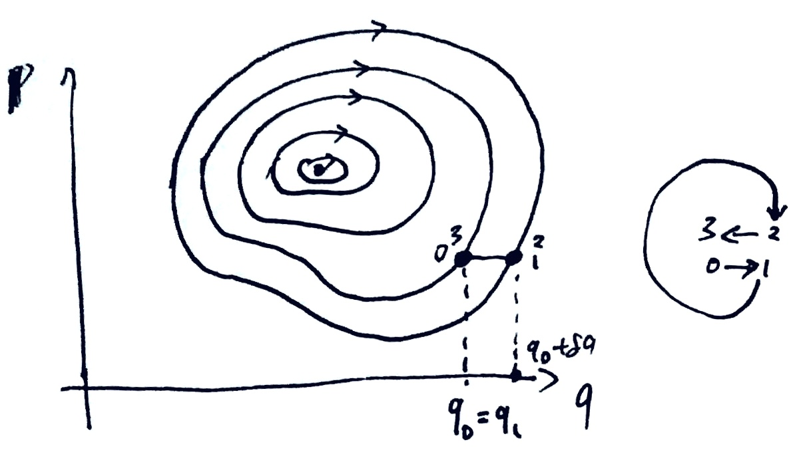{width="80%" fig-align="center"}

Take a particular cycle as shown, starting and ending at $q_0 = q_1$. Now consider this variation that fixes $(t_0, q_0), (t_1, q_1)$: move from point 0 to point 1, then go around the larger cycle to point 1, then return to point 0. The action of the varied cycle consists of three parts: $0\to 1, 1 \to 1, 1 \to 0$. By (modified) Hamilton's principle, the variation of action is zero.

Now, let $T(E) = t_1 - t_0$ be the cycle period for the cycle with energy $E$, then from our above argument, we have

$$\oint_E pdq - E T(E) = \oint_{E + \delta E} pdq - (E + \delta E) T(E) + O(\delta E^2)$$

where the $O(\delta E^2)$ term deals with the $0\to 1, 1\to 0$ parts of $\int -Hdt$. Thus we obtain

$$\frac{d}{dE} \oint_E pdq = T(E)$$

:::

::: {.callout-note title="Worked example: pendulum in gravity" collapse="true"}

The 1D pendulum in gravity, with length $l$ and mass $m$, has Lagrangian $L = \frac 12 m(l\dot q)^2 + mgl\cos q$, momentum $p = ml^2 \dot q$, and Hamiltonian

$$H = \frac{p^2}{2ml^2} - mgl \cos(q)$$

We know that the pendulum is not a SHO. Indeed, the cycle period $T(E)$ strictly increases with energy $E$ of the cycle, and it diverges as the pendulum swing approaches the highest point: $\lim_{E \to mgl} T(E) = +\infty$.

Consider the cycle with maximum swing angle $\theta$. The cycle encloses an oval-shaped region in phase space, with equation $p^2 = 2m^2 gl^3(\cos q - \cos\theta)$. Consequently, we have the somewhat mysterious result:

$$\int_0^{E(\theta)} T(E) dE = 4\sqrt{2m^2 gl^3} \int_0^\theta \sqrt{\cos q - \cos\theta} dq$$

where $E(\theta) = -mgl \cos\theta$ is the energy of the system when it has maximum swing angle $\theta$.

When $\theta$ is small, the integral is approximately

$$\int_0^\theta \sqrt{\frac 12 (\theta^2 - q^2)}dq = \frac{\pi\theta^2}{4\sqrt 2}$$

which does correspond to $T(E) \approx 2\pi\sqrt{\frac lg}$, and $\delta E = mgl(1 - \cos(\theta)) \approx \frac 12 mgl \theta^2$.

When $\theta = \pi$, the integral can be exactly evaluated:

$$\int_0^{mgl} T(E) dE = 16\sqrt{m^2 gl^3}$$

We are unable to interpret this strange but satisfying equality.

Taking $\partial_\theta$ under the integral sign, we get

$$T(E) = \sqrt{\frac{8l}g} \int_0^\theta \frac{dq}{\sqrt{\cos q - \cos \theta}}$$

which may be directly verified.

:::

### Action-angle variables

Now, it would be great if we could "unwind" the rotatory dynamics by a time-independent canonical transform to some $(Q, P)$, by where $P$ is constant along the cycles, and $Q$ is increasing. That is, we want $P$ to be the analog of "amplitude", and $Q$ to be the analog of "phase angle".

Since the transform is time-independent and canonical, the Hamiltonian $H$ is unmodified, so $H$ is a function of $P$ only, not $Q$ (since $H$ is a conserved quantity of motion). Then, since the transform is canonical, Hamilton's equations of motion read $\dot Q = \partial_P H(P)$. Consequently, the Hamiltonian equations of motion would become

$$\begin{cases} P(t) = P(0) \\ Q(t) = Q(0) + H'(P) t \end{cases}$$

as simple as it could be! It remains to find such a canonical transform.

We are already mostly there: we know that $P$ is constant along the cycles, and $Q$ increasing along the cycles. It remains to find the right scaling, so that the transform is canonical, that is, the coordinates preserve area: $dP \wedge dQ = dp \wedge dq$.

Define $P = \frac{1}{2\pi} \oint pdq$. Here the $2\pi$ factor is not essential, since we could always do a point transform, scale down $Q$ by $2\pi$, and scale up $P$ by $2\pi$. However, the factor will make many formulas look cleaner.

From the proof of @thm-1d-oscillator-period, we know that increasing the energy of the cycle by $\delta H$ would increase the cycle area by $T(H)\delta H$, and the cycle area is $2\pi P$, thus

$$\delta(2\pi P) = T(H) \delta H \implies \frac{2\pi}{T(H)} = H'(P)$$

so we find that the equations of motion are:

$$\begin{cases} P(t) = P(0) \\ Q(t) = Q(0) + 2\pi \frac{t}{T(H)} \end{cases}$$

This allows us to graphically construct the $(Q, P)$ coordinates on phase space:

1. Draw the cycles in phase space.
2. Select a "line of longitude" arbitrarily as $Q = 0$ line. 
3. Follow the trajectory of each point on the line of longitude, and mark down a new line of longitude at equal phases-angles. So for example, if you are on the cycle of energy $E$, you would start the ride, and after $T(E)/3$ has passed, note down its phase-angle as $2\pi/3$. The set of all such points at every cycle is the line of longitude with $Q = 2\pi/3$.

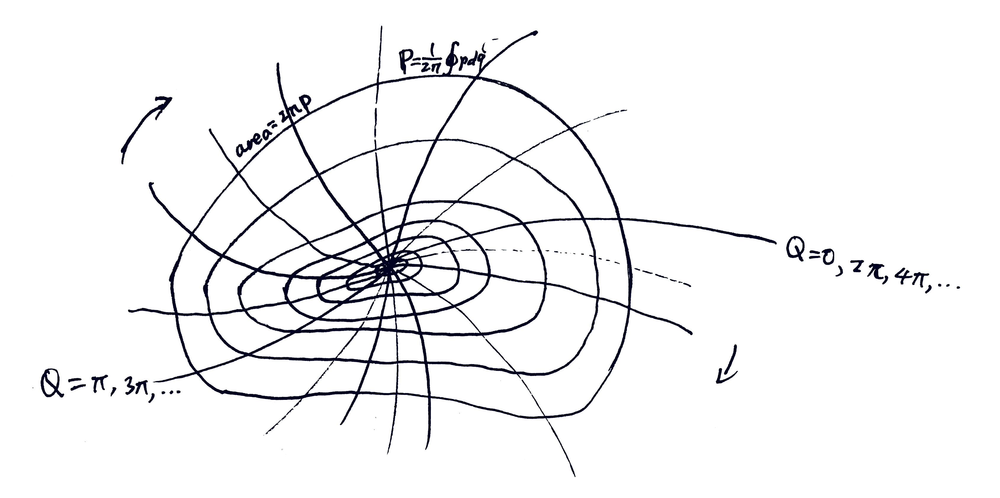{width="80%" fig-align="center"}

Now, we can graphically see that this construction really preserves areas:

1. Take an infinitesimal parallelogram at $(Q, P)$ with sides $\delta Q, \delta P$, such that $\delta Q = \frac{2\pi}{N}$ for some infinite integer $N$.
2. Evolve the system in discrete steps of $\frac{T(P)}{N}$, and follow the parallelogram along. 
3. Note that the parallelogram would tile the thin ring between $P$ and $P+ \delta P$. The thin ring has area $\delta \oint pdq = 2\pi \delta P$, so each parallelogram has area $2\pi \delta P/N = \delta P \delta Q$.

::: {.callout-warning}

This is not as trivial as it seems. The "area" in phase space was defined by $\oint pdq$, but we did not say that $p, q$ are perpendicular in any sense. Thus, it is not obvious that $\delta P \delta Q$ would be the area of the parallelogram. Indeed, we *should not* say that $p, q$ are perpendicular, because angles are undefined and *should not* be defined in phase space.

:::

The entire construction of $(Q, P)$ from $(q, p)$ is often done in one divinely-inspired move by a generating function.

### Adiabaticity

<small>This section based on [@duncanConstructingQuantumMechanics2019, chapter 5; @deoliveiraParametricInvariance2022].</small>

The Lorentz pendulum is a famous example that connects the classical and the quantum world. In the early 1900s, as physicists were trying to explain various phenomena, such as the black body radiation spectrum, the atomic spectra, and such, they came to the **quantum hypothesis**. Consider a classical system undergoing periodic motion -- such as the electrons cycling around a proton in the hydrogen atom. Whereas classically, its $\oint pdq$ may be of any value, the quantum hypothesis states that it can only take values in

$$
\oint pdq = nh, \quad n = 1, 2, 3, \dots
$$

for a certain constant of nature $h$ -- later given the name of **Planck's constant**. For example, if we have a simple harmonic oscillator, then we have

$$
E\nu = n h
$$

where $\nu = 1/T$ is the frequency of the oscillator.

At the 1911 Solvay Conference, where the great physicists grappled with the new quantum phenomena,[^solvay-1911] Einstein gave a presentation on the quantum hypothesis. At the end of the presentation, Lorentz asked a question about the pendulum. The conversation went as follows:

[^solvay-1911]: The entire conference is summarized in [@straumannFirstSolvayCongress2011].

> Mr. Lorentz recalls a conversation he had with Mr. Einstein some time ago, in which they discussed a simple pendulum that could be shortened by holding the string between two fingers and sliding them downwards. Suppose that initially, the pendulum has exactly one energy element corresponding to the frequency of its oscillations. It then seems that at the end of the experiment, its energy will be less than the element corresponding to the new frequency. 
> 
> Mr. Einstein -- If the length of the pendulum is changed infinitely slowly, the energy of the oscillation remains equal to $h\nu$, if it was initially equal to  $h\nu$ ; it varies proportionally to the frequency. The same is true for a resistance-free oscillating electrical circuit, and also for free radiation.
> 
> Mr. Lorentz -- This result is very curious and removes the difficulty. In general, the hypothesis of energy elements gives rise to interesting problems in all cases where one can change the frequency of vibrations at will.
>
> [@institutssolvayTheorieRayonnementQuanta1912, page 450]

![The adiabatic pendulum of Lorentz. Figure from [@fowler131AdiabaticInvariants2020]](figure/adiabatic-pendulum.png){width=30% fig-align="center"}

Why is this interesting? The quantum hypothesis states that for quantum oscillators, $E/\nu = nh$, where $n$ can only take values in the natural numbers. The Lorentz pendulum seems to show that the quantity $E/\nu$ can change continuously. Thus, for example, we might start at a quantized value of $E/\nu = 100h$, and end up at $100.5h$, invalidating the quantum hypothesis for macroscopic systems. And if macroscopic systems do not follow the quantum hypothesis, then as the macroscopic system becomes microscopic, it seems the quantum hypothesis would be invalidated as well.

Einstein replied that $E/\nu$ of the oscillator *is conserved* if the length of the pendulum is changed infinitely slowly. Surprising, but it saves the quantum hypothesis.

#### The adiabatic theorem

Consider a pendulum with a string length $\lambda$ that is slowly changed over time. How slow? Slow enough that the system completes many cycles before $\lambda$ makes any appreciable change. That is,

$$\dot \lambda \ll \frac{\lambda}{T(\lambda)}$$

::: {.callout-warning title="Parametric resonance"}

It is vitally important that the pulling on the pendulum is not only slow, but also "smeared", meaning that $\dot\lambda$ is equal over the entirety of a single oscillation. If it is not smeared, then we can break the theory. Consider for example a (spherical) child on a (frictionless) swing (in a vacuum). It is well-known that the child can, by swinging the legs in sync with the swing, get as high as possible. This is called parametric resonance.

Compared to adiabatic change, parametric resonance differs in that it is discriminating about the states. When you adiabatically pull on the string of a pendulum, your rate of pulling is the same over the entire cycle of a pendulum swing. When you resonantly pull on the string of a pendulum, your rate of pulling differs over the cycle of a pendulum swing. In the language of thermodynamics, adiabaticity means treating all microstates equally, without discrimination.

:::

Let the angular frequency of oscillation be $\omega = \sqrt{\frac g\lambda}$, then $E/\omega$ is constant over time.

::: {.callout-note title="Proof" collapse="true"}

By basic physics, the force in the string is 

$$
F = mg \cos \theta + m\dot \theta^2 / \lambda \approx mg - \ub{\frac 12 mg \theta^2}{$V/\lambda$} + \ub{m\lambda \dot\theta^2}{$2T/\lambda$}
$$

Because the system is undergoing simple harmonic oscillation, the time-average of $V$ and $T$ are both $\frac 12 E$, where $E$ is the oscillation energy. Therefore, the time-average force is $\bar F = mg + \frac 12 E/\lambda$.

Thus, if we shorten the string by $\delta \lambda$, we would inject an energy of $\delta E = \bar F (-\delta\lambda) -( mg\delta\lambda)$ (we subtract away the gravitational energy at the lowest point, as it is irrelevant). This gives us 

$$
\delta E + E \delta\lambda / 2\lambda = 0 \implies E\lambda^{1/2} = \Const
$$

Since the angular frequency of oscillation is $\omega = \sqrt{\frac g\lambda}$, we have the result.

:::

::: {#exr-0}

Perform the same analysis on a vibrating string. The string is fixed at both ends, and the length of the string is slowly changed. The string is in a standing wave pattern, and the length of the string is changed so slowly that the string completes many cycles before the length changes appreciably. What is the adiabatic invariant in this case? The answer is in [@rayleighXXXIVPressureVibrations1902].

:::

::: {.callout-note title="Adiabatic invariance to all orders" collapse="false"}

The adiabatic invariance is actually much stronger than what we have shown. It is not just that the enclosed action $I$ is conserved up to $O(\dot\lambda)$, but that it is conserved to all orders in $O(\dot \lambda^n)$ [@lenardAdiabaticInvarianceAll1959]. Under stronger restrictions, it is even conserved to order $O(e^{c/\dot \lambda})$. See [@henrardAdiabaticInvariantClassical1993, section 4] for more theorems in this style.

:::

Generalizing from this experience, for an arbitrary 1D oscillator with Hamiltonian $H(q, p; \lambda)$, the phase space trajectory is a closed wobbly cycle. As we vary $\lambda$ adiabatically by external force, the cycle changes shape, both because the system has received energy from the external force, and because the Hamiltonian of the system has changed. Nevertheless, the area enclosed within should remain constant.

::: {.callout-note title="Proof" collapse="false"}

In general, force is the energetic cost of changing a parameter. That is, $F = (\partial_{\lambda} H)_{p, q}$. Here, we are using a notation commonly used in thermodynamics: for partial derivatives, we write in the subscript the variables being held constant.

Let us adiabatically vary $\lambda$. After many cycles have passed, the oscillator is orbiting around the cycle defined by $H(q, p; \lambda) = E$. After many more cycles have passed, we have varied $\lambda$ by $\delta \lambda$, and the oscillator would be orbiting around the cycle defined by $H(q, p; \lambda + \delta \lambda) = E + \delta E$, where $\delta E = \bar F \delta \lambda$ is the increase in oscillator energy due to the external force varying $\lambda$.

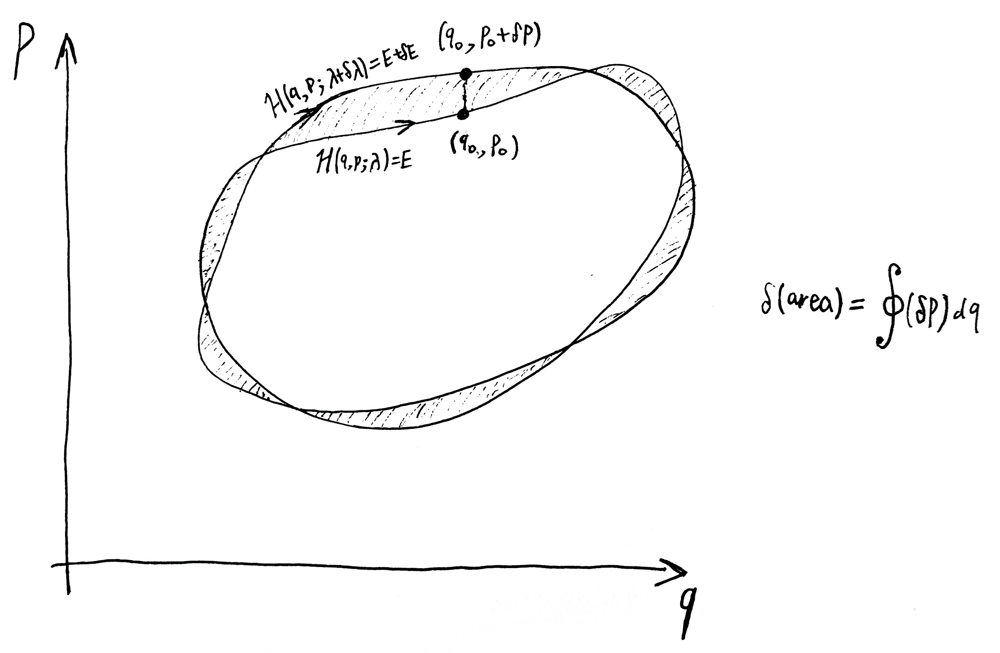{width=80% fig-align="center"}

As pictured, for each point $(q_0, p_0)$ on the first cycle, we move by $\delta p$, to end up with point $(q_0, p_0 + \delta p)$ on the second cycle. The cycle area would change by 

$$\delta(\text{area}) = \oint (\delta p)dq = \int_0^T (\delta p )\dot q dt + O(\delta T \delta p)$$

where $T$ is the cycle time of the first cycle, and $T + \delta t$ is the cycle time of the second cycle.

Expanding and simplifying,

$$
H(q_0, p_0 + \delta p ; \lambda + \delta \lambda) = E + \ub{\delta E}{$= \bar F \delta \lambda$} \implies 
(\partial_p H)_{\lambda, q}\delta p = [\overline{(\partial_\lambda H)_{q, p}} - (\partial_\lambda H)_{q, p}] \delta\lambda
$$

Now, integrate over a single cycle, and using the Hamilton equation of motion $\dot{q} = (\partial_p H)_{\lambda, q}$, 

$$\delta(\text{area}) =  \delta\lambda \int_0^T [\overline{(\partial_\lambda H)_{q, p}} - (\partial_\lambda H)_{q, p}] dt + O(\delta^2)$$

By definition, $\overline{(\partial_\lambda H)_{q, p}} = \frac 1T \int_0^T (\partial_\lambda H)_{q, p}dt$, thus we have $\delta(\text{area}) = O(\delta^2)$. Thus, integrating over the entirety of the adiabatic process, $\Delta(\text{area}) = O(\delta)$, which converges to zero as the adiabatic process becomes infinitely slow.

:::

::: {#multidimensional-adiabatic-theorem .callout-tip}

For a multidimensional oscillating system, we have three possibilities.

If the dimensions separate, like an $n$-dimensional oscillator $H = \frac{p_1^2 + \dots + p_n^2}{2m} + \frac 12 k (q_1^2 + \dots + q_n^2)$. In this case, the adiabatic theorem still applies along each dimension, with one adiabatic invariant per dimension.

If all dimensions mix together, like a tank of hot, entangled gas. In this case, the adiabatic theorem states that if we start with the microcanonical ensemble, then the phase space volume enclosed by the surface of $H = E$ remains constant as we adiabatically vary $\lambda$. The volume is named the Gibbs invariant. [@deoliveiraParametricInvariance2022]

If the dimensions neither separate nor mix together, but have some kind of complicated dynamics, then what adiabaticity means in that case is still a current area of research.

:::

#### Connection to thermodynamics

Consider a ball in a piston, bouncing elastically off its two ends. We hold one end of the piston constant, and slowly move the other. Assume the ball only moves in the $x$-direction for simplicity. Let the ball have speed $v$, and the walls of the piston have separation $L$.

The phase space diagram of the system is a rectangle with $\Delta q = L, \Delta p = (mv) - (-mv) = 2mv$, enclosing an area of $I = 2mvL$. If we slowly move the wall of the piston, then the action is conserved, giving us

$$
2mv_0 L_0 = 2mvL \implies v = \frac{L_0}{L} v_0
$$

We can formulate this into the language of thermodynamics. First, expand our system to three dimensions -- from a piston to a box. Since the motion of the ball in the $x, y, z$ directions are independent, we can treat them separately. We also assume equipartition of energies, that is, the energy of the ball is equally distributed among the three dimensions, so $v_{x, 0} = v_{y, 0} = v_{z, 0}$. The conservation of action then states that

$$
v_i = \frac{L_{i, 0}}{L_i} v_{i, 0} \quad \text{for } i = x, y, z
$$

Imagine the ball is a gas molecule, and the piston is a wall of a container. Let $E = \sum_{i = x, y, z} \frac 12 mv_i^2$ be the energy of the gas molecule, and $V = \prod_{i = x, y, z}L_i$ be the volume of the gas. We then have

$$
V = V_0 \prod_i \frac{L_i}{L_{i, 0}} \approx V_0 \left(1 + \sum_i \frac{\delta L_{i}}{L_{i, 0}}\right), \quad
\begin{aligned}
E &= \frac 12 m \sum_i \left(\frac{L_{i,0}}{L_i}\right)^2 v_{i, 0}^2\\
&= \frac 32 m v_0^2 \frac 13 \sum_i \left(\frac{L_{i,0}}{L_i}\right)^2 \\
&\approx E_0 \left(1 - \frac 23 \sum_i \frac{\delta L_{i}}{L_{i, 0}}\right)
\end{aligned}
$$

These imply that $E^{3/2}V \approx E_0^{3/2}V_0$. Now, this is precisely what happens if you compress an ideal gas adiabatically. This is one connection between the concept of "adiabatic" in classical mechanics and thermodynamics.

::: {#exr-0}

Prove that $I$ is conserved: calculate the average force $\bar F$ on the piston, then calculate the work done by the piston.

:::

#### More examples

Given a Lorentz pendulum and a schedule for varying its arm length, we can plot the angle $x$ as a function of time, and see directly that $I = T (\frac 12 m \dot x_{max}^2)$ is conserved over many swings of the pendulum.

![A Lorentz pendulum with length increasing linearly with time. As its length increases, $\dot x_{max}$ decreases while $T$ increases, keeping $I$ conserved. Annotated from [@sanchez-sotoVariationsAdiabaticInvariance2013, figure 1]](figure/sanchez-soto_fig_1_annotated.png){width=80% fig-align="center"}

For a more rigorous proof of adiabatic invariance at the level of first-year graduate student, see [@wellsAdiabaticInvarianceAction2007]. [@henrardAdiabaticInvariantClassical1993] is a good comprehensive review of adiabatic invariance in classical mechanics, and points to the literature on a lot of applications in celestial mechanics, magnetism, and the geometry of phase space plots. In textbooks on classical statistical mechanics, the adiabatic invariance theorem is used to derive many results. [@fernandez-pinedaAdiabaticInvariancePhase1982] gives some worked-out examples, such as the ideal gas and the photon gas. 

## Old quantum mechanics

> Sommerfeld, in the new edition of his book [*Atomic structure and spectral lines*], has introduced the adiabatic hypothesis through a couple of very elegant changes and footnotes, in such a way that my participation in that can rather appear reduced to — a plagiarism. Lorentz and Einstein have founded the subject, I have given it a name and Burgers has put everything in order. I was first **very, very** depressed. I know that I have never discovered anything, and **quite surely never will discover anything**, that I can love so fervently as this line of thought which I found out with so large joy.
>
> Ehrenfest's letter to Bohr, 8 May 1922. Emphasis in original. Quoted in [@navarroPaulEhrenfestGenesis2006]

### The adiabatic hypothesis

There are two ways to interpret the word "adiabatic". In thermodynamics, "adiabatic" means "no exchange of heat". In mechanics, "adiabatic" means "gradual".[^adiabatic-chinese] It is a winding story of how one word "adiabatic" came to mean two things that fortuitously are connected after all, the details of which are given in [@jammerConceptualDevelopmentQuantum1966, Chapter 3; @laidlerMeaningAdiabatic1994]. The story is almost as interesting as that of the word "entropy", which also has two meanings that are fortuitously connected after all.

[^adiabatic-chinese]: Because "adiabatic" has two meanings in English, in Chinese, it also has two different translations based on the two meanings. There is 绝热, which means "no exchange of heat", and 浸渐, which means "gradually, like moisture soaking into something".

Rankine first coined the term "adiabatic" in 1858, to denote a process in which no heat is exchanged with the surroundings. Later, Boltzmann and Clausius tried to explain the second law of thermodynamics mechanically, by using purely mechanical models of the microscopic world. In this sense, they defined an "adiabatic" mechanical process to be one where a certain variable is slowly changed (for example, if we have a box of little bouncing balls, and we slowly move its walls), because an adiabatic thermodynamic process in their view is actually an adiabatic mechanical process.

"Adiabatic motion" in mechanics was introduced by Helmholtz and Hertz, to denote mechanical processes where external forces act upon a system, but only on a few parameters, with no action on the underlying details. For example, think back to the case of bouncing balls in a box. The external force only moves the walls of the box *on average*, with no attempt to move the walls to manipulate the precise location of the ball. They used the thermodynamic terminology, because the work done on the system during an adiabatic motion results exclusively in changes in its energy. [@jammerConceptualDevelopmentQuantum1966, Chapter 3]

In 1900, Pyotr Lebedev experimentally proved that radiation pressure exists, and follows Maxwell's theory of electromagnetism. Inspired by this, Lord Rayleigh [@rayleighXXXIVPressureVibrations1902] generalized the concept of radiation pressure to all kinds of vibrations, starting with the humble pendulum. Since his goal was to understand what happens when you adiabatically compress a photon gas, that is, [Wien's displacement law](https://en.wikipedia.org/wiki/Wien's_displacement_law#Discovery),[^kelvin-photon-gas] he studied the effect of adiabatic motion on some simple mechanical systems undergoing wave motion, such as the Lorentz pendulum, a vibrating cord, a piston of gas with a standing acoustic ave, etc.

[^kelvin-photon-gas]: Since he didn't actually know what a photon was, it might be better to say that he was studying what would happen when you compress a hot chamber of light. Though Wien's displacement law is nowadays proved straight from quantum mechanics, back when ien discovered it in 1893, he used a thermodynamic argument using the adiabatic compression of a photon gas. For a brief presentation of how Rayleigh did it, see [@terhaarAdiabaticInvarianceAdiabatic1966].

Like Lord Kelvin, Paul Ehrenfest was also trying to explain Wien's displacement law. He was puzzled by the fact that while Wien's displacement law was derived without the quantum hypothesis, yet somehow, it remains true. Suppose we start with a box of light, then it follows a certain black body radiation, which can only be derived by the quantum hypothesis. Now suppose we adiabatically compress the box of light. Though the compression process is studied classically, without the quantum hypothesis, the final state of the light is still the black body radiation. So, it seems that if we start with a system following the quantum hypothesis, then any adiabatic *classical* process would give us a system that still follows the quantum hypothesis. This is his **adiabatic hypothesis**, for which he is famous.

During the 1910s, Ehrenfest published a series of papers to subsume the many ad-hoc quantum rules under the framework of the adiabatic hypothesis. His idea is as follows: If, in a periodic system described by classical mechanics (such as an electron orbiting a proton), a certain quantity $I$ has units of joule-second, and is conserved as it undergoes adiabatic motion, then this quantity *should* be quantized, and only this quantity *can* be quantized. Only $I$ *can* be quantized, for the reason discussed by Lorentz and Einstein at the Solvay conference.

Further, $I$ *should* be quantized, because otherwise, why else should $I$ be adiabatically conserved? The adiabaticity of $I$ in the classical world, on the surface, is a shadow of the discreteness of $I$ in the quantum world, deep down. Because $I$ is quantized, if we vary the system slowly enough, the system would have no reason to make a big jump from $I = nh$ to $I = (n+1)h$. This discreteness in the quantum world traps $I$ in its starting position, and this is why $I$ appears adiabatic in the classical world.

Thus, quantized quantities are precisely adiabatic invariants. We can write down $I = nh$, where $n \in \N$, and proceed to calculate the properties of the system, such as its energy levels, its absorption and emission spectra, etc.

In short, this is Ehrenfest's recipe for doing "old quantum mechanics":

* Find a system that has a conserved quantity $I$ under adiabatic motion.
  * You can do this by solving the equations of motion, then integrate $\oint pdq$.
  * Alternatively, you can start with a harmonic oscillator, and adiabatically deform the system until it becomes the system you want. Ehrenfest called such systems "adiabatically related to the harmonic oscillator" [@jammerConceptualDevelopmentQuantum1966, page 99].
* Proclaim that $I = nh$ for some constant $h$.
* Calculate the properties of the system.

### The Bohr--Sommerfeld model

As an example, consider the pinnacle of old quantum theory, the [Bohr--Sommerfeld model](https://en.wikipedia.org/wiki/Bohr%E2%80%93Sommerfeld_model) of the hydrogen atom. First, treat the hydrogen atom as if it is a relativistic solar system, with the electron as a planet, moving at relativistic speeds[^relativistic-atom] under the inverse-square force $F \propto \frac{1}{r^2}$. Next, assume that the adiabatic invariant is quantized:

[^relativistic-atom]:
    Because the electron moves faster closer to the atom than further away, it has more mass close to the atom than further away. This allows the orbit to precess in a way that is not predicted by Newtonian mechanics. Generally, any perturbation of the inverse-square force will cause the orbit to precess. Even special relativity would predict some precession for the perihelion of Mercury, though it predicts a value of $7''/\text{year}$ only $1/6$ of the correct value [@mcdonaldSpecialRelativityPrecession2023; @goldsteinClassicalMechanics2008, exercise 7.27, page 332]. Only general relativity predicts the correct value. Assuming that only special relativity contributes, the perihelion of Mercury would take $7.5 \times 10^7$ Mercury-years to go around the sun once.

    As the electron moves a lot faster than Mercury, it takes much shorter time, but still it takes $4\times 10^4$ electron-years to go around the nucleus once, as noted in Bohr's Nobel lecture [@bohrStructureAtom1923].

$$\int_0^T p_r \,dq_r = n' h$$

where $q_r$ is the radial position of the electron, $p_r$ is the momentum conjugate to it, $n'$ is the "auxiliary quantum number", and $T$ is the period of the electron's orbit. This, when combined with the hypothesis of quantized angular momentum $mvr = nh$ (here, $n$ is the "principal quantum number"), would predict the emission spectrum of the hydrogen atom. Because the equation of motion for the electron separates into a radial component $q_r, p_r$ and an angular component $q_\theta, p_\theta$, we can apply the [multidimensional adiabatic theorem](#multidimensional-adiabatic-theorem) and find that both $\int_0^T p_r \,dq_r$ and $\int_0^T p_\theta \,dq_\theta$ are adiabatic invariants.

Sommerfeld went further, piling epicycles upon epicycles, to explain the fine structure of atomic spectra. All those has been swept away by the new quantum theory like how the new astronomy of Kepler swept away the epicycles of Ptolemy. But the adiabatic hypothesis remains to this day a fruitful meeting point between the classical, the quantum, and the thermodynamic world.

Have some cool pictures, because I like cool pictures.

::: {#fig-atombau layout-ncol=1}

Selections from [@sommerfeldAtomicStructureSpectral1923].

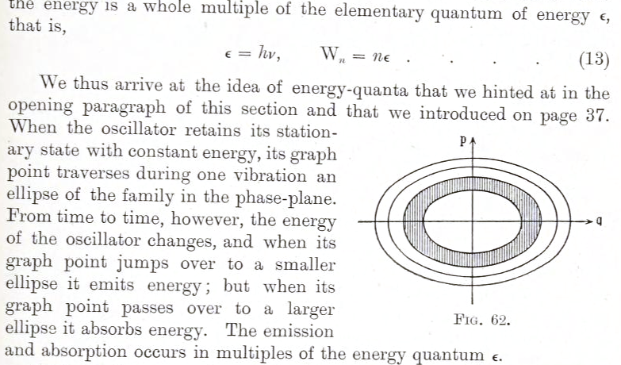{width=80% fig-align="center"}

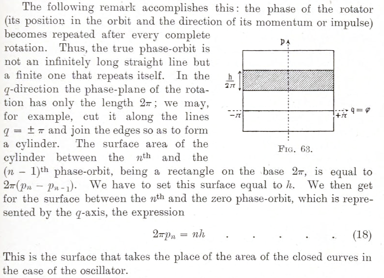{width=80% fig-align="center"}

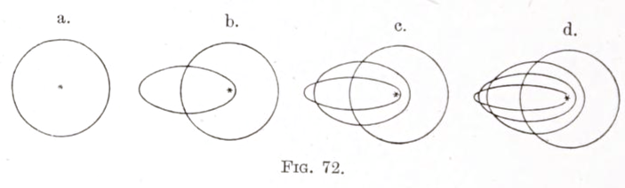{width=80% fig-align="center"}

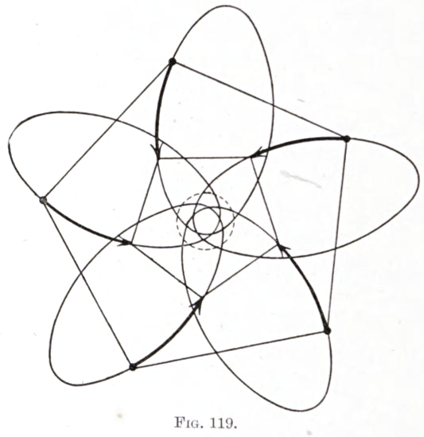{width=50% fig-align="center"}

:::

::: {#fig-kramers layout-ncol=1}

Selections from [@kramersAtomBohrTheory1923].

{width=70% fig-align="center"}

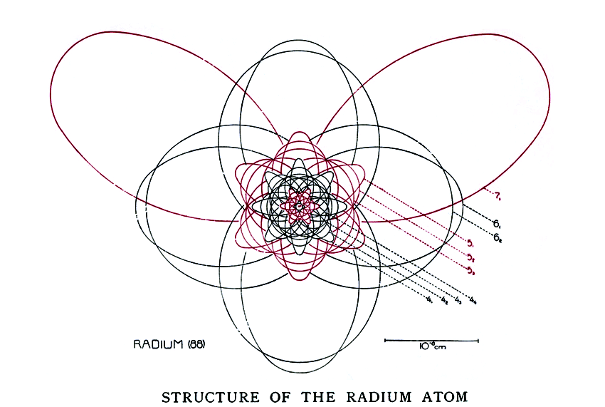

![A modern redrawing. [@holtebekkAtomAtomteori2023]](figure/atomteori_vectorized_bohr_atoms.png)

:::

> What we are nowadays hearing of the language of spectra is a true " music of the spheres " within the atom, chords of integral relationships, an order and harmony that becomes ever more perfect in spite of the manifold variety. The theory of spectral lines will bear the name of Bohr for all time. But yet another name will be permanently associated with it, that of Planck. All integral laws of spectral lines and of atomic theory spring originally from the quantum theory. It is the mysterious organon on which Nature plays her music of the spectra, and according to the rhythm of which she regulates the structure of the atoms and nuclei.
>
> Preface to the first edition of *Atomic structure and spectral lines*, Arnold Sommerfeld, 1919. [@sommerfeldAtomicStructureSpectral1923]

### The Einstein---Brillouin--Keller quantization

This topic is quite obscure and hard to find a simple reference for, yet I found it is absolutely necessary to treat this correctly, if only to soothe my mathematical conscience. I wrote it based on [@stoneEinsteinsUnknownInsight2005; @duncanConstructingQuantumMechanics2019, chapter 5].

Let's take a more careful look at the Bohr--Sommerfeld model of a hydrogen atom. The electron orbits a proton, and the equation of motion is spherically symmetric. Therefore, we can write it in spherical coordinates $(r, \theta, \psi)$, where $r$ is the radius, $\theta$ is the co-latitude, and $\psi$ is the longitude. The Bohr--Sommerfeld quantization then states that

$$
\begin{aligned}
& \oint p_r d r = n_r h \\
& \oint p_{\theta} d \theta=n_\theta h, \\
& \oint p_\psi d \psi=n_\psi h .
\end{aligned}
$$

for some positive integers $n_r, n_\theta, n_\psi$. However, we notice something deeply unsatisfying: How does the atom "know" which way is the sphere pointing? To define the spherical coordinates, we need to define the direction of the north and south pole. The Bohr--Sommerfeld quantization condition is thus creating an artificial direction in space where none should exist. Worse, if we solve the equations, we would find that this artificial direction has physically measurable consequences.

Sommerfeld evaded the difficulty by arguing that as long as there is even a hair of magnetic field $B$ pointing in some direction $\hat z$, we can pick $\hat z$ as the north pole direction, and that since the field strength is nowhere zero, the problem will never occur in practice.

We see the difficulty inherent in the old quantum theory. Suppose we have a hydrogen atom suspended in free space, then the tiniest change in the external magnetic field would create a large (for the atom, at least) change in its north-pole direction. The [Stern--Gerlach experiment](https://en.wikipedia.org/wiki/Stern%E2%80%93Gerlach_experiment), performed in 1922, experimentally showed that the external field can determine the direction of $\hat z$, and thus the quantization of angular momentum. To see something in classical mechanics so jumpy is disconcerting, and certainly disturbed me greatly when I first understood the Stern--Gerlach experiment. In 4 years, Schrödinger would have proposed his equation, Heisenberg his matrix mechanics, and old quantum theory washed away by the new quantum mechanics.

Einstein, in his only paper on the old quantum mechanics,[^einstein-1916] elegantly resolved the problem by using the [Poincaré--Cartan integral invariant](#thm-poincare-cartan) to construct quantization equations that do not depend on our arbitrary choices of coordinate systems.

[^einstein-1916]: [@einsteinQuantensatzSommerfeldUnd1917], reprinted and translated in [@einsteinCollectedPapersAlbert1997, volume 6, pages 434--444].

As we saw with @exr-zero-poincare-cartan, a contractable loop on the torus integrates to zero. Thus, we can attach and detach contractible loops at will, deform the cycle arbitrarily, and still get the same number. That is, the integral is determined by the topology of the cycle, not the exact shape of the cycle.[^homology-torus] This gives us the Einstein quantization:

$$
\oint_{\gamma_i} \lra{p, dq} = n_i h
$$

where $\gamma_1, \dots, \gamma_d$ range over the $d$ topologically distinct loops around the $n$-dimensional torus in phase space, and $n_1, \dots, n_d$ are positive integers. This was later modified by Brillouin and Keller to take account of singularities in the trajectory, such as a hard wall reflector, giving us the [EBK quantization](https://en.wikipedia.org/wiki/Einstein%E2%80%93Brillouin%E2%80%93Keller_method).

[^homology-torus]: In the jargon of topology, this is a linear function on $T^d$, [the homology group of the torus](https://en.wikipedia.org/wiki/Homology_(mathematics)). Here, $d$ is the dimension of the torus.

::: {.callout-warning}

The EBK quantization resembles the Bohr--Sommerfeld quantization condition, but it is quite different. In the Bohr--Sommerfeld quantization condition, the integral $\oint p_i dq_i$ integrates over a cycle of *physically real* trajectory in phase space. In EBK quantization, the integral $\oint_{\gamma_i} \lra{p, dq}$ integrates over a *geometric* cycle in phase space with *no physical reality at all*.

Both conditions happen to be the same when we have a 1D oscillator, but that is because the only way to *physically* go around the torus is the only way to *geometrically* go around the torus. It is a misleading coincidence.

In general, the physically real trajectories look like a braiding on the torus, and are not even closed cycles. They definitely do *not* go around the torus exactly once in exactly one direction.

:::

There is only one problem left: What happens when we don't have a torus? It is all well and good when we can construct a torus in phase space with as many dimensions as possible. However, when we have a classically chaotic system, such as the three-body problem, we cannot have something this simple.

Consider the simplest case of the three-body problem: We put two suns in a circular orbit around each other, and a speck of dust orbiting them. The two suns' orbit is perfectly predictable, so we consider only the trajectory of the dust. We also assume the dust only moves in the plane of the suns. Thus, the system has only 2 dimensions of configuration, or 4 dimensions of phase.

As the energy of the system is conserved, the motion of the dust is restricted to the constant energy surface $H(q_1, q_2, p_1 p_2) = E$, which is a 3-dimensional blob within the 4-dimensional phase space. However, in general, this is all we can say about it. The motion of the dust is chaotic, and would densely crisscross over a 3-dimensional subset of the blob.

Without a torus in phase space, we cannod construct the action-angle variables, and thus the integral $\oint_{\gamma}\lra{p, dq}$ is undefined. Einstein presciently pointed this out in his 1916 paper:

> If there exist fewer than $d$ \[constants of motion\], as is the case, for example, according to Poincaré in the three-body problem, then the $p_i$ are not expressible by the $q_i$ and the quantum condition of Sommerfeld--Epstein fails also in the slightly generalized form that has been given here.

Interestingly, Dirac got tripped up on the exact same point, trying and failing to extend Bohr--Sommerfeld old quantum theory, before he found the way out through the new quantum theory:

> I was very much impressed by action and angle variables. Far too much of the scope of my work was really there; it was much too limited. I see now that it was a mistake; just thinking of action and angle variables one would never have gotten on to the new mechanics. So without Heisenberg and Schrödinger I would never have done it by myself.
>
> [@kraghDiracScientificBiography1990, page 16]

Dirac, as we said, approached quantum mechanics through Poisson brackets. Let $f, g$ be classical observables, and $\hat f, \hat g$ be their quantum versions, the formula $\hat f \hat g - \hat g \hat f = i\hbar \{f, g\}$ shows that the operators $\hat f, \hat g$ are commutative precisely where $\{f, g\} = 0$. However, there are classical systems where this is impossible! Let $n$ be the dimension of its configuration space, $H$ be its Hamiltonian, then there does not exist $f_1, \dots, f_n$ such that $\{f_i, f_j\} = 0$ and $f_1 = H$. Old quantum theory simply does not work for such systems, nor does EBK quantization.

This failure of the EBK quantization on classically chaotic systems was forgotten for many years, but eventually rediscovered.[^einstein-quantum-chaos] When it did, it became a seed of [quantum chaos](https://en.wikipedia.org/wiki/Quantum_chaos), which I hope to explain clearly some day. In the mean time, I leave you with some beautiful pictures of quantum chaos instead.

[^einstein-quantum-chaos]: See [@stoneEinsteinsUnknownInsight2005] for a brief history and more cool pictures. It was written in 2005, the "Einstein Year", the 100th anniversary of Einstein's *annus mirabilis*.

![The nonchaotic quantum circular billiard and the chaotic quantum cardioid billiard. Figure from [@backerQuantumChaosBilliards2007]](figure/chaotic_integrable_quantum_billiard.png)

 of departed classicality. Figure from [@kingExploringQuantumClassical2014]](figure/king_2009_quantum_scars.png)
