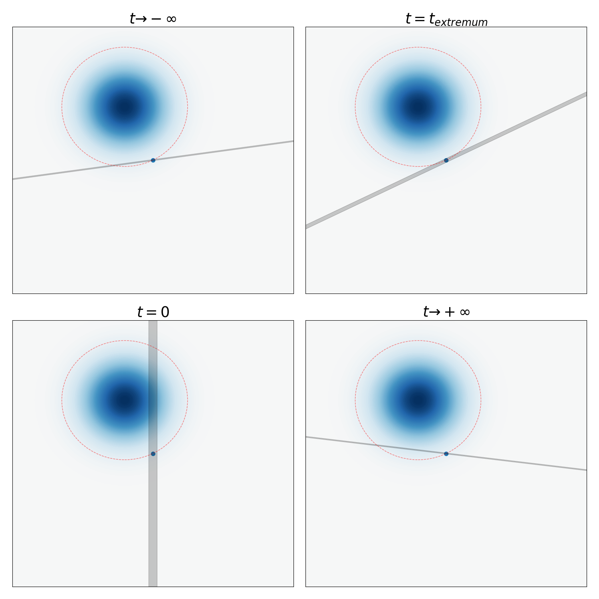
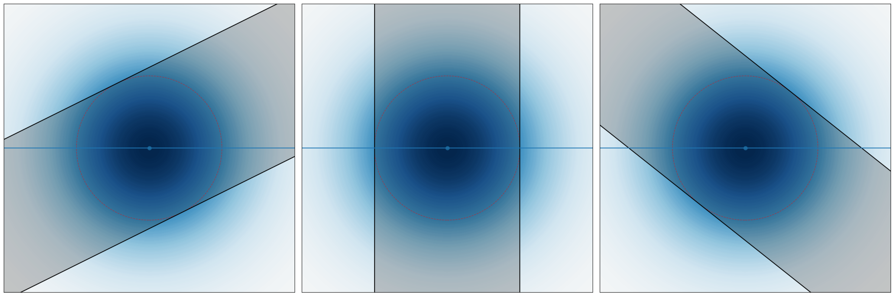

## Quadratic Hamiltonian

If the Hamiltonian $H$ is a sum of kinetic and potential energies, as $H = T(p) + V(q)$, then

$$
\begin{aligned}
  (f \star_t g)(q,p) &= f\left(q_1 + t\overrightarrow{\partial_{p_1}}, \dots, p_1 - t\overrightarrow{\partial_{q_1}}, \dots\right) g(q,p) \\
  &= f(q,p) g\left(q_1 - t\overleftarrow{\partial_{p_1}}, \dots, p_1 + t\overleftarrow{\partial_{q_1}}, \dots\right) \\
  &= f\left(q_1 + t\overrightarrow{\partial_{p_1}}, \dots, p\right) g\left(q_1 - t\overleftarrow{\partial_{p_1}}, \dots, p\right)
  \end{aligned}
$$

Thus,

$$
H \star W = T(p - (i\hbar/2)\nabla_q) W + V(q +  (i\hbar/2) \nabla_p) W
$$

and similarly for the other direction. Together, it means

$$
\partial_t W = \frac{T(p - (i\hbar/2)\nabla_q) - T(p + (i\hbar/2)\nabla_q)}{i\hbar} W + \frac{V(q + (i\hbar/2)\nabla_p) - V(q - (i\hbar/2)\nabla_p)}{i\hbar} W
$$

In particular, if $T, V$ are both quadratic, such as in the case of a harmonic oscillator $H = \frac{p^2}{2m} + \frac 12 m\omega^2 q^2$, then we have

$$
\partial_t W = -\nabla_p T \cdot \nabla_q W + \nabla_q V \cdot \nabla_p W = \{H, W\}
$$

which is exactly the same as the classical Hamiltonian equations of motion.

In other words, we can picture the phase-space evolution of a quantum harmonic oscillator's Wigner function as exactly the same as if it is the phase space evolution in classical statistical mechanics. The only difference is that there are both regions of positive and negative probabilities. But at least it is all real-valued!

### Free particle

For a particle in free space, the Hamiltonian is $H = \frac{\|p\|^2}{2m}$. Thus, the Wigner function $W$ evolves by a simple shearing flow in phase space:

$$
W(t, q, p) = W(0, q - pt/m, p)
$$

This picture allows us to obtain some results pictorially.

#### Gaussian wavepacket

Consider the simplest case of a gaussian wavepacket on $\R$, centered at $q = 0$, with zero total momentum. Over time, it contracts, until its width $\sigma_q$ reaches a minimum, before spreading out again. Let $t = 0$ be the time of minimal width, so its wavefunction satisfies

$$
\psi(0, q) = \sqrt{\rho_{N (0, \sigma_q^2)}(q)}
$$

where $\rho_{N (0, \sigma_q^2)}$ denotes the probability density function of the gaussian with mean $0$ and variance $\sigma_q^2$. By direct calculation, its Wigner function is the probability density function of the gaussian with mean $(0, 0)$ and variance $\diag(\sigma_q^2, \sigma_p^2)$, satisfying the uncertainty principle $\sigma_q^2 \sigma_p^2 = \hbar^2/4$.

More generally, a gaussian wavepacket with initial peak position $q_0$ and momentum $p_0$ has a Wigner function with mean $(q_0, p_0)$ and variance $\diag(\sigma_q^2, \sigma_p^2)$. For concreteness, let $q_0 > 0, p_0 < 0$. As time $t$ increases from $-\infty$ to $t = 0$, the Wigner function shears to the left more and more, until it becomes an ellipse with major axes parallel to the $p$-axis and the $q$-axis right at $t = 0$. The center of mass on the $q$-axis is the projection of the center of the Wigner function, which moves at constant velocity $p_0/m$. The $q$-marginal distribution of the Wigner function first shrinks, reaching a minimum at $t = 0$, before growing again. Its $p$-axis marginal remains unchanged. This is shown in the following animation.

<video controls width=100%>
  <source src="figure/shear_wigner.webm" type="video/webm" />
</video>

#### Negative probability flow

In [@villanuevaNegativeFlowProbability2020; @goussevCommentNegativeFlow2020], it was noted that for a gaussian wavepacket with positive group velocity $p_0 / m > 0$, it is often the case that there is a paradoxical "negative probability flow". Specifically, it was found that, if we stand at a point $q_1 > q_0$, and plot $Pr(q > q_1 | t)$, the probability that the particle is found at $q > q_1$ at time $t$, then as time passes, that probability first decreases, before it increases, even though the wavepacket always has positive group velocity. This is immediate in the phase space picture.

Consider a gaussian wavepacket with $W(0, q, p) = \rho_{N ((q_0, p_0), \diag(\sigma_q^2, \sigma_p^2))}$, with $q_0 < 0, p_0 > 0$. Geometrically, $Pr(q > q_1 | t)$ is the integral of $W(t, q, p)$ on the region to the right of the vertical line $q = q_1$, which is equal to the integral of $W(0, q, p)$ on the region to the right of the sheared line $q = -\frac{t}{m} p$. The sheared line rotates clockwise over time.

From the geometry of gaussian distributions, this integral can be pictorially calculated by finding the ellipse of constant $\rho_{N ((q_0, p_0), \diag(\sigma_q^2, \sigma_p^2))}$ that is tangent to the sheared line. At $t \to -\infty$, the sheared line is just the $q$-axis. As $t$ increases, the sheared line rotates counterclockwise, and the tangent ellipse grows, until it hits the maximal size at some critical time $t = t_{\text{critical}}$, at which point the tangent ellipse is equal to

$$
\frac{(q-q_0)^2}{\sigma_q^2} + \frac{(p-p_0)^2}{\sigma_p^2} = \frac{(q_1-q_0)^2}{\sigma_q^2} + \frac{(0-p_0)^2}{\sigma_p^2}
$$

It is a simple exercise to show $t_{\text{critical}} = -\frac{mp_0 \sigma_q^2}{(q_1- q_0) \sigma_p^2}$.

After that, the tangent ellipse shrinks again. This is illustrated in the following figure.

By tracing out the pictures, we visually see that $Pr(q > q_1|t)$ decreases over the region $t \leq t_{\text{critical}}$, and increases over the region $t \geq t_{\text{critical}}$.

By a similar pictorial reasoning, if $q_0 > 0, p_0 > 0$, then $Pr(q > q_1|t)$ increases over the region $t \leq t_{\text{critical}}$, and decreases over the region $t \geq t_{\text{critical}}$. Only when $q_0 = q_1$ is $Pr(q > q_1|t)$ strictly monotonic over all time.

#### Wave dispersion

As noted previously, a gaussian wave packet first shrinks, then grows, according to a precise formula proved in every introductory quantum mechanics course. We derive this formula geometrically.

Without loss of generality, consider a wavepacket with zero group velocity, centered at $q = 0$, reaching minimal width $\sigma_q$ at $t=0$. Its Wigner function is $\rho_{N((0, 0), \diag(\sigma_q^2, \sigma_p^2))}$, where $\sigma_q \sigma_p = \hbar / 2$.

Now, consider its one-sigma ellipse $\frac{q^2}{\sigma_q^2} + \frac{p^2}{\sigma_q^2} = 1$. It projects to an interval $[-\sigma_q, +\sigma_q]$ on the $q$-axis, meaning that at time $t=0$, the probability of finding the particle within the interval $[-\sigma_q, +\sigma_q]$ is plus-or-minus one-sigma, that is, 68.3%.

Now, at time $t$, the new one-sigma interval can be either found by shearing the Wigner function, or by shearing the $q$-intervals. As pictured, the sheared $q$-intervals are the tangent lines to the one-sigma ellipse satisfying $q + \frac{t}{m} p = C$. The tangent points are 

$$
(q, p) = \left( \frac{\sigma_q}{\sqrt{1 + \left( \frac{\sigma_p t}{\sigma_q m}\right)^2}}, \frac{\sigma_p}{\sqrt{1 + \left( \frac{\sigma_p t}{\sigma_q m}\right)^{-2}}}\right)
$$

and so, the projection to the $q$-axis has end points 

$$
\pm \sigma_q\sqrt{1 + \left( \frac{\sigma_p t}{\sigma_q m}\right)^2} = \pm \sqrt{\sigma_q^2 + \left( \frac{\hbar t}{2m\sigma_q}\right)^2}
$$

as expected.

<video controls width=100%>
  <source src="figure/gaussian_wavepacket_spreading.webm" type="video/webm" />
</video>

In particular, for very large $t$, the wavepacket spreads linearly. This is in fact a generic result for arbitrary waves. Specifically, the $q$-marginal of the Wigner function at $q = q_1$ and time $t$ can be found by shearing a thin slice $q \in [q_1, q_1 + \delta q]$ back by $\frac{pt}{m}$. If $t$ is large, then this thin slice, perpendicular to the $q$-axis, is sheared to become almost perpendicular to the $p$-axis instead, which is approximately $p \in [mq_1 / t, m(q_1 + \delta q)/ t]$. Thus, we have

$$
|\psi_q(t, q)|^2 \to \frac{m}{t}|\psi_p(0, mq_1 / t)|^2
$$

as $t \to +\infty$. 

#### Hermite--Gauss waves

For a simple harmonic oscillator with Hamiltonian $\frac{p^2}{2m} + \frac 12 m\omega^2 q^2$, the evolution of the Wigner function is still the same as the classical one. Thus, the Wigner function simply rotates in phase space. A standing wave for a simple harmonic oscillator, then, is some wavefunction $\psi(q)$ such that its Wigner function is rotationally symmetric. 

It is proved in every introductory quantum mechanics course that such standing waves are precisely the Hermite--Gauss waves:

$$
\psi_n(x) = \frac{1}{\sqrt{2^n\,n!}}  \left(\frac{m\omega}{\pi \hbar}\right)^{1/4}  e^{
- \frac{m\omega x^2}{2 \hbar}} H_n\left(\sqrt{\frac{m\omega}{\hbar}} x \right), \qquad n = 0,1,2,\ldots.
$$

where $H_n$ are the [physicist's Hermite polynomials](https://en.wikipedia.org/wiki/Hermite_polynomials). Therefore, by the previous picture of how the probability density spreads, we conclude that

::: {#prp-todo}

The Hermite--Gauss waves are the only wavefunctions whose probability density functions retain their shapes during propagation in free space.

:::

Furthermore, the exact same argument as the previous section allows us to compute how fast the wave spreads. Though the $q$-marginal is no longer gaussian, we can still characterize its width by a single number.

Concretely, let $t=0$ be the point in time where the wave has minimal spread -- that is, the point at which its Wigner function has contour ellipses that are not tilted, but has major axes parallel to the $q$-axis and the $p$-axis. Let $\sigma_q$ be the quartile distance. That is, between $q_{50\%}$ and $q_{75\%}$, where $q_{75\%}$ is the point such that $Pr(q \leq q_{75\%}) = 75\%$.

Since in the simple harmonic oscillator, the Wigner function just rotates around classically, we can calculate as if it is classical. This means that the energy conservation holds:

$$
\frac{\sigma_p(0)^2}{2m} = \frac 12 m\omega^2 \sigma_q(0)^2 \implies \sigma_p(0)/\sigma_q(0) = m\omega
$$

Now, the same geometric argument shows that

$$
\sigma_q(t) = \sigma_q(0)\sqrt{1 + \left( \frac{\sigma_p(0) t}{\sigma_q(0) m}\right)^2} = \sigma_q(0)\sqrt{1 + \left(\omega t\right)^2}
$$

which is a surprisingly simple and elegant formula. The case of the gaussian is recovered by noting that it is the only Hermite--Gauss wave that exactly reaches the minimum allowed by the uncertainty principle: $\sigma_q(0) \sigma_p(0) = \hbar/2$, which, when combined with $\sigma_p(0)/\sigma_q(0) = m\omega$ that is satisfied by all Hermite--Gauss waves, gives us $\omega = \frac{\hbar}{2 m \sigma_q^2}$, and so we recover the previous result of $\sigma_q(t) = \sigma_q(0)\sqrt{1 + \left(\frac{\hbar t}{2 m \sigma_q^2}\right)^2}$

<video controls width=100%>
  <source src="figure/gaussian_wavepacket_spreading_2.webm" type="video/webm" />
</video>

These results were previously proved in [@andrewsEvolutionFreeWave2008] analytically. However as far as the author knows, this is the first time these were derived geometrically, with minimal calculus.

#### Square wave

As a concrete example of a wave that is not Hermite--Gauss, consider the square wave function

$$
\psi(q) = \begin{cases}a^{-1/2} & \text{ if }q \in [-a/2, +a/2]\\ 0  & \text{ else}\end{cases}
$$

Its Wigner function is easily calculated as

$$
\begin{aligned}
	  W_0(q, p) &= \frac{1}{2a\pi \hbar} \int_{|q + y/2| \leq a/2, |q - y/2| \leq a/2} dy e^{-ipy /\hbar} \\
	  &= \frac{1}{2a\pi \hbar} \frac{\hbar}{-ip} e^{-ipy /\hbar}\Big|_{\max(2q - a, -2q- a)}^{\min(2q+a, -2q+a)}\\
	  &= \frac{1}{a \pi p} \sin\left(\frac{p(a - 2|q|)}{\hbar} \right)
	  \end{aligned}
$$

when $q \in [-a/2, +a/2]$. For larger values, $W = 0$.  

The $p$-marginal distribution is

$$
\begin{aligned}
\rho_p(p) &:= \int_\R  W_0(q,p)dq  \\
	  &= \int_{-a/2}^{+a/2} \frac{1}{a \pi p} \sin\left(\frac{p(a - 2|q|)}{\hbar} \right) dq \\
	  &= \frac{\hbar }{\pi a p^2} ( 1 - \cos(pa /\hbar))
\end{aligned}
$$

Let $f(t) := \frac{1 - \cos t}{\pi t^2} = \left(\frac{\operatorname{sinc}(t/2)}{\sqrt{2\pi}} \right)^2$, then $\rho_p(p) = \frac{a}{\hbar} f(\frac{a}{\hbar}p)$. Thus, the $p$-marginal distribution always has the same shape no matter what $a$ is.

Because at $t=0$, the Wigner function is zero outside of $q \in [-a/2, +a/2]$, at large $t$, the probability that the particle is found at $[q, q + \delta q]$ is the integral of $W_0$ over a the thin line passing $[q, q + \delta q]$ at slope $-m/t$. Thus, we have

$$
\begin{aligned}
\int_\R W_t(q, p)dp 
    &\approx \frac mt\int_{-a/2}^{+a/2} W_0(q, p)dq \\
    &= \frac{m}{t} \rho_p(qm/t) = \frac{\hbar t}{\pi m a q^2} \left(1 - \cos \left( \frac{ma}{\hbar t} q\right)\right) \\
    &= \frac{am}{\hbar t} f \left(\frac{am}{\hbar t} q\right)
\end{aligned}
$$

In particular, the higher-order waves are *not* disspated away, and so the square wave never converges to a gaussian wavepacket. In fact, it always converges to the same shape of $f$. This is directly against the claim of [@mitaDispersionNonGaussianFree2007], as previously pointed out by [@andrewsEvolutionFreeWave2008].

By the symmetry of the Wigner function in $q$ and $p$, we have the following result: If the wavefunction satisfies $\psi(q) = \sqrt{\frac{b}{\hbar} }\frac{\operatorname{sinc}(bq/2 \hbar)}{\sqrt{2\pi}}$ at $t=0$, then at large $t$, the wavefunction converges to a square wave on the interval $[-bt/2m, +bt/2m]$ with height $\sqrt{\frac{m}{bt}}$.

#### Generic wavepacket

In general, the shape of the wave of any normalizable wave function $\psi_q(q)$, propagating in free space, would, after a long time, converge to a translation-and-dilation of its $p$-marginal distribution $\psi_q(q)$, multiplied by a phase factor $e^{iS(t, q)}$. Since the $q$-marginal distribution can be arbitrary, the same is true for the $p$-marginal distribution. In particular, we have the following theorem, which is immediate from the geometric intuition.

::: {#prp-todo}

If $\rho$ is a smooth probability density function on $\R$, then there exists a wavefunction $\psi$ propagating in free space, such that for all large enough $t$,

$$
|\psi(t, q)|^2 \to \frac{m}{t}\rho(mq/t)
$$

:::

Such $\psi(0, q)$ can be found by taking the Wigner function of $\sqrt{\rho(p)} e^{iS(p)}$ for an arbitrary smooth function $S$, rotating by 90 degrees in the phase plane, then taking the inverse Wigner transform.

Previously, we showed that for almost any gaussian wavepacket, $Pr(q > q_1 | t)$ the probability of finding the particle to the right of some point $q_1$ at time $t$, would first increase then decrease, or first decrease then increase. In fact, this is true for almost any Wigner function, period. The Wigner function does not even need to be pure. It can be the Wigner function of a mixed state, and this would still be true.

::: {#prp-todo}

For almost any mixed state of a particle propagating in free space, and almost any $q_1$, the function $t \mapsto Pr(q > q_1 | t)$ is not monotonic.

:::

::: {.callout-note title="Proof" collapse="true"}

Fix some Wigner function $W$. Define $f(\theta)$ to be the integral of $W$ to the right of the line passing $(q_1, 0)$, making an angle $\theta$ with the $q$-axis. Then we have $f(0) = 1 - f(\pi)$, and in general, $f(\theta) = 1 - f(\pi + \theta)$. Thus, if $f$ reaches a global minimum at $\theta$, then it reaches a global maximum at $f(\theta + \pi)$. In particular, if $f(0)$ is neither the global minimum nor the global maximum, then $f(\theta)$ must reach either the global minimum or the global maximum at some $\theta \in (0, \pi)$. Therefore, $f$ is not monotonic as $\theta$ rotates.

:::

We can think of this as a "maximally non-dissipation" result. Unlike the heat equation, where all high-frequency fluctuations decay away, leaving behind just a single low-frequency gaussian mode, the Schrödinger equation results in a wave propagation that has no dissipation, but preserves the shape of $|\psi_p(0)|^2$ for all large times. This is unsurprising, as it is well-known that quantum mechanics does not dissipate.
